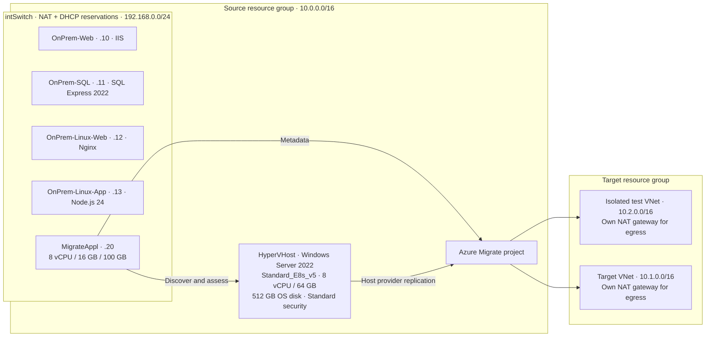

# TD SYNNEX | Azure Migrate Hyper-V Workshop

**Cloud Enablement Services** · Partner hands-on training

Discover, assess, test and migrate four Hyper-V VMs to Azure, then validate and clean up the environment. All four workloads use the **Hyper-V host replication provider**. The discovery appliance performs assessment; the replication provider on the Hyper-V host moves VM data. SQL Server does not require a different replication architecture simply because it stores data. [Microsoft Hyper-V migration tutorial](https://learn.microsoft.com/azure/migrate/tutorial-migrate-hyper-v)

**Release status:** engineering refresh merged to `main` on September 8, 2026; awaiting live rehearsal. Automated Windows and Linux checks pass, but an instructor must complete the [live rehearsal](docs/Instructor-Guide.md) before partner delivery. No Azure deployment or migration was performed during the code review.

## Learning path

Provision the environment before the teaching session. Budget a full working day for initial delivery; actual deployment, discovery, replication and backup time depends on bandwidth, quota and regional capacity. Measure duration in rehearsal before advertising a timed agenda.

| Module | Exercise | Completion evidence |
|---|---|---|
| 0 | [Setup](docs/Module-0-Setup.md) | Five nested VMs; four healthy sample workloads |
| 1 | [Discovery and assessment](docs/Module-1-Discovery.md) | Four workload names discovered and an Azure VM assessment |
| 2 | [Hyper-V replication and test migration](docs/Module-2-Agentless-Migration.md) | Successful isolated tests for every workload |
| 3 | [Cutover and stateful validation](docs/Module-3-Stateful-Migration.md) | Planned migration, SQL data comparison, application acceptance |
| 4 | [Azure Migrate and Site Recovery](docs/Module-4-ASR-Comparison.md) | Explain migration versus ongoing disaster recovery |
| 5 | [Post-migration operations](docs/Module-5-Post-Migration.md) | Monitoring evidence, optional backup/restore, cost and security review |
| Finish | [Cleanup](docs/Cleanup.md) | Test/replication artifacts and all workshop resources accounted for |

## Environment



This is a **single nested Hyper-V host**, not a cluster or a production landing zone. Its internal NAT topology is a workshop adaptation. Microsoft documents an external switch for a production appliance deployment; validate the nested topology in rehearsal and do not describe it as production support certification. [Appliance prerequisites](https://learn.microsoft.com/azure/migrate/deploy-appliance-script)

The sites and Node API are independent samples. The IIS page is static; Nginx is not a reverse proxy; the Node API has no database client or persistence. The SQL database remains named `ContosoApp` to keep its sample schema and validation stable.

## Start here

For an instructor rehearsal, use the [single-launcher walkthrough](docs/Automated-Rehearsal.md) and double-click [Start-Rehearsal.cmd](Start-Rehearsal.cmd) on Windows. It runs scripted stages in order, pauses for portal/evidence checkpoints and saves a resumable report. The manual learner path follows below.

1. Read [Module 0](docs/Module-0-Setup.md), including subscription, quota, licensing, downloads and cost preparation.
2. Obtain the merged version from [j33pguy/azure-migrate-workshop](https://github.com/j33pguy/azure-migrate-workshop/tree/main). Use `main` for rehearsal and record the exact commit shown below. For partner delivery, the instructor must supply the release tag or commit that passed rehearsal so every learner uses the same revision. Run these commands in a terminal, then continue from the repository directory:

   ```bash
   git clone --branch main https://github.com/j33pguy/azure-migrate-workshop.git
   cd azure-migrate-workshop
   git rev-parse HEAD
   ```

3. In a PowerShell session with the current Az modules, choose your dedicated subscription and variables:

```powershell
Connect-AzAccount
$subscriptionId = Read-Host 'Workshop subscription ID'
Set-AzContext -SubscriptionId $subscriptionId
$sourceRg = 'rg-ces-source-01'
$targetRg = 'rg-ces-target-01'
$location = 'eastus'
$adminCidr = Read-Host 'Your public IPv4 address followed by /32'
$password = Read-Host 'Lab-only administrator password' -AsSecureString

.\scripts\deploy-lab.ps1 -SubscriptionId $subscriptionId `
    -ResourceGroupName $sourceRg -Location $location `
    -AdminUsername 'labadmin' -AdminPassword $password -AdminSourceCidr $adminCidr

.\scripts\migrate-step1-setup-project.ps1 -SubscriptionId $subscriptionId `
    -SourceResourceGroup $sourceRg -TargetResourceGroup $targetRg -Location $location
```

The deployment scripts require **new, dedicated resource groups**. They intentionally refuse existing groups: replaying setup after cutover could restart the retired source VMs. They do not register the appliance or start replication. Complete Module 1 next.

## Script responsibilities

| Script | Behavior |
|---|---|
| `Start-LabRehearsal.ps1` | Ordered, resumable instructor rehearsal; automatic checks plus explicit manual checkpoints, reports and separate deployment/cleanup approval |
| `deploy-lab.ps1` | Billable source host, nested guests, DHCP/NAT and samples; protected setup parameters; fails if readiness is not observed |
| `host/configure-host.ps1` | Runs inside the Windows host; creates the four workloads and the appliance OS VM |
| `migrate-step1-setup-project.ps1` | Billable target/test network preparation; portal project creation follows |
| `migrate-step2` through `migrate-step5` | Local guides to the supported Hyper-V portal workflow; no migration automation |
| `Test-MigratedWorkloads.ps1` | Executes smoke tests inside explicitly named Azure VMs using their VM agents |
| `Test-LabSqlData.ps1` | Runs inside the SQL VM; captures or compares every defined column of the two sample tables against a preserved source baseline |
| `migrate-step6-post-migration.ps1` | Read-only VM inventory and Module 5 handoff |
| `cleanup-lab.ps1` | Preview/confirmed deletion of explicitly named, tagged groups; refuses vaults and locks |

## Costs and teardown

Estimate the host, OS disk, target/test VMs, replicated disks/storage, **two NAT gateways and their public IPs**, monitoring ingestion, optional Bastion and optional backup/DR. Use the [Azure pricing calculator](https://azure.microsoft.com/pricing/calculator/) for your region and agreement. There is no verified fixed daily price for this workshop. Deallocating VMs stops VM compute charges but does not remove billable disks, NAT gateways, IPs or retained backups.

```powershell
.\scripts\cleanup-lab.ps1 -SubscriptionId $subscriptionId `
    -ResourceGroupName $targetRg,$sourceRg -WhatIf
```

Follow [Cleanup](docs/Cleanup.md) before running the deletion without `-WhatIf`.

## Maintenance and provenance

Run `pwsh -NoProfile -File scripts/Start-LabRehearsal.ps1 -Mode Validate` and `python3 tests/check_docs.py` before sharing changes. CI also runs the PowerShell checks with Windows PowerShell 5.1 and exercises Linux HTTP failure handling. See the [review findings](review/REVIEW.md), [September 8 fixes](review/FOLLOWUP-FIXES.md), [instructor checklist](docs/Instructor-Guide.md), and [branding guide](docs/Branding-and-Forking.md).

The supplied source has an [MIT license](LICENSE) attributed to Pamir Erdem. Its GitHub metadata reports a standalone repository; the claimed Microsoft original was not identified. Preserve the existing license and trace the original source before making Microsoft-derived attribution claims. See [NOTICE](NOTICE.md).
