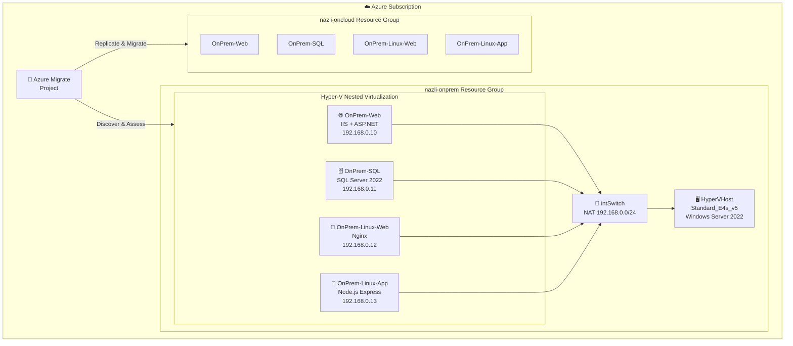
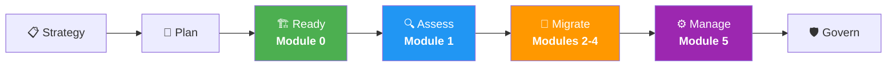
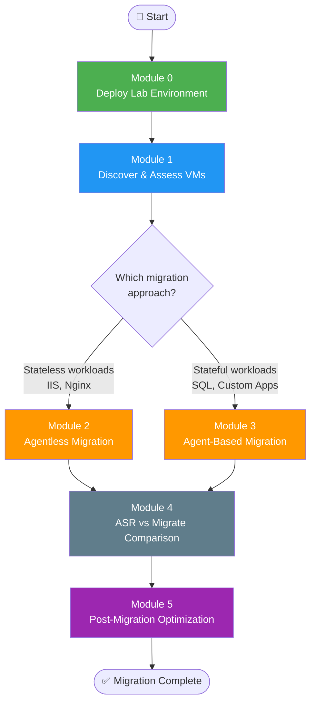
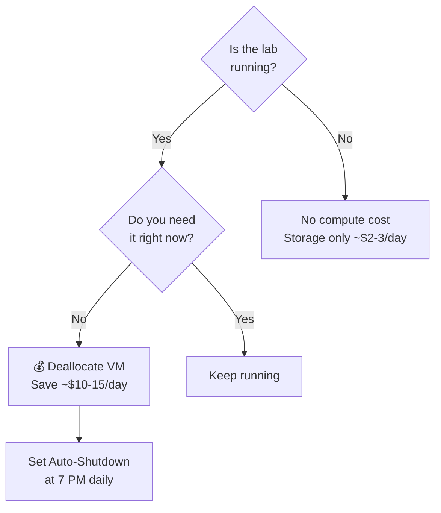

# Azure Migration Workshop: Hands-On Lab for Cloud Solution Architects

## Executive Summary

Cloud migration is a foundational pillar of enterprise digital transformation. Organizations that migrate to Azure gain operational agility, improved security posture, elastic scalability, and long-term cost optimization — but only when migrations are executed with architectural rigor, proper assessment, and well-defined governance.

This workshop provides a **hands-on, end-to-end migration experience** using [Azure Migrate](https://learn.microsoft.com/azure/migrate/migrate-services-overview) within a fully automated lab environment. Participants will discover, assess, and migrate a heterogeneous workload portfolio — Windows and Linux, stateless and stateful, legacy and modern — using both agentless and agent-based migration strategies. The lab environment leverages nested virtualization to accurately simulate an on-premises Hyper-V datacenter, enabling participants to practice real migration workflows without requiring physical infrastructure.

Aligned to the **[Microsoft Cloud Adoption Framework (CAF)](https://learn.microsoft.com/azure/cloud-adoption-framework/)**, this workshop covers the **Ready**, **Assess**, **Migrate**, and **Manage** phases. It is designed for Cloud Solution Architects, Infrastructure Engineers, and IT Decision Makers who need practical experience with migration tooling, architecture decisions, and post-migration operational excellence.

> **Total duration:** 4–5 hours | **Skill level:** Intermediate to Advanced | **CAF alignment:** Ready → Assess → Migrate → Manage

---

## 🏢 Business Context

### Why Organizations Migrate to Azure

Enterprise migration to Azure is driven by strategic imperatives that extend well beyond infrastructure modernization:

- **Digital Transformation** — Migrating workloads to Azure is often the first step toward adopting cloud-native services, AI/ML capabilities, and modern DevOps practices.
- **Cost Optimization** — Shifting from CapEx-heavy on-premises infrastructure to an OpEx consumption model enables financial flexibility. Azure Reserved Instances, Hybrid Benefit, and right-sizing further reduce TCO.
- **Security & Compliance** — Azure provides built-in security controls, regulatory compliance certifications (FedRAMP, HIPAA, ISO 27001, SOC 2), and services like Microsoft Defender for Cloud that strengthen organizational security posture.
- **Business Agility** — On-demand scaling, global region availability, and managed services allow organizations to respond to market demands faster than on-premises infrastructure permits.
- **Operational Resilience** — Azure's built-in high availability, disaster recovery, and backup capabilities reduce risk and improve business continuity.

### The 6 Rs of Migration Strategy

The [Cloud Adoption Framework](https://learn.microsoft.com/azure/cloud-adoption-framework/migrate/) defines six migration strategies. Understanding these is critical for making the right architectural decision per workload:

| Strategy | Description | When to Use |
|----------|-------------|-------------|
| **Rehost** (Lift & Shift) | Move workloads as-is to Azure IaaS | Fast migration, minimal refactoring budget |
| **Replatform** | Minor optimizations during migration (e.g., managed database) | Quick wins without full re-architecture |
| **Refactor** | Re-architect for cloud-native (PaaS, containers, serverless) | Strategic apps needing scalability/agility |
| **Rebuild** | Rewrite the application from scratch | Legacy apps that can't be refactored |
| **Replace** | Adopt SaaS alternatives | Commodity workloads (email, CRM, ERP) |
| **Retire** | Decommission workloads no longer needed | Redundant or obsolete systems |

> **This workshop focuses on Rehost (lift-and-shift)** — the most common starting point for enterprise migrations. Participants will use Azure Migrate to move workloads with minimal application changes, a pattern that typically covers 60–80% of an organization's initial migration wave.

### What This Workshop Simulates

The lab environment represents a typical enterprise scenario: a small application portfolio running on an on-premises Hyper-V cluster. The workloads are intentionally heterogeneous — mixed operating systems, mixed application tiers, stateless and stateful — to reflect the complexity architects encounter in real migration engagements.

---

## 🏗️ Architecture Overview

### Lab Topology

```
┌─────────────────────────────────────────────────────────────────────┐
│  Azure (Host VM - Standard_E4s_v5, Nested Virtualization Enabled)  │
│  └── Windows Server 2022 + Hyper-V Role                            │
│      │                                                              │
│      │  Internal Virtual Switch + NAT (192.168.1.0/24)             │
│      │  ┌─────────────────────────────────────────────────┐        │
│      ├──│ VM1: Win Server 2022 + IIS         "OnPrem-Web" │        │
│      ├──│ VM2: Win Server 2022 + SQL 2019    "OnPrem-SQL" │        │
│      ├──│ VM3: Ubuntu 22.04 + Nginx    "OnPrem-Linux-Web" │        │
│      └──│ VM4: Ubuntu 22.04 + Node.js  "OnPrem-Linux-App" │        │
│          └─────────────────────────────────────────────────┘        │
└─────────────────────────────────────────────────────────────────────┘
```

#### Interactive Architecture Diagram



### Why Nested Virtualization?

Nested virtualization enables a Hyper-V hypervisor to run inside an Azure VM, creating a self-contained on-premises simulation. This approach is the industry-standard pattern for Azure Migrate labs because:

- **Accurate simulation** — Guest VMs appear as true on-premises workloads to Azure Migrate. The discovery appliance, replication, and migration workflows behave identically to a production migration.
- **No physical hardware required** — Participants can run the workshop entirely in Azure, eliminating the need for dedicated lab infrastructure.
- **Isolated networking** — The internal virtual switch with NAT replicates a typical on-premises network topology where workloads sit behind a NAT gateway, mirroring how Azure Migrate would discover machines in a real datacenter.

### Network Topology

The lab uses an **Internal Virtual Switch** with **NAT configuration** (subnet `192.168.1.0/24`). This design is deliberate:

- Guest VMs communicate with each other on a private layer-2 segment, simulating an on-premises VLAN.
- NAT provides outbound internet access for guest VMs (required for Azure Migrate agent installation and replication traffic), while the VMs remain non-routable from the public internet — exactly like workloads behind a corporate firewall.
- The Azure Migrate appliance (deployed on the host or as an additional guest) discovers machines via this internal network, replicating how the appliance scans a Hyper-V host in production.

### Workload Portfolio & Real-World Mapping

The four guest VMs represent a deliberately chosen cross-section of workloads commonly encountered in enterprise migration engagements:

| Lab Workload | Technology | Real-World Equivalent | Migration Considerations |
|---|---|---|---|
| **OnPrem-Web** | Windows Server 2022 + IIS | Legacy .NET intranet application, line-of-business web portal | Stateless, simple rehost candidate. May benefit from post-migration replatform to Azure App Service. |
| **OnPrem-SQL** | Windows Server 2022 + SQL Server 2019 Express | Enterprise relational database (ERP, CRM, custom LOB) | Stateful workload requiring careful RPO/RTO planning. Candidate for post-migration replatform to Azure SQL Managed Instance. |
| **OnPrem-Linux-Web** | Ubuntu 22.04 + Nginx | Linux-based web frontend, reverse proxy, or static content server | Validates cross-platform migration capabilities. Common in organizations with mixed OS estates. |
| **OnPrem-Linux-App** | Ubuntu 22.04 + Node.js | Modern API microservice, webhook handler, internal tooling | Represents modern development patterns increasingly found alongside legacy workloads. Post-migration candidate for Azure Container Apps or AKS. |

> **Architect's Note:** This workload mix intentionally spans both Windows and Linux, stateless and stateful, legacy and modern tiers. In a real engagement, each workload would be evaluated against the 6 Rs framework, and migration waves would be planned based on dependency mapping and business criticality.

---

## 📚 Workshop Learning Path — Aligned to Cloud Adoption Framework

Each module maps to a specific CAF phase, providing participants with a structured journey from environment preparation through post-migration operations.

| CAF Phase | Module | Title | What You'll Learn | Duration |
|-----------|--------|-------|-------------------|----------|
| **Ready** | Module 0 | [Environment Setup](docs/module-0-setup.md) | Landing zone preparation, infrastructure provisioning via IaC, Hyper-V host configuration | 30–60 min |
| **Assess** | Module 1 | [Discovery & Assessment](docs/module-1-discovery.md) | Workload discovery with the Azure Migrate appliance, dependency mapping, Azure readiness assessment, TCO and sizing analysis | 45 min |
| **Migrate** | Module 2 | [Agentless Migration](docs/module-2-agentless.md) | Snapshot-based replication, zero-downtime migration patterns, agentless migration for IIS and Nginx workloads | 60 min |
| **Migrate** | Module 3 | [Agent-Based Migration](docs/module-3-agent-based.md) | Continuous replication, RPO/RTO optimization, agent-based migration for SQL Server and Node.js workloads | 60 min |
| **Migrate** | Module 4 | [ASR vs Azure Migrate](docs/module-4-asr-comparison.md) | Tool selection criteria, DR integration with Azure Site Recovery, migration at scale considerations | 30 min |
| **Manage** | Module 5 | [Post-Migration Optimization](docs/module-5-post-migration.md) | Azure Monitor onboarding, backup configuration, Microsoft Defender for Cloud, right-sizing, cost governance | 45 min |

> **Total estimated duration:** 4–5 hours. Modules are designed to be completed sequentially, as each builds upon the environment state established by the previous module.

### Cloud Adoption Framework Flow



---

## ✅ Prerequisites

### Azure Subscription Requirements

| Requirement | Details |
|---|---|
| **Subscription Access** | Contributor role at the subscription level (Owner required if configuring RBAC or Policy during Module 5) |
| **Resource Provider Registration** | `Microsoft.Migrate`, `Microsoft.OffAzure`, `Microsoft.Compute`, `Microsoft.Network`, `Microsoft.Storage` must be registered |
| **vCPU Quota** | Minimum 4 vCPUs for the Esv5 family in your target region. [Check quota](https://learn.microsoft.com/azure/quotas/view-quotas) and [request increases](https://learn.microsoft.com/azure/quotas/quickstart-increase-quota-portal) if needed |
| **Region Availability** | Deploy to a region supporting Esv5-series VMs with nested virtualization (e.g., `eastus`, `westus2`, `westeurope`). See [Products available by region](https://azure.microsoft.com/explore/global-infrastructure/products-by-region/) |

### Tooling

| Tool | Details |
|---|---|
| **Azure PowerShell** | Az module v9.0+ installed (`Install-Module -Name Az -Scope CurrentUser`) |
| **RDP Client** | Built-in on Windows; [Microsoft Remote Desktop](https://learn.microsoft.com/windows-server/remote/remote-desktop-services/clients/remote-desktop-clients) on macOS/Linux |
| **Git** | To clone this repository |

### Networking Considerations

- Outbound RDP (TCP 3389) must be permitted from your workstation to Azure public IPs.
- If connecting from a corporate network, ensure your firewall or proxy does not block RDP traffic.
- The deployment script creates an NSG allowing inbound RDP. In production, you would use [Azure Bastion](https://learn.microsoft.com/azure/bastion/bastion-overview) or a VPN gateway instead.

### Knowledge Prerequisites

Participants should have foundational knowledge in the following areas. Recommended pre-reading is linked for each:

- **Hyper-V administration** — [Hyper-V on Windows Server](https://learn.microsoft.com/windows-server/virtualization/hyper-v/hyper-v-on-windows-server)
- **Azure fundamentals** — [AZ-900 learning path](https://learn.microsoft.com/training/paths/az-900-describe-cloud-concepts/)
- **Azure networking basics** — [Azure Virtual Network documentation](https://learn.microsoft.com/azure/virtual-network/virtual-networks-overview)
- **Azure Migrate overview** — [About Azure Migrate](https://learn.microsoft.com/azure/migrate/migrate-services-overview)

---

## 🚀 Quick Start — Landing Zone Deployment

The deployment script provisions a complete migration lab environment in a single command. This is analogous to deploying a [CAF landing zone](https://learn.microsoft.com/azure/cloud-adoption-framework/ready/landing-zone/) — a pre-configured Azure environment ready to host migrated workloads.

### 1. Clone the repository

```bash
git clone https://github.com/your-org/azure-migrate-workshop.git
cd azure-migrate-workshop
```

### 2. Authenticate to Azure

```powershell
Connect-AzAccount
Set-AzContext -SubscriptionId "<your-subscription-id>"
```

### 3. Deploy the lab environment

```powershell
.\scripts\deploy-lab.ps1 `
    -ResourceGroupName "rg-migrate-workshop" `
    -Location "eastus" `
    -AdminUsername "azureuser" `
    -AdminPassword (ConvertTo-SecureString "YourP@ssw0rd!" -AsPlainText -Force)
```

This script is **idempotent** — it can be re-run safely if interrupted. It handles the full provisioning lifecycle:

- Resource group creation
- Azure VM deployment (Standard_E4s_v5 with nested virtualization)
- Hyper-V role installation and configuration
- Internal virtual switch and NAT setup
- Guest VM deployment with pre-configured workloads (IIS, SQL Server, Nginx, Node.js)
- All host configuration is performed remotely via `Invoke-AzVMRunCommand` — no manual RDP steps required during setup

> ⏱️ **Deployment takes approximately 30–60 minutes.** The script provides progress output throughout execution.

### 4. Connect and begin

Connect to the host VM via RDP using the public IP output from the deployment script, then proceed to [Module 0: Environment Setup](docs/module-0-setup.md).

---

## 🔄 Migration Methodology

This workshop follows the proven **Azure Migrate methodology**, which aligns to the CAF Migrate phase:

```
Discover  →  Assess  →  Plan Migration Waves  →  Migrate (Test → Cutover)  →  Optimize
```

1. **Discover** — Deploy the Azure Migrate appliance to scan the Hyper-V host and discover all guest VMs, their configurations, performance metrics, and software inventory.
2. **Assess** — Generate Azure readiness assessments, right-size recommendations, and TCO analysis. Identify dependencies between workloads using dependency visualization.
3. **Plan Migration Waves** — Group workloads into migration waves based on dependencies, business criticality, and migration complexity. In this workshop, Wave 1 covers stateless workloads (agentless), and Wave 2 covers stateful workloads (agent-based).
4. **Migrate** — Execute test migrations first, validate functionality, then perform the production cutover. Azure Migrate supports both agentless (snapshot-based) and agent-based (continuous replication) approaches.
5. **Optimize** — Post-migration, right-size VMs, configure monitoring and alerting, enable backup and disaster recovery, and apply security hardening.

> **Further reading:** [Azure Migrate documentation](https://learn.microsoft.com/azure/migrate/) | [CAF Migrate methodology](https://learn.microsoft.com/azure/cloud-adoption-framework/migrate/)

### Migration Methodology Flowchart



---

## 🏛️ Key Architectural Decisions

The following decisions were made when designing this lab environment. Understanding the rationale helps architects apply similar reasoning in production engagements.

### ADR-1: Hyper-V over VMware as the Virtualization Platform

**Decision:** Use Hyper-V as the on-premises hypervisor simulation.

**Rationale:** Hyper-V supports nested virtualization natively on Azure VMs, enabling a fully self-contained lab. VMware nested virtualization on Azure requires additional licensing and complexity (e.g., Azure VMware Solution). Hyper-V also represents a significant portion of the enterprise virtualization market, making it directly applicable to real migration scenarios. Azure Migrate supports both Hyper-V and VMware discovery — the migration workflows are analogous.

### ADR-2: Standard_E4s_v5 VM Size

**Decision:** Use Standard_E4s_v5 (4 vCPUs, 32 GB RAM) as the host VM.

**Rationale:** The Esv5 family supports nested virtualization, provides sufficient memory to run four guest VMs concurrently (each allocated 2–4 GB RAM), and balances performance with cost (~$10–15/day). Larger sizes (E8s_v5, E16s_v5) are available if participants need additional headroom but increase lab costs proportionally.

### ADR-3: Mixed OS Workload Portfolio

**Decision:** Include both Windows Server and Ubuntu Linux guest VMs with diverse application stacks.

**Rationale:** Enterprise environments are rarely homogeneous. A mixed portfolio forces participants to work with cross-platform migration tooling and understand the differences in agent installation, driver injection, and post-migration configuration between Windows and Linux. This reflects the [Azure Well-Architected Framework](https://learn.microsoft.com/azure/well-architected/) principle of **Operational Excellence** — building processes that work across your entire estate.

### ADR-4: NAT Networking with Internal Virtual Switch

**Decision:** Use an internal virtual switch with NAT rather than an external switch or bridged networking.

**Rationale:** NAT networking creates an isolated network segment that accurately simulates an on-premises datacenter behind a corporate firewall. Guest VMs have outbound internet access (required for Azure Migrate replication) but are not directly routable — exactly matching the network topology that Azure Migrate encounters in production environments. This also aligns with the WAF **Security** pillar by not exposing guest VMs to the public internet.

---

## 💰 Estimated Cost & Cost Management

| Resource | Approx. Cost/Day | Notes |
|---|---|---|
| Host VM (Standard_E4s_v5) | ~$10–15 | Primary cost driver; deallocate when not in use |
| Managed Disks (OS + data) | ~$2–3 | Persistent even when VM is deallocated |
| Networking (Public IP, NSG) | ~$1–2 | Static IP incurs cost when unassigned |
| Azure Migrate (assessment) | Free | No additional cost for discovery and assessment |
| Replication storage (during migration) | ~$1–2 | Temporary; cleaned up post-migration |
| **Total** | **~$15–25/day** | |

### Cost Management Recommendations

- **Deallocate the host VM** when not actively working (`Stop-AzVM -ResourceGroupName "rg-migrate-workshop" -Name "<vm-name>"`). Guest VMs stop automatically with the host.
- **Set a budget alert** on the resource group to avoid unexpected charges ([Azure Cost Management](https://learn.microsoft.com/azure/cost-management-billing/costs/tutorial-acm-create-budgets)).
- **Use Azure Dev/Test pricing** if available through your subscription type.
- **Clean up immediately** after completing the workshop — see [Cleanup](#-cleanup) below.

### When to Deallocate?



---

## 🧹 Cleanup

Remove all lab resources to stop incurring costs:

```powershell
.\scripts\cleanup-lab.ps1 -ResourceGroupName "rg-migrate-workshop"
```

This removes the resource group and all resources within it, including the host VM, managed disks, network interfaces, public IP addresses, and any Azure Migrate project artifacts within the resource group.

> **Important:** Also verify that the Azure Migrate project and Recovery Services vault (if created during Module 4) are fully removed. These resources may exist in separate resource groups depending on your configuration.

---

## 📁 Repository Structure

```
azure-migrate-workshop/
├── README.md                          # This document — workshop overview and architecture context
├── docs/
│   ├── Module-0-Setup.md             # Environment setup and validation
│   ├── Module-1-Discovery.md         # Azure Migrate discovery and assessment
│   ├── Module-2-Agentless.md         # Agentless migration (IIS, Nginx)
│   ├── Module-3-Agent-Based.md       # Agent-based migration (SQL Server, Node.js)
│   ├── Module-4-ASR-Comparison.md    # ASR vs Azure Migrate comparison
│   └── Module-5-Post-Migration.md    # Post-migration optimization
├── images/                            # Architecture diagrams and screenshots
├── scripts/
│   ├── deploy-lab.ps1                # Automated lab deployment (IaC)
│   └── cleanup-lab.ps1               # Resource cleanup and teardown
```

---

## 🤝 Contributing

Contributions are welcome. To contribute:

1. Fork this repository
2. Create a feature branch (`git checkout -b feature/my-improvement`)
3. Commit your changes (`git commit -m "Add my improvement"`)
4. Push to your branch (`git push origin feature/my-improvement`)
5. Open a Pull Request

Please ensure your changes follow the existing documentation style, align to the CAF/WAF framing used throughout this workshop, and include any necessary updates to the relevant workshop modules.

---

## 📄 License

This project is licensed under the [MIT License](LICENSE).

---

## 📖 Additional Resources

| Resource | Link |
|---|---|
| Microsoft Cloud Adoption Framework | [CAF Documentation](https://learn.microsoft.com/azure/cloud-adoption-framework/) |
| Azure Well-Architected Framework | [WAF Documentation](https://learn.microsoft.com/azure/well-architected/) |
| Azure Migrate Documentation | [Azure Migrate](https://learn.microsoft.com/azure/migrate/) |
| Azure Site Recovery Documentation | [ASR Documentation](https://learn.microsoft.com/azure/site-recovery/) |
| Azure Landing Zones | [Landing Zone Documentation](https://learn.microsoft.com/azure/cloud-adoption-framework/ready/landing-zone/) |
| Migration Best Practices | [CAF Migrate Best Practices](https://learn.microsoft.com/azure/cloud-adoption-framework/migrate/azure-best-practices/) |
