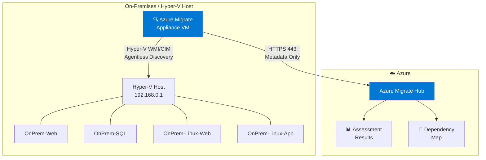
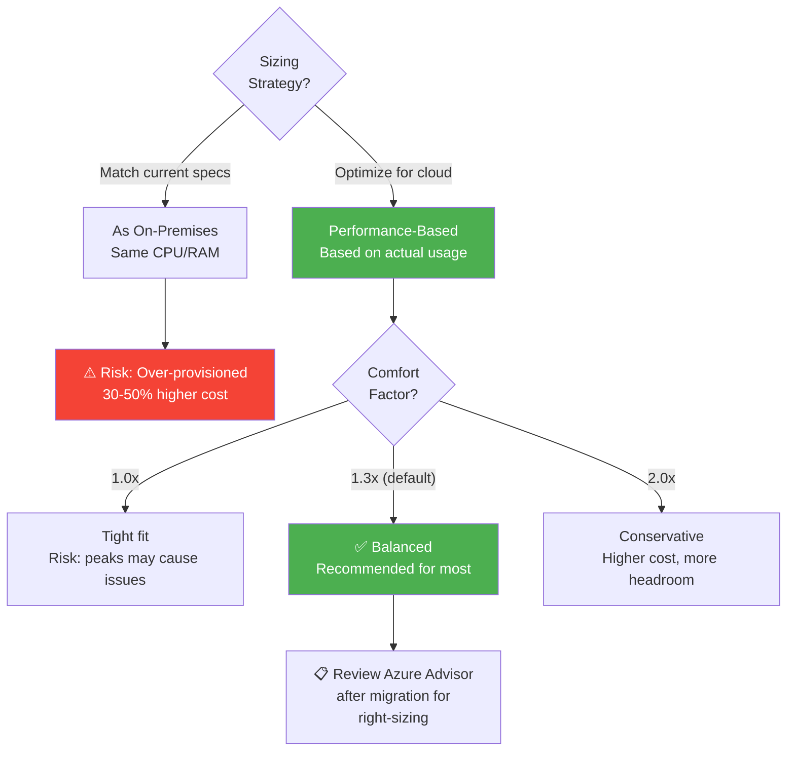
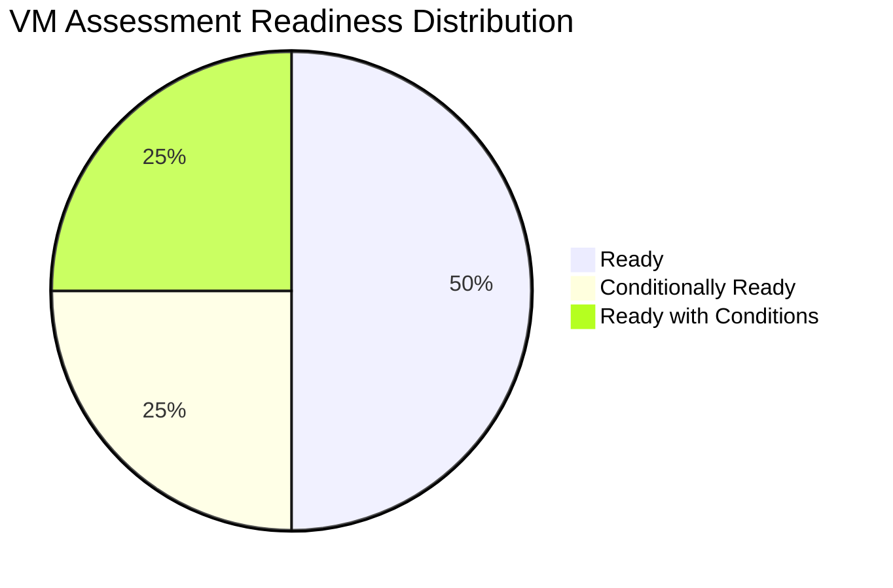
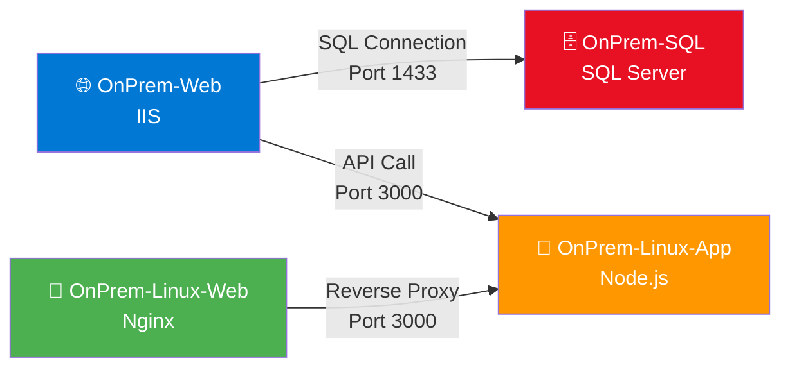
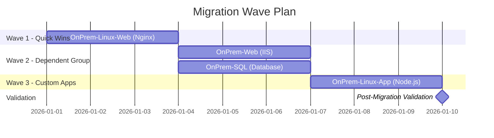

# Module 1: Discovery & Assessment — The Foundation of Every Successful Migration

> **Cloud Adoption Framework Phase:** [Assess](https://learn.microsoft.com/en-us/azure/cloud-adoption-framework/strategy/) · **Estimated Duration:** 60–90 minutes

## Module Overview

Discovery is the single greatest predictor of migration success or failure. Industry data consistently shows that **38–50% of failed cloud migrations cite inadequate assessment and planning** as the root cause. As a Cloud Solution Architect, I treat discovery not as a checkbox exercise but as the phase that determines the trajectory of everything that follows.

A thorough discovery reveals:

- **Workload inventory** — what you actually have (vs. what the CMDB says you have)
- **Dependencies** — which systems talk to each other and cannot be separated
- **Readiness blockers** — incompatible OS versions, unsupported configurations, licensing constraints
- **Cost projections** — the business case that justifies the migration investment

Skip this phase, underinvest in it, or rush through it, and you will pay for it in every subsequent module — with downtime, rework, and cost overruns.

This module walks you through discovery and assessment using Azure Migrate, but every step includes the "why" and "what you'd do differently at scale" context that separates a lab exercise from production readiness.

---

## Learning Objectives

By the end of this module, you will be able to:

- Understand the Azure Migrate discovery architecture (appliance-based, agentless)
- Deploy and configure the Azure Migrate appliance on Hyper-V
- Discover on-premises VMs and interpret the collected inventory data
- Configure and create Azure VM assessments with production-appropriate settings
- Interpret assessment results for executive stakeholder communication
- Identify migration blockers and understand common remediation strategies
- Use dependency analysis to create **migration wave plans**
- Estimate TCO and build a business case for migration funding

---

## Concepts — Azure Migrate Architecture

Before touching the portal, you need a mental model of how Azure Migrate works. Too many engineers start clicking buttons without understanding the data flow, and then struggle to troubleshoot or explain the architecture to stakeholders.

### Azure Migrate Hub

Azure Migrate is a **central orchestration point** — not a single tool. It integrates discovery, assessment, and migration capabilities across multiple workload types (VMs, databases, web apps, VDI). Think of it as the control plane for your entire migration program.

### Discovery Appliance

The appliance is a lightweight VM (Windows Server-based) deployed on-premises. For Hyper-V environments, it performs **agentless discovery** by querying the Hyper-V management APIs — no agents are installed on guest VMs during discovery. The appliance collects:

- Server configuration metadata (CPU, memory, disk, network adapters)
- Performance counters (utilization over time)
- Software inventory (installed applications, roles, features)
- SQL Server instance and database metadata
- Web application inventory (IIS/Apache)

### Data Flow

Understanding the data flow is critical for security reviews and customer conversations:

```
┌─────────────────────────────────────────────────────────────────┐
│  On-Premises Environment                                        │
│                                                                 │
│  ┌──────────────┐    WinRM/WMI     ┌──────────────────────┐    │
│  │  Hyper-V Host │◄───────────────►│  Azure Migrate       │    │
│  │  192.168.0.1  │                 │  Appliance           │    │
│  │               │                 │  192.168.0.20        │    │
│  │  ┌──────────┐ │                 │                      │    │
│  │  │ Guest VMs│ │                 │  Collects metadata   │    │
│  │  │ .10-.13  │ │                 │  only — no workload  │    │
│  │  └──────────┘ │                 │  data leaves on-prem │    │
│  └──────────────┘                  │  until replication    │    │
│                                    └──────────┬───────────┘    │
│                                               │                 │
└───────────────────────────────────────────────┼─────────────────┘
                                                │ HTTPS (443)
                                                │ Metadata only
                                                ▼
                                    ┌───────────────────────┐
                                    │  Azure Migrate Service │
                                    │  (Azure Cloud)         │
                                    │                        │
                                    │  - Discovery metadata  │
                                    │  - Assessment engine   │
                                    │  - Dependency mapping  │
                                    └───────────────────────┘
```



> **Key point for security-conscious customers:** Only metadata flows to Azure during discovery. No workload data, application data, or VM disks leave the on-premises environment until you explicitly begin replication in Module 2 or 3.

### Assessment Types

Azure Migrate supports multiple assessment targets — not just Azure VMs:

| Assessment Type | What It Evaluates | When to Use |
|---|---|---|
| **Azure VM** | IaaS lift-and-shift readiness | Default for most server workloads |
| **Azure SQL** | SQL Server → Azure SQL DB, MI, or SQL on VM | Database migration planning |
| **Azure App Service** | Web apps → Azure App Service | .NET/Java web app modernization |
| **Azure VMware Solution (AVS)** | VM → AVS node sizing | VMware-native migration path |

### Dependency Analysis Approaches

| Approach | How It Works | Pros | Cons |
|---|---|---|---|
| **Agentless** | Analyzes network connections from appliance data | No agents, fast to enable | Less granular, connection-level only |
| **Agent-based** | MMA + Dependency Agent on each VM → Log Analytics | Process-level visibility, port/protocol detail | Requires agent installation on every VM |

> **CSA Recommendation:** Start with agentless dependency analysis. Only deploy agents on VMs where you need process-level dependency detail — typically complex multi-tier applications.

---

## Step 1: Create an Azure Migrate Project

### Hands-On Steps

1. Sign in to the [Azure portal](https://portal.azure.com).
2. In the search bar, type **Azure Migrate** and select it from the results.
3. Click **Create project**.
4. Configure the project:

   | Setting | Value |
   |---|---|
   | Subscription | *Your subscription* |
   | Resource group | `rg-migrate-workshop` |
   | Project name | `MigrateWorkshop-Project` |
   | Geography | *Select the geography closest to your region* |

5. Under **Assessment tool**, select **Azure Migrate: Discovery and assessment**.
6. Under **Migration tool**, select **Azure Migrate: Server Migration**.
7. Click **Create**.


**Expected Outcome:** The Azure Migrate project is created and you are redirected to the Azure Migrate dashboard showing the Discovery and Assessment and Server Migration tools.

### Why This Matters — CSA Context

**Project geography is a metadata residency decision, not a migration target decision.** The geography you select determines where Azure Migrate stores discovery metadata (server names, IPs, performance data). It does not restrict which Azure region you migrate workloads to.

This distinction matters for regulated industries:

- **EU customers** should select a European geography to keep discovery metadata within EU boundaries
- **Government customers** should ensure they use Azure Government regions if required by compliance
- **Data sovereignty** requirements may dictate metadata residency even when the migration target region is different

**Best practice for production:** One Azure Migrate project per migration scope — typically per datacenter or business unit. Mixing thousands of VMs from multiple datacenters into a single project creates noise and makes assessment results hard to act on.

**Naming convention recommendation:** Use a pattern like `migrate-<datacenter>-<year>` (e.g., `migrate-dc-east-2024`) so projects are self-documenting and easy to find months later.

---

## Step 2: Deploy the Azure Migrate Appliance

The Azure Migrate appliance is a lightweight Windows Server VM that performs agentless discovery of your Hyper-V environment.

### 2.1 — Download the Appliance VHD

1. In the Azure Migrate dashboard, under **Azure Migrate: Discovery and assessment**, click **Discover**.
2. Select **Are your servers virtualized?** → **Yes, with Hyper-V**.
3. In the **1: Generate project key** section, enter the appliance name: `AzMigrateAppliance`.
4. Click **Generate key** and **copy the project key** — you will need it later.
5. Click **Download** to download the appliance VHD (`.zip` file, ~10 GB).


> **Tip:** You can download the VHD directly onto the Hyper-V host to avoid having to transfer it. Use the Edge browser on the host VM, or copy the download URL and use `Invoke-WebRequest` in PowerShell.

### 2.2 — Import the Appliance on the Hyper-V Host

1. RDP into the Hyper-V host (if not already connected).
2. Extract the downloaded `.zip` file to a local folder (e.g., `C:\AzMigrateAppliance`).
3. Open **Hyper-V Manager**.
4. Click **Import Virtual Machine** and browse to the extracted folder.
5. Select **Register the virtual machine in-place** and complete the import wizard.

Alternatively, create a new VM manually:

```powershell
# Create the appliance VM using the downloaded VHD
$VMName = "AzMigrateAppliance"
$VHDPath = "C:\AzMigrateAppliance\AzureMigrateAppliance.vhd"

New-VM -Name $VMName `
       -MemoryStartupBytes 8GB `
       -Generation 1 `
       -VHDPath $VHDPath `
       -SwitchName "intSwitch"
```

### 2.3 — Configure Networking

The appliance needs two network connections:

- **Internal network** (`intSwitch`) — to discover guest VMs on `192.168.0.0/24`
- **External network** — to communicate with Azure services

```powershell
# Add a second network adapter for external connectivity
Add-VMNetworkAdapter -VMName "AzMigrateAppliance" -SwitchName "Default Switch"
```

Configure a static IP on the internal adapter so the appliance is reachable from the host:

| Setting | Value |
|---|---|
| IP Address | 192.168.0.20 |
| Subnet Mask | 255.255.255.0 |
| Default Gateway | 192.168.0.1 |

> **Note:** The external adapter (connected to the Default Switch) will receive an IP via DHCP and provide internet connectivity for Azure registration.

### 2.4 — Start the Appliance VM

```powershell
Start-VM -Name "AzMigrateAppliance"
```

Wait for the appliance to boot completely (~3–5 minutes).


**Expected Outcome:** The `AzMigrateAppliance` VM is running in Hyper-V Manager alongside the four on-premises guest VMs.

### Why This Matters — CSA Context

**Security model.** The appliance is a locked-down Windows Server VM managed by Microsoft. It auto-updates, runs with minimal attack surface, and communicates with Azure exclusively over outbound HTTPS (port 443). It does not require inbound ports from the internet. In customer security reviews, I emphasize that:

- The appliance stores credentials locally in an encrypted credential store (DPAPI)
- No workload data (application data, file contents, database records) is collected
- All communication is encrypted in transit with TLS 1.2+
- The appliance can be deleted after migration without any impact on migrated workloads

**Network requirements in production:**

| Endpoint | Protocol | Purpose |
|---|---|---|
| `*.azure.com` | HTTPS 443 | Azure Migrate service APIs |
| `*.microsoftonline.com` | HTTPS 443 | Azure AD authentication |
| `*.windows.net` | HTTPS 443 | Azure Storage (for uploads) |
| `aka.ms` | HTTPS 443 | Appliance auto-update |

**Appliance sizing at scale:** A single appliance supports discovery of up to **5,000 VMs** on Hyper-V. For environments with more than 5,000 VMs, deploy additional appliances — each registered to the same Azure Migrate project. In large enterprise migrations (10,000+ VMs), plan for 2–3 appliances and stagger discovery to avoid overwhelming management infrastructure.

---

## Step 3: Configure the Appliance and Start Discovery

### 3.1 — Connect to the Appliance Configuration Manager

1. From the Hyper-V host, open a web browser.
2. Navigate to **https://192.168.0.20:44368**.
3. Accept the self-signed certificate warning and proceed.

> **Warning:** Use HTTPS (port 44368). The appliance configuration manager will not respond on HTTP.


### 3.2 — Set Up Prerequisites

The appliance configuration manager will run prerequisite checks:

1. **Internet connectivity** — Verifies the appliance can reach Azure endpoints.
2. **Time sync** — Ensures the appliance clock is synchronized.
3. **Appliance updates** — Installs any available updates.

Wait for all prerequisite checks to pass before proceeding.

> **Note:** If internet connectivity fails, verify that the external network adapter is connected and has a valid IP address. You may need to configure DNS settings.

### 3.3 — Register with Azure

1. Click **Login** to authenticate with your Azure credentials.
2. In the **Register with Azure Migrate** section, paste the **project key** you copied in Step 2.1.
3. Click **Register**.

**Expected Outcome:** The appliance displays a confirmation that it has been successfully registered with your Azure Migrate project.


### 3.4 — Add Hyper-V Host Credentials

1. In the **Manage credentials** section, click **Add credentials**.
2. Enter the credentials for the Hyper-V host:

   | Setting | Value |
   |---|---|
   | Friendly name | `HyperVHostCreds` |
   | Username | `azureuser` |
   | Password | *The password you set during deployment* |

3. Click **Save**.

### 3.5 — Add the Hyper-V Host for Discovery

1. In the **Provide Hyper-V host details** section, click **Add discovery source**.
2. Select **Hyper-V Host/Cluster**.
3. Enter the Hyper-V host IP address: `192.168.0.1`.
4. Select the credentials you created (`HyperVHostCreds`).
5. Click **Save**.

### 3.6 — Start Discovery

1. Click **Start discovery**.
2. The appliance begins connecting to the Hyper-V host and inventorying all guest VMs.


**Expected Outcome:** The appliance confirms that discovery has been initiated and shows the Hyper-V host as connected.

### Why This Matters — CSA Context

**Credential best practices for production:**

- **Never use domain admin credentials.** Create a dedicated service account with the minimum required permissions (Hyper-V Administrators group membership for Hyper-V discovery)
- For guest VM software inventory, the appliance needs guest credentials — use a least-privilege local account, not a domain admin
- Rotate credentials after the discovery phase; the appliance does not need ongoing access after migration completes
- Document all service accounts in your migration runbook for audit trail

**Discovery scope decisions.** In this workshop we discover all VMs on the host, but in production you may want to limit discovery to specific hosts or clusters. Reasons include:

- **Phased migration** — discover only the datacenter wing being migrated this quarter
- **Security boundaries** — different teams own different clusters and have different approval timelines
- **Performance** — discovering 10,000 VMs simultaneously can generate significant WinRM traffic

**Discovery frequency.** The appliance performs continuous discovery after initial startup, collecting delta updates every 5 minutes for metadata and performance counters. Performance-based assessments benefit from longer collection periods — **Microsoft recommends at least 1 day, ideally 30 days** of performance data for accurate right-sizing.

---

## Step 4: Wait for Discovery and Validate Results

Discovery typically takes **15–30 minutes** to complete the initial inventory. During this time, the appliance:

- Connects to the Hyper-V host via WinRM
- Enumerates all guest VMs and their configurations
- Collects metadata (CPU, memory, disk, network adapters)
- Begins performance data collection (ongoing — runs continuously)
- Initiates software inventory discovery (installed applications, roles)
- Discovers SQL Server instances and databases (if SQL credential is configured)

### Verify Discovery in the Azure Portal

1. Go to the [Azure portal](https://portal.azure.com).
2. Navigate to **Azure Migrate** → **Servers, databases and web apps**.
3. Under **Azure Migrate: Discovery and assessment**, check the **Discovered servers** count.

You should see **4 discovered servers**:

| Server Name | OS | IP Address |
|---|---|---|
| OnPrem-Web | Windows Server 2022 | 192.168.0.10 |
| OnPrem-SQL | Windows Server 2022 | 192.168.0.11 |
| OnPrem-Linux-Web | Ubuntu 22.04 | 192.168.0.12 |
| OnPrem-Linux-App | Ubuntu 22.04 | 192.168.0.13 |


> **Tip:** If fewer than 4 servers appear, wait a few more minutes and refresh the portal. Discovery happens in phases — VM inventory appears first, followed by software inventory and performance data.

### What to Expect in Real Environments

| Environment Size | Initial Discovery Time | Full Inventory (with software) |
|---|---|---|
| Small (< 100 VMs) | 15–30 minutes | 2–4 hours |
| Medium (100–1,000 VMs) | 30–60 minutes | 6–12 hours |
| Large (1,000–5,000 VMs) | 1–2 hours | 24–48 hours |

> **CSA Tip:** Do not wait for full software inventory before creating your first assessment. Start with the VM-level assessment as soon as servers appear. Run the software/SQL assessment later when that data is fully populated.

---

## Step 5: Create and Interpret an Assessment

This is the most critical section of Module 1. The assessment is where discovery data transforms into actionable migration intelligence. Every configuration choice here has cost and risk implications.

### 5.1 — Start the Assessment Wizard

1. In the Azure Migrate dashboard, under **Azure Migrate: Discovery and assessment**, click **Assess** → **Azure VM**.


### 5.2 — Configure Assessment Settings (Deep Dive)

1. **Assessment name:** `Workshop-Assessment`
2. Click **Edit** next to assessment properties and configure:

   | Setting | Recommended Value | CSA Rationale |
   |---|---|---|
   | Target location | *Your target Azure region (e.g., East US)* | See target region guidance below |
   | Storage type | Automatic | Let Azure Migrate recommend Premium vs Standard |
   | Reserved instances | No reserved instances | For workshop; use RI/Savings Plans for production |
   | Sizing criteria | **Performance-based** | **Critical — see below** |
   | Performance history | 1 month (or available data) | Longer = more accurate right-sizing |
   | Percentile utilization | 95th percentile | Captures peak usage without outlier spikes |
   | Comfort factor | **1.3** | Default buffer for growth — see guidance below |
   | VM series | Select general purpose (Dsv5, Ddsv5) | Exclude exotic/GPU series unless needed |
   | Pricing | Pay-As-You-Go | Start here; layer in RI/SP savings afterward |
   | Currency | *Your preferred currency* | |
   | OS licensing | *Windows Server with Software Assurance or Linux* | SA = Azure Hybrid Benefit savings |

3. Click **Save**.

#### Target Region Selection

Target region is not just about proximity. Consider:

- **Latency** — where are your users? Use [Azure Speed Test](https://www.azurespeed.com/) to measure
- **Compliance** — does data need to remain in a specific country/region?
- **Service availability** — not all VM series are available in all regions
- **Cost** — pricing varies by region (East US is typically cheapest in North America)
- **Disaster recovery** — choose a region that pairs well with your DR strategy

#### Sizing Criteria: As On-Premises vs Performance-Based

This is the **single most impactful configuration decision** in the assessment:

| Criteria | How It Works | Best For |
|---|---|---|
| **As on-premises** | Maps current vCPU/RAM to equivalent Azure VM | Quick estimates, lift-and-shift without optimization |
| **Performance-based** | Analyzes actual CPU/RAM/disk utilization and recommends the smallest VM that meets demand | Right-sized migrations, cost optimization |

**Performance-based sizing typically saves 30–50% compared to as-on-premises.** Most on-premises VMs are over-provisioned. A VM allocated 8 vCPUs but consistently using 2 will be recommended for a 2-vCPU Azure VM with performance-based sizing.

> **CSA Recommendation:** Always use performance-based sizing for production assessments. Use as-on-premises only for quick initial estimates or when performance data is not yet available.



#### Comfort Factor

The comfort factor is a multiplier applied on top of performance-based sizing to accommodate:

- Traffic growth after migration
- Seasonal spikes not captured in the performance window
- Application behavior changes in the cloud

| Factor | Meaning | When to Use |
|---|---|---|
| 1.0x | No buffer — size exactly to observed performance | Dev/test environments, known stable workloads |
| **1.3x (default)** | 30% headroom | Most production workloads |
| 1.5x–2.0x | 50–100% headroom | Rapidly growing workloads, seasonal peaks |

#### VM Series Exclusions

Limit target VM families to avoid the assessment recommending exotic or expensive series:

- **Include:** General purpose (D-series), Memory-optimized (E-series) for database servers
- **Exclude:** GPU (N-series), HPC (H-series), Confidential (DC-series) — unless you specifically need them
- This prevents a SQL Server from being recommended to a GPU VM just because the memory fits

### 5.3 — Select Servers to Assess

1. Click **Select servers to assess**.
2. Create or select a group name: `AllServers`.
3. Select all 4 discovered VMs:
   - ☑ OnPrem-Web
   - ☑ OnPrem-SQL
   - ☑ OnPrem-Linux-Web
   - ☑ OnPrem-Linux-App
4. Click **Next: Review + create assessment**.
5. Review the configuration and click **Create assessment**.

### 5.4 — Review Assessment Results

After the assessment completes (typically within a few minutes):

1. Navigate to **Azure Migrate** → **Servers, databases and web apps**.
2. Click the number next to **Assessments** under the Discovery and assessment tool.
3. Click on **Workshop-Assessment** to view the results.


| Server | Readiness | Recommended Size | Est. Monthly Cost |
|---|---|---|---|
| OnPrem-Web | Ready | Standard_D2s_v5 | *Varies* |
| OnPrem-SQL | Ready | Standard_D2s_v5 | *Varies* |
| OnPrem-Linux-Web | Ready | Standard_D2s_v5 | *Varies* |
| OnPrem-Linux-App | Ready | Standard_D2s_v5 | *Varies* |

> **Note:** Actual sizing recommendations and cost estimates depend on the guest VM configurations in your lab. The values shown here are approximate.

### 5.5 — Interpreting Readiness Categories

The assessment classifies each VM into one of four readiness categories:

| Category | Meaning | Action Required |
|---|---|---|
| **Ready** | VM can be migrated as-is to Azure | Proceed with migration |
| **Conditionally Ready** | VM can migrate but may need changes (e.g., boot type, OS version, NIC count) | Review conditions and remediate |
| **Not Ready** | VM cannot be migrated to Azure IaaS (e.g., unsupported OS, >128 disks) | Consider modernization or alternative targets |
| **Readiness Unknown** | Insufficient data to determine readiness | Re-run discovery, check appliance connectivity |

**"Conditionally Ready" is not a failure.** Common conditions and remediations:

| Condition | Remediation |
|---|---|
| Boot type not supported (BIOS → UEFI) | Azure supports both; no action needed for most VMs |
| OS version approaching end of support | Plan Extended Security Updates (ESU) or OS upgrade |
| Network adapter count exceeds target VM limit | Reduce NICs or select a larger VM size |
| Disk count or size exceeds limits | Consolidate disks or use Azure managed disk tiers |



### 5.6 — Building the Business Case

Assessment results are the foundation of your migration business case. Here's how to translate technical data into executive language:

**What to include in a stakeholder summary:**

1. **Total estate:** "We assessed 4 servers currently running on-premises"
2. **Readiness:** "100% of workloads are Ready for Azure migration with no blockers"
3. **Monthly cost projection:** "Estimated Azure monthly spend is $X (Pay-as-You-Go)" — then show savings with Reserved Instances
4. **TCO comparison:** Current on-prem costs (hardware amortization + power + cooling + labor) vs. projected Azure spend
5. **Risk summary:** "Zero Not Ready workloads. No remediation required before migration"

**How to present "Conditionally Ready" to leadership:**

> ❌ "5 of our servers have migration issues"
>
> ✅ "5 servers need minor configuration adjustments before migration — all have straightforward remediations that we've documented. None are blockers."

**Cost optimization layers to present:**

| Strategy | Typical Savings | Commitment |
|---|---|---|
| Pay-as-You-Go (baseline) | — | None |
| Azure Hybrid Benefit (Windows SA / Linux) | 40–55% on compute | Existing SA licenses |
| 1-year Reserved Instances | 30–40% on compute | 1-year commitment |
| 3-year Reserved Instances | 55–65% on compute | 3-year commitment |
| Azure Savings Plans | 25–35% on compute | Flexible commitment |
| Dev/Test pricing | 40–60% | Dev/Test subscription |

> **CSA Tip:** Present the PAYG number first (worst case), then layer in optimization strategies. This lets stakeholders see the "ceiling" cost and understand that actual spend will be significantly lower.

---

## Step 6: Dependency Analysis

Dependency analysis answers the question every migration architect must answer: **"What talks to what?"**

Migrating a web server without its database server means downtime. Migrating a database without the applications that connect to it means broken connections. Dependency analysis prevents these failures.

> **Note:** Agent-based dependency analysis requires additional agent installation. If you want to proceed directly to migration, you can use the agentless dependency data visible in the Azure Migrate portal under each discovered server.

### Agentless vs Agent-Based — When to Use Each

| Consideration | Agentless | Agent-Based |
|---|---|---|
| Setup effort | None (built into appliance) | Install 2 agents per VM |
| Visibility level | Network connections (IP + port) | Process-level (which executable opened which port) |
| Data source | Appliance network analysis | Log Analytics workspace |
| Time to value | Available within hours of discovery | 10–15 minutes after agent installation |
| Cost | Included | Log Analytics ingestion costs |
| Best for | Initial dependency mapping, small environments | Complex multi-tier apps, compliance requirements |

> **CSA Recommendation:** Use agentless dependency analysis for initial wave planning. Deploy agents only on complex multi-tier application groups where you need process-level visibility to understand dependencies.

### 6.1 — Enable Agent-Based Dependency Visualization

1. In the Azure Migrate dashboard, click on the **AllServers** group.
2. Click **Dependency analysis** → **Agent-based**.
3. Configure a **Log Analytics workspace**:

```powershell
# Create a Log Analytics workspace (run on your local machine)
New-AzOperationalInsightsWorkspace `
    -ResourceGroupName "rg-migrate-workshop" `
    -Name "law-migrate-workshop" `
    -Location "eastus" `
    -Sku PerGB2018
```

4. Copy the **Workspace ID** and **Workspace Key** from the Log Analytics workspace.

### 6.2 — Install Agents on Windows VMs

Connect to each Windows guest VM (OnPrem-Web, OnPrem-SQL) and install:

1. **Microsoft Monitoring Agent (MMA):**

```powershell
# Download and install MMA (run on each Windows guest VM)
$MMAUrl = "https://go.microsoft.com/fwlink/?LinkId=828603"
Invoke-WebRequest -Uri $MMAUrl -OutFile "C:\MMASetup.exe"
Start-Process -FilePath "C:\MMASetup.exe" -ArgumentList '/C:"setup.exe /qn ADD_OPINSIGHTS_WORKSPACE=1 OPINSIGHTS_WORKSPACE_ID=<WorkspaceID> OPINSIGHTS_WORKSPACE_KEY=<WorkspaceKey> AcceptEndUserLicenseAgreement=1"' -Wait
```

2. **Dependency Agent:**

```powershell
# Download and install Dependency Agent
$DAUrl = "https://aka.ms/dependencyagentwindows"
Invoke-WebRequest -Uri $DAUrl -OutFile "C:\DASetup.exe"
Start-Process -FilePath "C:\DASetup.exe" -ArgumentList '/S' -Wait
```

### 6.3 — Install Agents on Linux VMs

SSH into each Linux guest VM (OnPrem-Linux-Web, OnPrem-Linux-App) and install:

```bash
# Download and install MMA (run on each Linux guest VM)
wget https://raw.githubusercontent.com/Microsoft/OMS-Agent-for-Linux/master/installer/scripts/onboard_agent.sh
sh onboard_agent.sh -w <WorkspaceID> -s <WorkspaceKey> -d opinsights.azure.com

# Download and install Dependency Agent
wget --content-disposition https://aka.ms/dependencyagentlinux -O DASetup
chmod +x DASetup
sudo ./DASetup -s
```

> **Warning:** Replace `<WorkspaceID>` and `<WorkspaceKey>` with the actual values from your Log Analytics workspace.

### 6.4 — View and Interpret the Dependency Map

After agents report in (~10–15 minutes):

1. Go to **Azure Migrate** → **Discovered servers**.
2. Click on a server (e.g., **OnPrem-Web**).
3. Click **Dependency analysis** to view the map.

The dependency map shows:

- Inbound and outbound connections for each server
- Ports and protocols used
- Connected processes and the servers they communicate with


**Expected Outcome:** The dependency map reveals that OnPrem-Web communicates with OnPrem-SQL (port 1433) and that OnPrem-Linux-Web communicates with OnPrem-Linux-App (port 3000), helping you identify migration groups.



### How to Read the Dependency Map for Wave Planning

Dependencies tell you which VMs **must** migrate together. In our environment:

- **OnPrem-Web → OnPrem-SQL (port 1433):** The web server depends on the SQL database. These are a dependency group — migrate together or accept connectivity changes.
- **OnPrem-Linux-Web → OnPrem-Linux-App (port 3000):** The Linux web frontend calls the backend API. Another dependency group.
- **No cross-group dependencies** between the Windows and Linux pairs — they can migrate independently.

---

## Migration Wave Planning

This is where assessment and dependency analysis converge into an actionable migration plan. A CSA doesn't just migrate VMs — they orchestrate migration in **waves** that minimize risk and maximize business continuity.

### Wave Planning Criteria

Assign VMs to waves based on:

| Criterion | Low Complexity (Early Waves) | High Complexity (Later Waves) |
|---|---|---|
| Dependencies | Standalone, no dependencies | Multiple interconnected systems |
| Business criticality | Dev/test, non-production | Revenue-generating, customer-facing |
| Technical complexity | Standard OS, simple apps | Custom apps, legacy frameworks |
| Risk tolerance | Easy rollback, low impact | Requires extensive testing |
| Stakeholder readiness | Team is ready and trained | Requires change management |

### Example Wave Plan for This Workshop

Based on our assessment results and dependency analysis:

| Wave | VMs | Rationale | Rollback Strategy |
|---|---|---|---|
| **Wave 1** | OnPrem-Linux-Web | Standalone (if Linux-App is not required in sync), lowest risk, good confidence builder | Revert DNS, keep on-prem VM running during validation |
| **Wave 2** | OnPrem-Web + OnPrem-SQL | Dependency group — web depends on DB (port 1433), must migrate together | Maintain on-prem DB replica during cutover window |
| **Wave 3** | OnPrem-Linux-App | Custom application, needs functional testing post-migration | Keep on-prem instance for A/B validation |

> **Alternative grouping:** If OnPrem-Linux-Web and OnPrem-Linux-App have a hard dependency (port 3000), move them into the same wave. Dependency analysis tells you whether this is a hard requirement or a soft preference.



### Wave Execution Pattern

For each wave:

1. **Pre-migration validation:** Confirm assessment readiness, test network paths, verify credentials
2. **Replication:** Start replication (Module 2 or 3) — data sync runs continuously
3. **Test migration:** Perform a test failover to an isolated Azure VNet — validate application functionality
4. **Cutover:** Coordinate with stakeholders, perform final sync, switch DNS/load balancer
5. **Post-migration validation:** Verify application health, performance, monitoring
6. **Decommission on-prem (after soak period):** Keep on-prem VMs powered off (not deleted) for 2–4 weeks as rollback insurance

---

## Key Takeaways

- **Discovery is not optional — it's the foundation.** Every minute invested in thorough discovery saves hours of troubleshooting during migration. Rushed discovery leads to missed dependencies, incorrect sizing, and cost overruns.

- **Performance-based sizing saves 30–50% vs as-on-premises.** Most on-premises VMs are significantly over-provisioned. Let actual utilization data drive your Azure VM sizing, not legacy allocations.

- **Dependency analysis prevents migration failures.** Migrating a web server without its database is a guaranteed outage. Map dependencies before you move anything.

- **Assessment results drive the business case.** Translate readiness data and cost projections into executive language. Lead with PAYG costs (ceiling), then show optimization paths (RI, AHB, Savings Plans) to demonstrate cost maturity.

- **Wave planning reduces risk.** Never migrate everything at once. Start with low-risk, independent workloads. Build confidence and process maturity before tackling complex dependency groups.

---

## Real-World Considerations

When you move beyond this workshop into production migrations, keep these additional factors in mind:

### Large-Scale Discovery (10,000+ VMs)

- Deploy **multiple appliances** (each handles up to 5,000 VMs on Hyper-V) registered to the same Azure Migrate project
- Stagger discovery start times to avoid WinRM connection storms on management infrastructure
- Use discovery scoping to phase by datacenter wing, cluster, or business unit
- Allow 30+ days of performance data collection for accurate right-sizing across seasonal patterns

### SQL-Specific Assessment

- Run a dedicated **Azure SQL assessment** for all discovered SQL Server instances
- Azure Migrate recommends the best target: Azure SQL Database, Managed Instance, or SQL Server on Azure VM
- Consider SQL Server version, features used (CLR, linked servers, SSIS), and data size for target selection
- Azure SQL MI is typically the "sweet spot" — full SQL Server compatibility with PaaS management

### Web Application Assessment

- Use **Azure Migrate for web apps** to assess IIS and Apache/Tomcat workloads
- Identifies candidates for Azure App Service (PaaS) vs staying on IaaS
- App Service migration can reduce operational overhead by 60–70% compared to VM-based hosting

### Legacy and Unsupported OS Versions

- Windows Server 2012/2012 R2 and older require **Extended Security Updates (ESU)** — free on Azure, paid on-premises
- Linux distributions past end-of-life may show as "Conditionally Ready" — plan OS upgrades pre- or post-migration
- 32-bit operating systems are not supported for Azure IaaS — identify these early and plan modernization

---

## Next Steps

With discovery and assessment complete, you have the data-driven foundation to begin migrating. Choose your migration method:

➡️ **Module 2: Agentless Migration** — Migrate Hyper-V VMs to Azure using agentless replication *(recommended for this workshop)*

➡️ **Module 3: Agent-Based Migration** — Migrate using the Azure Migrate replication agent for more control and flexibility
