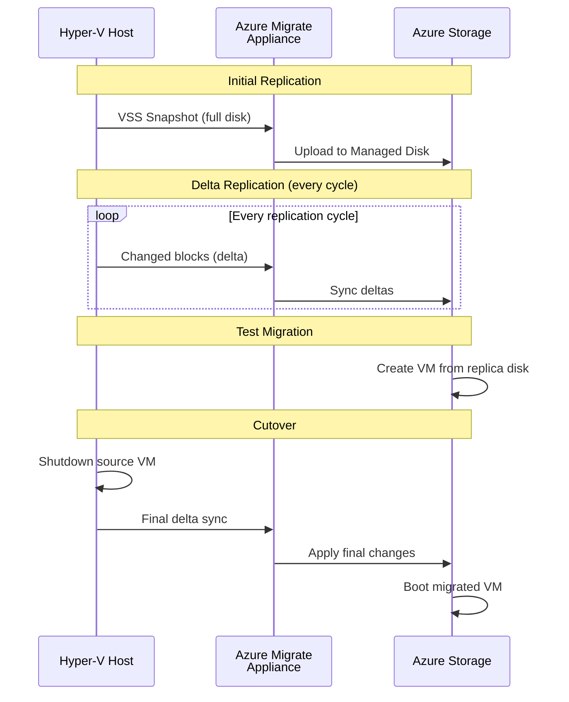
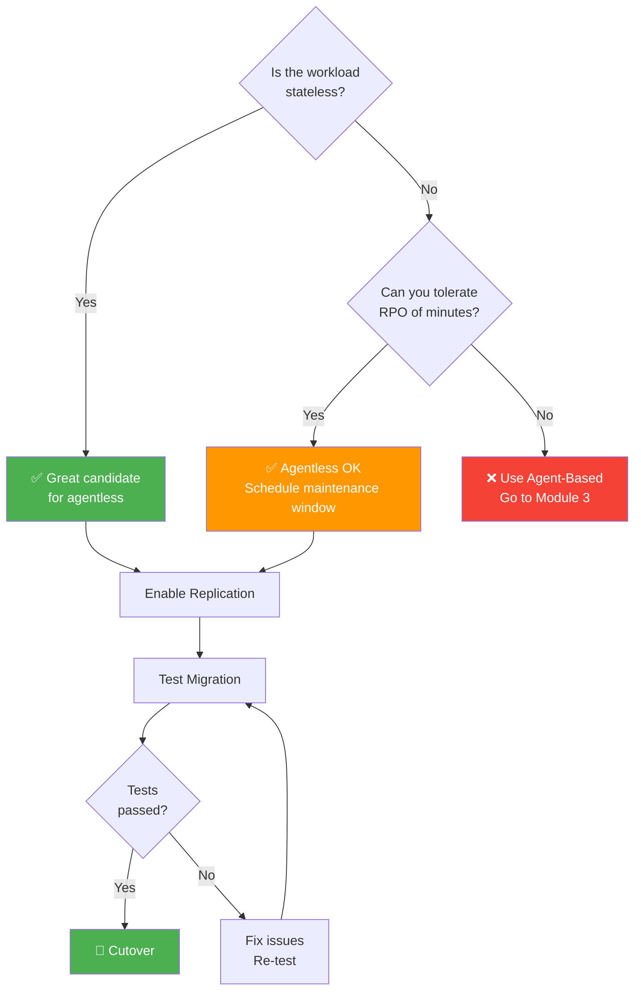

# Module 2: Agentless Migration — Zero-Footprint Migration

| **Estimated Time** | 60–90 minutes |
|---------------------|---------------|
| **Level**           | Advanced — Cloud Solution Architect |
| **Prerequisites**   | Module 1 (Discovery & Assessment) completed |
| **CAF Phase**       | **Migrate** — Cloud Adoption Framework |

---

## 1. Overview — Zero-Footprint Migration: When and Why

Agentless migration is a **zero-footprint** approach: no software is installed on the source VMs, no agents to manage, and no attack surface expansion on production workloads. As a Cloud Solution Architect, understanding what happens under the hood is essential for setting stakeholder expectations and designing migration waves.

### How It Works Architecturally

Agentless migration for Hyper-V leverages the hypervisor's native snapshot and change-tracking capabilities. The Azure Migrate appliance orchestrates the entire flow without touching the guest OS:

1. **Initial Snapshot** — Azure Migrate triggers a Hyper-V VSS (Volume Shadow Copy Service) snapshot of the VM's virtual disks.
2. **Full Replication** — The appliance reads the snapshot and streams all disk blocks to Azure-managed replica disks via HTTPS (port 443).
3. **Delta Sync Cycles** — On subsequent intervals, Hyper-V's Resilient Change Tracking (RCT) identifies changed blocks since the last snapshot. Only deltas are transferred.
4. **Final Sync & Cutover** — During cutover, a final delta sync captures the last changes, the source VM is optionally shut down, and the Azure VM boots from the replica disks.

```
┌──────────────────┐     VSS Snapshot      ┌─────────────────────┐
│  Source VM        │ ─────────────────────→ │  Hyper-V Host       │
│  (No agent)       │     RCT Deltas        │  (Change Tracking)  │
└──────────────────┘                        └─────────┬───────────┘
                                                       │ HTTPS/443
                                                       ▼
                                            ┌─────────────────────┐
                                            │  Azure Migrate      │
                                            │  Appliance          │
                                            └─────────┬───────────┘
                                                       │ HTTPS/443
                                                       ▼
                                            ┌─────────────────────┐
                                            │  Azure Managed Disks│
                                            │  (Replica)          │
                                            └─────────────────────┘
```

#### Agentless Replication Flow



### RPO/RTO Characteristics

| Metric | Value | Implication |
|--------|-------|-------------|
| **RPO** | Snapshot interval (typically 5–15 minutes) | Data changes between snapshots are at risk during unplanned events |
| **RTO** | VM boot time (2–5 minutes) | Includes final delta sync + Azure VM provisioning |
| **Initial Sync** | Proportional to disk size ÷ bandwidth | Plan for 15–60 min in lab; hours in production with large disks |

### When to Choose Agentless

✅ **Use agentless for:**
- Stateless web servers, reverse proxies, load balancers
- Linux servers with standard configurations
- Non-critical workloads where minutes of RPO are acceptable
- Quick wins in early migration waves to build team confidence
- Environments where installing agents requires change advisory board (CAB) approval

❌ **Do not use agentless for:**
- Databases or stateful applications requiring near-zero RPO
- Physical servers (not supported)
- Workloads with high disk churn rates (delta sync intervals may not keep pace)
- VMs with shared disks, pass-through disks, or ultra-large disks (>4 TB)

> **⚠️ Limitation Awareness:** Agentless replication is periodic, not continuous. Between snapshot intervals, changes are not protected. For mission-critical workloads, see [Module 3: Agent-Based Migration](Module-3-Agent-Based-Migration.md).

#### Agentless Migration Decision



---

## 2. Migration Runbook — CSA Artifact

A Cloud Solution Architect treats every migration as a **controlled operation**, not an ad-hoc activity. Before touching the portal, you produce a migration runbook. This section frames Module 2 as that runbook.

### Pre-Migration Checklist

- [ ] Assessment from Module 1 reviewed — VM compatibility confirmed, no blockers
- [ ] Target Azure landing zone resources provisioned (Resource Group, VNet, Subnet, NSG)
- [ ] Azure RBAC permissions verified — migration operator has Contributor on target RG
- [ ] Rollback plan documented and reviewed with application owner
- [ ] Source VM backup taken (Hyper-V checkpoint or independent backup)
- [ ] Azure subscription quota confirmed for target VM SKUs
- [ ] Network line-of-sight verified: appliance → Azure (HTTPS/443)

### Migration Window Planning

| Factor | Workshop (This Lab) | In Production |
|--------|-------------------|---------------|
| **Window type** | Anytime | Scheduled maintenance window |
| **Duration** | 1–2 hours | 2–4 hours (including validation) |
| **Business hours?** | N/A | Avoid — migrate during off-peak |
| **Approval required?** | No | CAB/change management ticket |

### Communication Plan

| When | Who to Notify | Message |
|------|---------------|---------|
| **T-7 days** | Application owners, operations team | Migration scheduled for [date/time]. Maintenance window: [duration]. |
| **T-1 hour** | Operations team, on-call engineers | Migration starting in 1 hour. Monitoring dashboards: [link]. |
| **T-0 (start)** | All stakeholders | Migration in progress. Source VMs will be shut down. ETA: [time]. |
| **T+complete** | All stakeholders | Migration complete. Validation in progress. |
| **T+validated** | All stakeholders | Migration validated. Production traffic restored. |

### Success Criteria

Define "done" before you start:

- [ ] Azure VMs are running and reachable
- [ ] Application responds with HTTP 200 and correct content
- [ ] Internal network connectivity verified (VM-to-VM, VM-to-DNS)
- [ ] Performance baseline is within acceptable range vs. on-premises
- [ ] Monitoring and alerting are active on migrated VMs
- [ ] Rollback window is established (48–72 hours)

---

## 3. Prerequisites

- ✅ Module 1 completed — Azure Migrate project created and appliance deployed
- ✅ All 4 guest VMs discovered in Azure Migrate
- ✅ The following VMs are running inside Hyper-V on the host:

| VM Name             | OS                    | Role        | IP Address    |
|---------------------|-----------------------|-------------|---------------|
| OnPrem-Web          | Windows Server 2022   | IIS         | 192.168.0.10  |
| OnPrem-Linux-Web    | Ubuntu 22.04          | Nginx       | 192.168.0.12  |

- ✅ Azure subscription with sufficient quota for at least 2× Standard_B2s VMs
- ✅ A target Resource Group and Virtual Network in Azure

---

## 4. Step 1 — Prepare for Migration

### 4.1 Navigate to Azure Migrate

1. Open the [Azure Portal](https://portal.azure.com).
2. Search for **Azure Migrate** in the top search bar and select it.
3. Click **Servers, databases and web apps** in the left menu.


### 4.2 Open the Migration Tool

1. In the **Migration tools** tile, locate **Azure Migrate: Server Migration**.
2. Click **Discover** to begin the discovery process for migration.

### 4.3 Select Hyper-V as the Source

1. In the **Discover** dialog, for **Are your machines virtualized?**, select **Yes, with Hyper-V**.
2. Select the **Target region** where you want to migrate VMs.
3. Confirm that the Azure Migrate appliance you deployed in Module 1 appears as registered.


> **Note:** If the appliance does not appear, verify it is powered on and has network connectivity to Azure. You may need to wait a few minutes for registration to propagate.

4. Click **Finalize discovery** once the appliance is confirmed.

**Expected Outcome:** The Azure Migrate: Server Migration tool shows the appliance as registered and ready for replication.

---

## 5. Step 2 — Configure Replication (OnPrem-Web)

### 5.1 Start the Replication Wizard

1. In **Azure Migrate: Server Migration**, click **Replicate**.
2. In the **Source settings** tab:
   - **Are your machines virtualized?** → Select **Yes, with Hyper-V**
   - **Azure Migrate Appliance** → Select your appliance from the dropdown
3. Click **Next**.


### 5.2 Select the Virtual Machine

1. In the **Virtual machines** tab, select **Yes** for **Import migration settings from an assessment** if you ran an assessment in Module 1, or select **No** to configure manually.
2. Locate **OnPrem-Web** in the VM list and check the box next to it.
3. Click **Next**.

### 5.3 Configure Target Settings

1. **Subscription** — Select your Azure subscription.
2. **Resource Group** — Select or create a resource group (e.g., `rg-migrate-workshop`).
3. **Replication Storage Account** — Select or create a storage account for replication data.
4. **Virtual Network** — Select the target VNet for the migrated VM.
5. **Subnet** — Select the appropriate subnet.
6. Click **Next**.

> **🏗️ In Production — Resource Group Strategy:**
> Do not dump all migrated VMs into a single resource group. Align your RG strategy with your landing zone design:
> - **By workload:** `rg-webapp-prod`, `rg-webapp-dev` — best for application teams with RBAC boundaries
> - **By environment:** `rg-prod-migrate`, `rg-staging-migrate` — good for centralized operations
> - **By migration wave:** `rg-wave1-migrate` — temporary, consolidate post-migration
>
> The VNet/Subnet design should follow your **hub-spoke network topology**. Migrated VMs land in a spoke VNet with NSG rules pre-configured. Never migrate directly into a hub network.

### 5.4 Configure Compute Settings

1. **VM Name** — Accept the default (`OnPrem-Web`) or customize.
2. **Azure VM Size** — Select **Standard_B2s** (2 vCPUs, 4 GB RAM).
3. **OS Type** — Select **Windows**.
4. **OS Disk** — Select the boot disk.

```
Recommended VM Size: Standard_B2s
  vCPUs: 2
  Memory: 4 GB
  Temporary Storage: 8 GB
```

5. Click **Next**.


> **🏗️ In Production — Naming Conventions:**
> Post-migration VM names should follow your organization's naming standard. Example: `vm-web-prod-001` rather than carrying over the on-premises name. Rename during this step, not after migration.

### 5.5 Configure Disk Settings

1. Review the list of disks attached to OnPrem-Web.
2. Select all disks you want to replicate (typically all).
3. Choose the **disk type** for each disk in Azure:
   - **Standard HDD** — Cost-effective for dev/test
   - **Standard SSD** — Recommended for most workloads
   - **Premium SSD** — For production/high-performance workloads
4. Click **Next**.

> **🏗️ In Production — Storage Selection:**
> Match the disk tier to workload requirements. Standard SSD (E-series) covers most web workloads. Reserve Premium SSD (P-series) for IOPS-sensitive applications. Choose **LRS** (Locally Redundant Storage) for non-critical workloads or **ZRS** for zone-resilient deployments.

### 5.6 Review and Start Replication

1. Review all settings on the summary page.
2. Click **Replicate** to begin replication.

**Expected Outcome:** A replication job starts for OnPrem-Web. The status will show as **Enabling protection** initially.

---

## 6. Step 3 — Configure Replication (OnPrem-Linux-Web)

Repeat the replication process for the Linux web server.

### 6.1 Start Replication

1. In **Azure Migrate: Server Migration**, click **Replicate** again.
2. Configure source settings as before (Hyper-V, same appliance).

### 6.2 Select the Virtual Machine

1. Locate **OnPrem-Linux-Web** in the VM list and select it.
2. Click **Next**.

### 6.3 Configure Target Settings

1. Use the same subscription, resource group, and VNet as OnPrem-Web.
2. Click **Next**.

### 6.4 Configure Compute Settings

1. **VM Name** — `OnPrem-Linux-Web`
2. **Azure VM Size** — **Standard_B2s**
3. **OS Type** — Select **Linux**
4. Click **Next**.

> **⚠️ Warning:** Ensure you select **Linux** as the OS type. Selecting the wrong OS type can cause boot issues after migration. Azure uses this to configure the boot loader, kernel drivers, and guest agent correctly.

### 6.5 Configure Disks and Start Replication

1. Select all disks for replication.
2. Choose **Standard SSD** for disk type.
3. Review and click **Replicate**.


**Expected Outcome:** Both OnPrem-Web and OnPrem-Linux-Web now show replication jobs in progress.

---

## 7. Step 4 — Monitor Replication

### 7.1 View Replication Status

1. In **Azure Migrate: Server Migration**, click **Replicating servers** (or the count displayed in the tile).
2. You will see both VMs listed with their current replication status.


### 7.2 Understand Replication States

| State                     | Description                                              | Action Required |
|---------------------------|----------------------------------------------------------|-----------------|
| **Enabling protection**   | Initial configuration is being applied                   | Wait |
| **Initial replication**   | Full disk data is being copied to Azure                  | Monitor bandwidth |
| **Protected**             | Initial replication complete; delta replication is active | Ready for test migration |
| **Planned failover pending** | Ready for test or production migration                | Proceed to next step |

### 7.3 Check Replication Health

1. Click on a VM name to open the **replication details** blade.
2. Review:
   - **Replication health** — Should show **Healthy**
   - **Latest recovery point** — Timestamp of the last successful sync
   - **Infrastructure view** — Visual diagram of the replication pipeline

> **Note:** Initial replication can take **15–30 minutes** depending on disk size and network bandwidth. In a lab environment with nested virtualization, this may take longer.

### 7.4 Monitor via PowerShell (Optional)

```powershell
# Connect to Azure (if not already connected)
Connect-AzAccount

# List all replicating servers in the Azure Migrate project
Get-AzMigrateServerReplication `
    -ResourceGroupName "rg-migrate-workshop" `
    -ProjectName "your-migrate-project-name"
```

> **🏗️ In Production — Monitoring at Scale:**
> For large migration waves, use Azure Monitor Workbooks or Power BI dashboards connected to Azure Migrate data to track replication health across dozens or hundreds of VMs. Set up Azure Monitor alerts for replication health degradation — do not rely on manual portal checks.

**Expected Outcome:** Both VMs reach the **Protected** state, indicating initial replication is complete and they are ready for migration.

---

## 8. Step 5 — Test Migration (CRITICAL)

> **🛡️ CSA Position: Test migration is NON-NEGOTIABLE.** It is the single most important risk mitigation step in any migration. Skipping test migration to "save time" is a false economy — the cost of a failed production cutover (downtime, data loss, rollback complexity) dwarfs the 30 minutes a test migration takes. Every production migration failure I have seen in the field could have been caught by a test migration.

Test migration creates a complete copy of the VM in Azure using an isolated test VNet. It does not affect the source VM, production replication, or production networking.

### 8.1 Design the Isolated Test Network

The test VNet must be **completely isolated** — no peering to production VNets, no DNS integration, no shared subnets. This prevents:
- DNS pollution (test VMs registering in production DNS)
- IP conflicts with production workloads
- Unintended client traffic hitting test VMs

```powershell
# Create a test VNet for test migrations
New-AzVirtualNetwork `
    -Name "vnet-migrate-test" `
    -ResourceGroupName "rg-migrate-workshop" `
    -Location "your-azure-region" `
    -AddressPrefix "10.100.0.0/16"

# Add a subnet to the test VNet
$vnet = Get-AzVirtualNetwork -Name "vnet-migrate-test" -ResourceGroupName "rg-migrate-workshop"
Add-AzVirtualNetworkSubnetConfig `
    -Name "subnet-test" `
    -VirtualNetwork $vnet `
    -AddressPrefix "10.100.1.0/24"
$vnet | Set-AzVirtualNetwork
```

### 8.2 Test Migrate OnPrem-Web

1. In the **Replicating machines** view, click on **OnPrem-Web**.
2. Click **Test migration** in the toolbar.
3. Select **vnet-migrate-test** as the virtual network.
4. Click **Test migration** to start.


5. Wait for the test migration job to complete (approximately 10–15 minutes).

### 8.3 Validate the Windows IIS Test VM

1. Navigate to **Virtual Machines** in the Azure Portal.
2. Locate the test VM (named `OnPrem-Web-test`).
3. Assign a public IP or use Azure Bastion to connect.
4. **RDP into the test VM** and run the validation checklist:

**Validation Checklist — IIS Web Server:**

| # | Check | Command | Expected Result |
|---|-------|---------|-----------------|
| 1 | IIS service running | `Get-Service -Name W3SVC` | Status: Running |
| 2 | HTTP response | `Invoke-WebRequest -Uri http://localhost -UseBasicParsing \| Select-Object StatusCode` | StatusCode: 200 |
| 3 | Correct content | `(Invoke-WebRequest -Uri http://localhost -UseBasicParsing).Content \| Select-String "IIS"` | Content contains expected text |
| 4 | Network connectivity | `Test-NetConnection -ComputerName 8.8.8.8 -Port 443` | TcpTestSucceeded: True |
| 5 | DNS resolution | `Resolve-DnsName www.microsoft.com` | Resolves successfully |
| 6 | Disk integrity | `Get-Volume` | All volumes healthy |

```powershell
# Run all checks
Get-Service -Name W3SVC
Invoke-WebRequest -Uri http://localhost -UseBasicParsing | Select-Object StatusCode
Get-Volume | Format-Table DriveLetter, FileSystemLabel, HealthStatus, SizeRemaining
```

> **🏗️ In Production — Documenting Test Results:**
> Capture test migration results in a structured format for audit and compliance. Include screenshots, command output, and sign-off from the application owner. For regulated industries (healthcare, finance), this documentation may be a compliance requirement.

**Expected Outcome:** IIS is running and serving the default website on the test VM.

### 8.4 Test Migrate OnPrem-Linux-Web

1. Return to **Replicating machines** and click on **OnPrem-Linux-Web**.
2. Click **Test migration** → Select the test VNet → Click **Test migration**.
3. Wait for the test migration to complete.

### 8.5 Validate the Linux Nginx Test VM

1. Locate the test VM `OnPrem-Linux-Web-test`.
2. **SSH into the test VM** and verify:

```bash
# Check Nginx status
sudo systemctl status nginx

# Verify HTTP response
curl -s -o /dev/null -w "%{http_code}" http://localhost

# Verify correct content is served
curl -s http://localhost | head -20

# Check disk health
df -h
lsblk
```

**Expected Outcome:** Nginx is running and serving the default web page on the test VM.

### 8.6 Clean Up Test Migrations

1. Return to the **Replicating machines** view in Azure Migrate.
2. For each VM, click **Clean up test migration**.
3. Select **Testing is complete. Delete test virtual machine**.
4. Click **Clean up test** to delete the test VMs.

> **⚠️ Warning:** Always clean up test migrations before performing the production migration. Leaving test VMs running incurs costs, creates resource sprawl, and may cause confusion during cutover.

**Expected Outcome:** Test VMs are deleted and replication status returns to **Protected**.

---

## 9. Step 6 — Cutover Planning & Execution

#### Cutover Timeline

```mermaid
gantt
    title Cutover Timeline
    dateFormat HH:mm
    axisFormat %H:%M
    section Preparation
    Reduce DNS TTL          :done, t1, 00:00, 30min
    Notify stakeholders     :done, t2, 00:30, 15min
    section Migration
    Final delta sync        :active, t3, 00:45, 15min
    Shutdown source VMs     :t4, after t3, 5min
    Boot Azure VMs          :t5, after t4, 10min
    section Validation
    Smoke tests             :t6, after t5, 15min
    Update DNS records      :t7, after t6, 10min
    Monitor (rollback window):crit, t8, after t7, 120min
```



### 9.1 Cutover Checklist

A CSA's cutover checklist goes beyond "click Migrate":

**T-7 Days (One Week Before):**
- [ ] Reduce DNS TTL to 300 seconds (5 minutes) for all records pointing to source VMs
- [ ] Confirm rollback plan with application owner — signed off
- [ ] Verify target NSG rules allow required traffic (HTTP/80, HTTPS/443)
- [ ] Schedule maintenance window with all stakeholders
- [ ] Prepare monitoring dashboards for migrated VMs

**T-1 Hour (Pre-Cutover):**
- [ ] Verify replication health is **Healthy** for all VMs
- [ ] Confirm latest recovery point is within acceptable RPO
- [ ] Notify stakeholders: *"Migration starting in 1 hour"*
- [ ] Application team confirms users have been notified

**T-0 (Cutover):**
- [ ] Initiate migration with source VM shutdown
- [ ] Monitor final delta sync completion
- [ ] Verify Azure VMs are running
- [ ] Run smoke tests on migrated VMs
- [ ] Update DNS records to point to Azure VM IPs
- [ ] Notify stakeholders: *"Migration complete — validation in progress"*

**T+1 Hour (Post-Cutover):**
- [ ] Application-level validation complete
- [ ] Performance baseline comparison (before vs after)
- [ ] Configure Azure Backup on migrated VMs
- [ ] Enable Azure Monitor and configure alerts
- [ ] Notify stakeholders: *"Migration validated — production traffic restored"*

### 9.2 IP Address Management Strategy

| Strategy | When to Use | Considerations |
|----------|-------------|----------------|
| **Retain IPs** | Site-to-site VPN/ExpressRoute with on-premises | Requires careful subnet planning; source VMs must be powered off |
| **Reassign IPs** | Clean break from on-premises | Requires DNS updates and connection string changes |
| **Azure Private DNS** | Long-term best practice | Decouple applications from IP addresses |

### 9.3 Execute Migration — OnPrem-Web

1. In **Replicating machines**, select **OnPrem-Web**.
2. Click **Migrate** in the toolbar.
3. In the migration dialog:
   - **Shut down the source VM before migration?** → Select **Yes** (recommended for data consistency)
   - Review the summary
4. Click **Migrate**.

> **Note:** Shutting down the source VM ensures that no data changes are lost during the final delta sync. The source VM remains available on-premises for rollback — do not delete it yet.

### 9.4 Execute Migration — OnPrem-Linux-Web

1. Select **OnPrem-Linux-Web** and click **Migrate**.
2. Choose to shut down the source VM → Click **Migrate**.

### 9.5 Monitor Migration Progress

1. Click **Jobs** in the left menu of Azure Migrate to see migration job status.
2. Wait for both migrations to show **Completed**.


The migration engine executes these steps automatically:

1. **Final delta replication** — Captures all changes since last sync
2. **Source VM shutdown** — Graceful OS shutdown (if selected)
3. **Azure VM creation** — Provisions VM from replica managed disks
4. **Azure VM boot** — Starts the VM with Azure Guest Agent

**Expected Outcome:** Both VMs are migrated to Azure and showing as **Running** in the Virtual Machines blade.

---

## 10. Step 7 — Post-Migration Validation

### 10.1 Verify VMs Are Running

```powershell
# List migrated VMs
Get-AzVM -ResourceGroupName "rg-migrate-workshop" -Status | `
    Select-Object Name, PowerState, Location
```

### 10.2 Application-Level Smoke Tests — IIS

1. Connect to OnPrem-Web via RDP or Azure Bastion.
2. Run the full validation suite:

```powershell
# Service health
Get-Service W3SVC | Select-Object Name, Status

# IIS site configuration
Get-IISSite

# Local HTTP test
Invoke-WebRequest -Uri http://localhost -UseBasicParsing | Select-Object StatusCode

# Verify event logs for errors
Get-EventLog -LogName Application -EntryType Error -After (Get-Date).AddHours(-1) -ErrorAction SilentlyContinue
```

3. From an external machine (if a public IP is assigned):

```powershell
Invoke-WebRequest -Uri http://<public-ip-of-web-vm> -UseBasicParsing | Select-Object StatusCode
```

### 10.3 Application-Level Smoke Tests — Nginx

1. Connect to OnPrem-Linux-Web via SSH or Azure Bastion.

```bash
# Service health
sudo systemctl status nginx

# HTTP response verification
curl -I http://localhost

# Check listening ports
sudo ss -tlnp | grep ':80'

# Check system logs for errors
sudo journalctl -u nginx --since "1 hour ago" --no-pager | tail -20
```

### 10.4 Network Connectivity Verification

```powershell
# From the Windows VM — verify connectivity to Linux VM
Test-NetConnection -ComputerName <private-ip-of-linux-vm> -Port 80
```

```bash
# From the Linux VM — verify connectivity to Windows VM
ping -c 4 <private-ip-of-windows-vm>
curl -s http://<private-ip-of-windows-vm>
```

### 10.5 Security Posture Verification

> **🏗️ In Production — This step is mandatory, not optional.**

- [ ] NSG rules reviewed — only required ports are open (no wildcard `*` rules)
- [ ] Azure Defender for Servers enabled (or confirm organizational policy)
- [ ] Disk encryption status verified (Azure-managed keys at minimum)
- [ ] No public IPs assigned unless explicitly required and approved
- [ ] Just-in-Time VM access configured for management ports (RDP/SSH)

### 10.6 DNS Update & Validation

1. Update DNS records to point to the new Azure private/public IPs.
2. Verify resolution from client machines:

```powershell
Resolve-DnsName "webapp.contoso.com"
```

3. Restore DNS TTL to standard values (e.g., 3600 seconds) after validation period.

> **Tip:** Consider using Azure Private DNS Zones for name resolution within the VNet. This decouples your applications from IP addresses and simplifies future maintenance.

### 10.7 Backup & Monitoring Configuration

- [ ] Enable **Azure Backup** with appropriate retention policy
- [ ] Configure **Azure Monitor** agent and diagnostic settings
- [ ] Set up **alerts** for VM availability, CPU, memory, disk
- [ ] Verify VMs are visible in **Azure Monitor VM Insights**

**Expected Outcome:** Both migrated VMs are fully functional in Azure with workloads (IIS and Nginx) serving content, security controls applied, and monitoring active.

---

## 11. Rollback Strategy

A CSA always has a rollback plan — and knows exactly when to trigger it.

### When to Rollback

| Trigger | Threshold | Action |
|---------|-----------|--------|
| Application errors | HTTP 5xx rate > 5% | Rollback |
| Performance degradation | Latency > 200% of baseline | Investigate, rollback if unresolvable in 1 hour |
| Data integrity issues | Any data corruption detected | Immediate rollback |
| Network connectivity | Cannot reach dependent services | Investigate, rollback if unresolvable in 30 minutes |

### How to Rollback

1. **Power on the source VMs** on the Hyper-V host (they were shut down, not deleted).
2. **Update DNS records** to point back to on-premises IPs.
3. **Notify stakeholders:** *"Rollback initiated due to [reason]. Services restored to on-premises. Root cause analysis in progress."*
4. **Deallocate (do not delete)** the Azure VMs — you may reattempt migration after fixing the issue.

### Rollback Window

- **Recommended:** Maintain source VMs in their shutdown state for **48–72 hours** after cutover.
- **Do not decommission** source infrastructure until the application owner signs off on migration success.
- After the rollback window expires, take a final snapshot of source VMs before decommissioning.

> **🏗️ In Production:** For regulated environments, extend the rollback window to match your change management policy (often 5–7 business days). Document the decommission decision with timestamps and approvals.

---

## Key Takeaways

1. **Agentless = zero footprint, periodic sync.** Ideal for stateless workloads and quick wins in early migration waves.
2. **Test migration is non-negotiable.** It is the cheapest insurance policy in your migration toolkit.
3. **Migration is an operation, not a click.** Treat it with the same rigor as a production deployment: runbook, checklist, communication plan, rollback criteria.
4. **Post-migration is half the work.** Security posture, monitoring, backup, and DNS are not optional follow-ups — they are part of the migration definition of done.
5. **Keep source VMs for 48–72 hours.** The rollback window is not paranoia — it is professional risk management.

---

## Next Steps

Proceed to **[Module 3: Agent-Based Migration](Module-3-Agent-Based-Migration.md)** to migrate the remaining VMs (OnPrem-SQL and OnPrem-Linux-App) using the agent-based approach — the right choice for stateful, mission-critical workloads requiring continuous replication and near-zero RPO.
