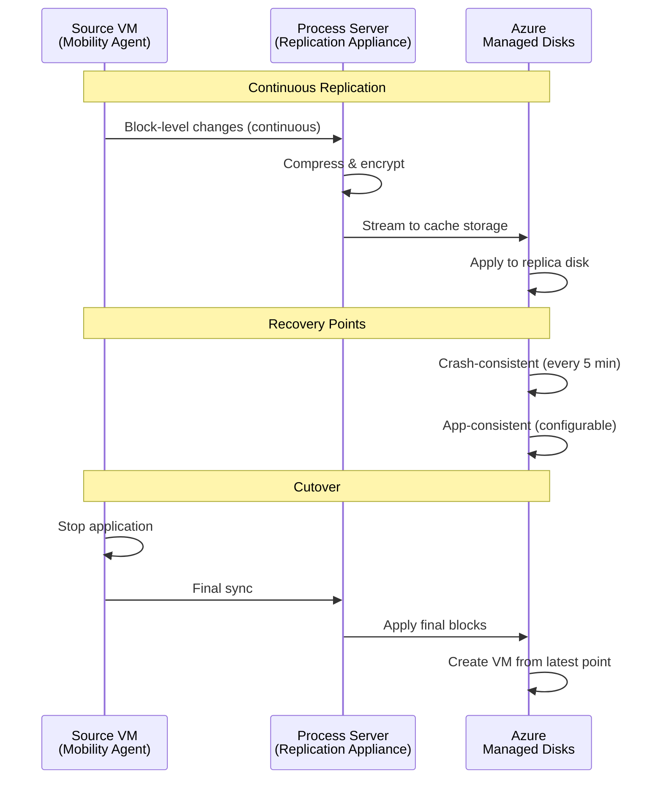
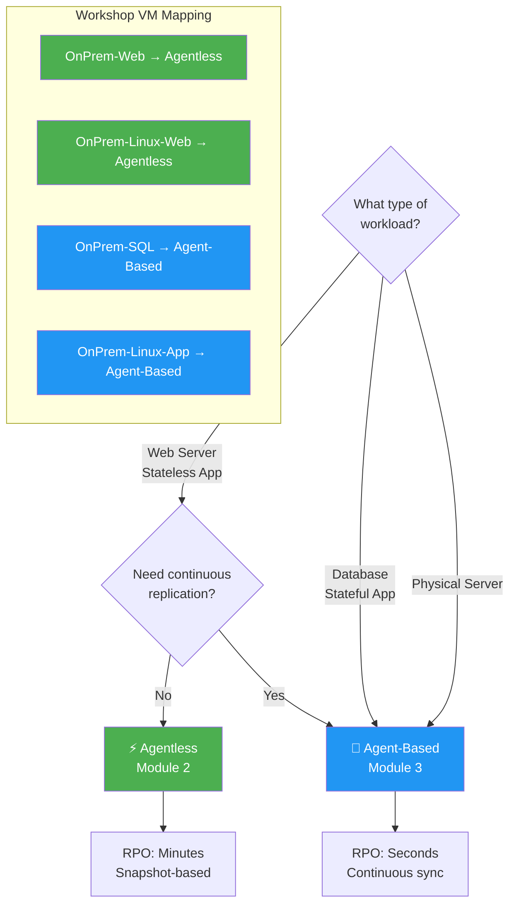
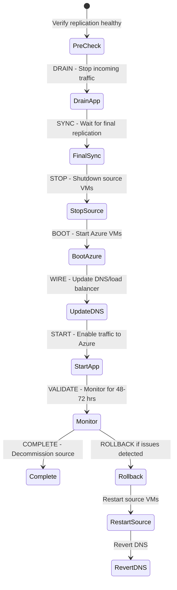

# Module 3: Agent-Based Migration — Continuous Replication for Mission-Critical Workloads

| **Estimated Time** | 75–90 minutes |
|---------------------|---------------|
| **Level**           | Advanced — Cloud Solution Architect |
| **Prerequisites**   | Module 1 (Discovery & Assessment) and Module 2 (Agentless Migration) completed |
| **CAF Phase**       | **Migrate** — Cloud Adoption Framework |

---

## 1. Overview — Continuous Replication for Mission-Critical Workloads

When a workload has state — a database with open transactions, a file server with active writes, a domain controller managing authentication — you cannot tolerate the gap between periodic snapshots. Agent-based migration solves this with **continuous, block-level replication** that achieves near-zero RPO.

### How It Works Architecturally

Agent-based migration deploys a **Mobility Service agent** on each source VM. This agent intercepts disk writes at the block level, streams them to a dedicated **replication appliance** (process server + configuration server), which forwards them to Azure cache storage and ultimately to Azure-managed replica disks.

```
┌──────────────────┐     Block-level changes     ┌───────────────────────┐
│  Source VM        │ ──────────────────────────→  │  Replication Appliance│
│  (Mobility Agent) │     Continuous stream        │  ┌─────────────────┐ │
│  - SQL Server     │     Port 9443                │  │ Process Server  │ │
│  - Node.js App    │                              │  │ Config Server   │ │
└──────────────────┘                               │  └─────────────────┘ │
                                                   └──────────┬──────────┘
                                                              │ HTTPS/443
                                                              ▼
                                                   ┌─────────────────────┐
                                                   │  Azure Cache Storage│
                                                   │  → Managed Disks    │
                                                   │  (Replica)          │
                                                   └─────────────────────┘
```

**The replication pipeline:**

1. **Change tracking** — The Mobility Service agent hooks into the OS I/O stack, capturing every disk write at the block level.
2. **Compression & streaming** — Changed blocks are compressed and streamed to the process server over port 9443.
3. **Cache & commit** — The process server caches data locally, then uploads to Azure cache storage accounts.
4. **Replica disk write** — Azure writes the data to replica managed disks, maintaining both crash-consistent and application-consistent recovery points.
5. **Cutover** — A final sync drains remaining changes, the source VM is shut down, and the Azure VM boots from replica disks.

#### Agent-Based Replication Flow



### RPO/RTO Characteristics

| Metric | Value | Implication |
|--------|-------|-------------|
| **RPO** | Near-zero (seconds to minutes) | Continuous replication means minimal data loss — critical for databases |
| **RTO** | Minutes (final sync + VM boot) | Cutover is fast regardless of total data volume |
| **Initial Sync** | Proportional to disk size ÷ bandwidth | Can take hours for large databases — plan around this |
| **Ongoing Overhead** | Low CPU/memory on source VM | Agent typically uses 5–10% CPU; monitor for high-churn workloads |

### When to Choose Agent-Based

✅ **Use agent-based for:**
- **Databases** — SQL Server, MySQL, PostgreSQL — anything with transaction logs and open connections
- **Stateful applications** — File servers, domain controllers, applications with persistent sessions
- **Tight RPO requirements** — When losing even minutes of data is unacceptable
- **Physical servers** — The only migration option for bare-metal servers
- **Multi-cloud sources** — AWS EC2 instances, GCP Compute Engine VMs

❌ **Agent-based is overkill for:**
- Stateless web servers (use agentless — Module 2)
- Dev/test VMs where RPO doesn't matter
- Environments where installing agents is prohibited by policy

### The Replication Appliance Architecture

The replication appliance runs two critical roles:

| Component | Role | Resource Needs |
|-----------|------|---------------|
| **Configuration Server** | Coordinates replication, manages agent registration, stores metadata | 8 GB RAM minimum |
| **Process Server** | Receives replication data, compresses, caches, uploads to Azure | CPU and disk-intensive; scale based on churn |

> **🏗️ In Production:** For large migrations, deploy **dedicated process servers** separate from the configuration server. A single process server handles approximately 200 VMs or 2 TB of daily churn. Add process servers for scale, not configuration servers.

---

## 2. Agentless vs. Agent-Based — Decision Matrix

This is the decision matrix a CSA uses when categorizing workloads into migration waves:

| Criteria | Agentless | Agent-Based |
|----------|-----------|-------------|
| **Source impact** | Zero — no software installed on source VMs | Mobility Service agent required on each VM |
| **RPO** | Snapshot interval (5–15 minutes) | Near-zero (seconds) |
| **Replication type** | Periodic Hyper-V/VMware snapshots | Continuous block-level streaming |
| **Best for** | Stateless, non-critical, quick wins | Databases, stateful, mission-critical |
| **Supported sources** | Hyper-V, VMware only | Hyper-V, VMware, Physical, AWS, GCP |
| **Application consistency** | Crash-consistent only | Application-consistent snapshots (VSS) |
| **Network overhead** | Low (periodic bursts) | Moderate (continuous stream) |
| **Rollback complexity** | Simple — source VM untouched | Moderate — agent must be uninstalled |
| **Scale limits** | ~300 VMs per appliance | ~200 VMs per process server |
| **Setup complexity** | Minimal — uses existing appliance | Moderate — dedicated appliance + agent per VM |
| **Change control impact** | None — no changes to source VMs | Requires change ticket for agent installation |

> **CSA Decision Rule:** If the workload has state (databases, file shares, session stores) or requires RPO < 15 minutes, choose agent-based. For everything else, default to agentless for operational simplicity.

#### Agentless vs Agent-Based Decision Tree



---

## 3. Stateful Workload Migration Strategy

Before touching the portal, a CSA defines the **stateful migration strategy**. Databases and stateful applications require coordinated cutover — you cannot migrate SQL Server at 2 PM and the application that depends on it at 4 PM.

### Application-Consistent Snapshots: Why They Matter

| Snapshot Type | What It Captures | Risk If Used for Database |
|--------------|------------------|---------------------------|
| **Crash-consistent** | Disk state at a point in time | Database may require crash recovery on boot; potential data loss of in-flight transactions |
| **Application-consistent** | VSS-coordinated flush of application buffers to disk | Database is in a clean, consistent state — no recovery needed |

Agent-based migration supports **application-consistent snapshots** via VSS (Windows) and pre/post scripts (Linux). For SQL Server, this means all committed transactions are flushed to disk before the snapshot is taken.

### SQL Server Migration Considerations

| Concern | Strategy |
|---------|----------|
| **Transaction log handling** | Continuous replication captures all log writes. During cutover, ensure no active transactions. |
| **Always On AG / FCI** | Migrate secondary replicas first, failover AG to Azure, then migrate primary. Complex — consider Azure SQL migration tools instead. |
| **Post-migration integrity** | Run `DBCC CHECKDB` on every user database immediately after migration |
| **Connection strings** | Catalog all applications connecting to this SQL Server. Plan connection string updates as part of the cutover. |
| **TempDB and log locations** | Azure VM may have different drive letters. Verify TempDB and log file paths post-migration. |
| **Recovery model** | Verify recovery model (FULL/SIMPLE) is preserved. Check backup chain is not broken. |

### Node.js / Application Server Considerations

| Concern | Strategy |
|---------|----------|
| **Stateless vs stateful** | If truly stateless, consider agentless. If using local sessions, file uploads, or SQLite — agent-based. |
| **Environment variables** | Document all env vars (DB_HOST, API_KEY, etc.) that reference on-premises resources. Update post-migration. |
| **Service discovery** | If the app discovers services by IP or hostname, update service registry/DNS post-migration. |
| **Process manager** | Verify PM2/systemd auto-starts the application on boot. Test this during test migration. |
| **Port bindings** | Confirm NSG rules allow inbound traffic on application ports (e.g., 3000, 8080). |

---

## 4. Prerequisites

- ✅ Module 1 completed — Azure Migrate project with VMs discovered
- ✅ The following VMs are running inside Hyper-V:

| VM Name              | OS                    | Role                   | IP Address    |
|----------------------|-----------------------|------------------------|---------------|
| OnPrem-SQL           | Windows Server 2022   | SQL Server 2019 Express| 192.168.0.11  |
| OnPrem-Linux-App     | Ubuntu 22.04          | Node.js Express app    | 192.168.0.13  |

- ✅ RDP access to OnPrem-SQL and SSH access to OnPrem-Linux-App
- ✅ Azure subscription with quota for 2× Standard_B2s VMs
- ✅ Target Resource Group and Virtual Network in Azure

---

## 5. Step 1 — Deploy the Replication Appliance

The replication appliance is a dedicated Windows Server that manages all replication traffic between on-premises VMs and Azure. It is distinct from the Azure Migrate discovery appliance used in Module 1.

### 5.1 Download the Replication Appliance

1. In the Azure Portal, navigate to **Azure Migrate** → **Servers, databases and web apps**.
2. In the **Migration tools** section, click **Discover**.
3. For **Are your machines virtualized?**, select **Physical or other (AWS, GCP, etc.)**.
4. Select your **Target region**.
5. Click **Create resources** — this provisions the required Azure resources (Recovery Services vault, cache storage accounts).
6. Under **Install the replication appliance**, click **Download** to get the appliance installer.


> **Note:** Also download the **registration key** — you will need it to register the appliance with your Azure Migrate project. The key expires after 5 days.

### 5.2 Install the Replication Appliance

1. Copy the installer and registration key to a Windows Server machine on the same network as the source VMs (you can use the Hyper-V host or a dedicated VM).
2. Run the installer (`MicrosoftAzureSiteRecoveryUnifiedSetup.exe`) as Administrator.
3. In the setup wizard:
   - Select **Install the configuration server and process server**.
   - Accept the license terms.
   - Browse to the **registration key** file you downloaded.
   - Select the **NIC** that connects to the source VMs.
4. Wait for the installation to complete (approximately 10–15 minutes).

```powershell
# Silent installation (for automation or repeatable deployments)
.\MicrosoftAzureSiteRecoveryUnifiedSetup.exe /q /x:C:\ASR_Setup
cd C:\ASR_Setup
.\UNIFIEDSETUP.EXE /AcceptThirdpartyEULA `
    /servermode "CS" `
    /InstallLocation "C:\Program Files (x86)\Microsoft Azure Site Recovery" `
    /CSType CSLegacy
```

> **🏗️ In Production — Appliance Sizing:**
>
> | VMs to Migrate | Process Server CPU | Process Server RAM | Cache Disk |
> |----------------|--------------------|--------------------|------------|
> | Up to 100 | 8 vCPUs | 16 GB | 600 GB SSD |
> | 100–200 | 12 vCPUs | 24 GB | 1 TB SSD |
> | 200+ | Deploy additional process servers | — | — |
>
> The cache disk must be SSD and sized at minimum 2× the daily churn of all replicating VMs.

### 5.3 Register the Appliance

1. After installation, the **Azure Site Recovery Configuration Server** management tool opens automatically.
2. Add an account for push installation (or use manual installation as described in Steps 2 and 3).
3. Under **Vault Registration**, paste the registration key.
4. Verify the appliance appears in the Azure Portal under **Azure Migrate** → **Discovered items**.


> **Tip:** If the appliance management tool doesn't open automatically, launch it from the desktop shortcut `cspsconfigtool.exe`.

**Expected Outcome:** The replication appliance is installed, registered, and visible in the Azure Migrate portal.

---

## 6. Step 2 — Install Mobility Service on OnPrem-SQL (Windows)

The Mobility Service agent is the on-VM component that captures disk writes and streams them to the replication appliance.

### 6.1 Obtain the Mobility Service Installer

The installer is available on the replication appliance at:

```
\\<replication-appliance-ip>\C$\Program Files (x86)\Microsoft Azure Site Recovery\home\svsystems\pushinstallsvc\repository\
```

Or download it from the Azure Portal:
1. In Azure Migrate → **Replicating machines** → click **Prepare infrastructure**.
2. Download the **Mobility Service installer for Windows**.

> **🏗️ In Production — Agent Deployment at Scale:**
> - Use **push installation** from the replication appliance for small batches.
> - For 50+ VMs, use **SCCM, Intune, or Ansible** for silent agent deployment.
> - Always verify agent version compatibility with the process server version. Mismatches cause replication failures.
> - Firewall rule required: source VM → process server on **port 9443** (outbound).

### 6.2 Connect to OnPrem-SQL

1. RDP into OnPrem-SQL:

```powershell
mstsc /v:192.168.0.11
```

2. Use the administrator credentials configured during Module 1 setup.

### 6.3 Install the Mobility Service

1. Copy the installer to OnPrem-SQL.
2. Run the installer as Administrator:

```powershell
# Extract the installer
.\MicrosoftAzureSiteRecoveryMobilityService.exe /q /x:C:\Temp\ASR_Mobility
cd C:\Temp\ASR_Mobility

# Install the agent
.\UnifiedAgent.exe /Role "MS" `
    /InstallLocation "C:\Program Files (x86)\Microsoft Azure Site Recovery" `
    /Platform "VmWare" `
    /Silent
```

### 6.4 Register with the Replication Appliance

After installation, register the agent with your replication appliance:

```powershell
cd "C:\Program Files (x86)\Microsoft Azure Site Recovery\agent"

.\UnifiedAgentConfigurator.exe /CSEndPoint <replication-appliance-ip> /PassphraseFilePath <passphrase-file-path>
```

> **Note:** The passphrase file is generated during the replication appliance setup and can be found at `C:\ProgramData\Microsoft Azure Site Recovery\private\connection.passphrase` on the replication appliance.

### 6.5 Verify Agent Health

```powershell
# Check the Mobility Service is running
Get-Service -Name "InMage Scout VX Agent - Sentinel/Outpost" | Select-Object Name, Status
Get-Service -Name "svagents" | Select-Object Name, Status
```

You can also verify in the Azure Portal:
1. Navigate to **Azure Migrate** → **Discovered items**.
2. Confirm OnPrem-SQL shows the Mobility Service agent as **Connected**.


> **🏗️ In Production — Agent Monitoring:**
> Set up Azure Monitor alerts for agent health status changes. An agent going offline during replication means data is not being captured — you lose RPO protection until it reconnects. Monitor the `svagents` service on every protected VM.

**Expected Outcome:** The Mobility Service agent is installed and registered on OnPrem-SQL, showing as connected in the Azure Portal.

---

## 7. Step 3 — Install Mobility Service on OnPrem-Linux-App (Linux)

### 7.1 Connect to OnPrem-Linux-App

```bash
ssh adminuser@192.168.0.13
```

### 7.2 Download the Mobility Service Installer

```bash
# Download from the replication appliance
wget "http://<replication-appliance-ip>:9443/installers/download?type=linuxmobility" \
    -O MobilityServiceInstaller.tar.gz

# Or copy via scp
scp adminuser@<replication-appliance-ip>:"/Program Files (x86)/Microsoft Azure Site Recovery/home/svsystems/pushinstallsvc/repository/Microsoft-ASR_UA*Ubuntu-22.04*release.tar.gz" \
    ~/MobilityServiceInstaller.tar.gz
```

### 7.3 Install the Mobility Service

```bash
# Extract the installer
mkdir -p /tmp/MobilityService
tar -xvf MobilityServiceInstaller.tar.gz -C /tmp/MobilityService

# Run the installer
cd /tmp/MobilityService
sudo ./install -d /usr/local/ASR -r MS -v VmWare -q
```

### 7.4 Register with the Replication Appliance

```bash
# Copy the passphrase file from the replication appliance
scp adminuser@<replication-appliance-ip>:"/ProgramData/Microsoft Azure Site Recovery/private/connection.passphrase" \
    /tmp/passphrase.txt

# Register the agent
cd /usr/local/ASR/Vx/bin
sudo ./UnifiedAgentConfigurator.sh -i <replication-appliance-ip> -P /tmp/passphrase.txt

# Clean up the passphrase file — do not leave credentials on disk
rm -f /tmp/passphrase.txt
```

### 7.5 Verify Agent Status

```bash
# Check agent service status
sudo systemctl status svagents

# Verify agent connectivity
sudo /usr/local/ASR/Vx/bin/UnifiedAgentConfigurator.sh -S
```

> **⚠️ Warning:** Ensure the Linux VM has outbound connectivity to Azure on port 443 and to the replication appliance on port 9443. Verify firewall rules:
> ```bash
> # Test connectivity to replication appliance
> nc -zv <replication-appliance-ip> 9443
> # Test connectivity to Azure
> nc -zv *.hypervrecoverymanager.windowsazure.com 443
> ```

**Expected Outcome:** The Mobility Service agent is installed and registered on OnPrem-Linux-App, showing as connected in the Azure Portal.

---

## 8. Step 4 — Configure Replication

### 8.1 Start the Replication Wizard

1. In **Azure Migrate: Server Migration**, click **Replicate**.
2. In **Source settings**:
   - **Are your machines virtualized?** → Select **Physical or other (AWS, GCP, etc.)**
   - This enables the agent-based replication workflow
3. Click **Next**.


### 8.2 Select Virtual Machines

1. In the **Virtual machines** tab, both VMs with the Mobility Service installed should appear.
2. Select **OnPrem-SQL** and **OnPrem-Linux-App**.
3. Click **Next**.

### 8.3 Configure Target Settings

1. **Subscription** — Select your Azure subscription.
2. **Resource Group** — Select `rg-migrate-workshop` (or your resource group).
3. **Replication Storage Account** — Select a storage account for cache data.
4. **Virtual Network** — Select the target VNet.
5. **Subnet** — Select the appropriate subnet.
6. Click **Next**.

> **🏗️ In Production — Target Design Considerations:**
> - Place SQL VMs in a **dedicated data subnet** with NSG rules restricting inbound to port 1433 from application subnets only.
> - Place application VMs in an **application subnet** with NSG rules allowing inbound on application ports from the web tier only.
> - Use **Proximity Placement Groups** for SQL + App VMs that need low-latency communication.

### 8.4 Configure Compute Settings

For **OnPrem-SQL**:
- **VM Name** — `OnPrem-SQL`
- **Azure VM Size** — **Standard_B2s**
- **OS Type** — **Windows**

For **OnPrem-Linux-App**:
- **VM Name** — `OnPrem-Linux-App`
- **Azure VM Size** — **Standard_B2s**
- **OS Type** — **Linux**

> **🏗️ In Production:** For SQL Server workloads, use memory-optimized SKUs (E-series or M-series). Standard_B2s is suitable for this lab but would be undersized for production database workloads. Right-size based on Module 1 assessment data.

### 8.5 Configure Disk Settings

1. For **OnPrem-SQL**, select all disks. Use **Standard SSD** or **Premium SSD** for the database disk.
2. For **OnPrem-Linux-App**, select all disks with **Standard SSD**.

> **Tip:** For SQL Server workloads, use **Premium SSD** for the disk hosting database files (`*.mdf`, `*.ldf`) to ensure adequate IOPS. Place TempDB on the Azure temporary disk (ephemeral SSD) for best performance — configure this post-migration.

### 8.6 Review and Start Replication

1. Review the configuration summary for both VMs.
2. Click **Replicate** to start replication.

**Expected Outcome:** Replication jobs start for both OnPrem-SQL and OnPrem-Linux-App. Continuous replication begins streaming data to Azure.

---

## 9. Step 5 — Monitor Replication

### 9.1 View Replication Status

1. In **Azure Migrate: Server Migration**, click the **Replicating servers** count.
2. Both VMs should appear with their current replication state.

### 9.2 Replication States for Agent-Based Migration

| State                         | Description                                                  | Action |
|-------------------------------|--------------------------------------------------------------|--------|
| **Enabling protection**       | Initial configuration and agent handshake in progress        | Wait — typically 5–10 minutes |
| **Initial replication (n%)**  | Full disk sync in progress with percentage completion        | Monitor bandwidth utilization |
| **Protected**                 | Initial sync complete; continuous replication is active      | Ready for test migration |
| **Resynchronization needed**  | Agent lost sync and needs to re-sync changed blocks          | **Investigate immediately** — network or agent issue |

### 9.3 Key Metrics to Monitor

| Metric | Healthy Range | Alert Threshold | Action |
|--------|--------------|-----------------|--------|
| **Replication lag (RPO)** | < 5 minutes | > 15 minutes | Check network bandwidth, process server load |
| **Data churn rate** | < 50 MB/s per VM | > 100 MB/s per VM | Consider dedicated process server |
| **Process server CPU** | < 70% | > 85% | Scale up or add process servers |
| **Process server cache disk** | < 70% utilized | > 80% utilized | Increase cache disk size |
| **Agent status** | Connected | Disconnected | Check agent service, network connectivity |

```powershell
# Check replication status via PowerShell
Get-AzMigrateServerReplication `
    -ResourceGroupName "rg-migrate-workshop" `
    -ProjectName "your-migrate-project-name" | `
    Select-Object MachineName, MigrationState, ReplicationProgressPercentage
```

### 9.4 Troubleshooting Common Replication Issues

| Symptom | Likely Cause | Resolution |
|---------|-------------|------------|
| Initial replication stuck at 0% | Network connectivity issue | Verify port 9443 from source to process server |
| RPO consistently > 30 minutes | High churn exceeding bandwidth | Throttle non-essential I/O during replication; increase bandwidth |
| Resynchronization triggered | Agent service crashed or network blip | Restart `svagents` service; resync will auto-resume |
| Process server disk full | Cache disk undersized for churn volume | Expand cache disk; ensure 2× daily churn capacity |

> **🏗️ In Production — Replication Monitoring:**
> Do not rely on portal spot-checks. Configure Azure Monitor alerts for:
> - RPO exceeding threshold (> 15 minutes for critical VMs)
> - Agent disconnection events
> - Process server resource utilization
> - Replication health status changes

**Expected Outcome:** Both VMs reach the **Protected** state with continuous replication active and healthy RPO.

---

## 10. Step 6 — Test Migration

> **🛡️ CSA Position: Test migration for stateful workloads is even more critical than for stateless VMs.** A web server that boots correctly is validated in 30 seconds. A database that boots correctly but has corrupt data is a silent disaster. Validate data integrity, not just service status.

### 10.1 Test Migrate OnPrem-SQL

1. In **Replicating machines**, click **OnPrem-SQL**.
2. Click **Test migration**.
3. Select the test VNet (e.g., `vnet-migrate-test` from Module 2).
4. Click **Test migration** and wait for the job to complete.


### 10.2 Validate SQL Server on Test VM — Deep Validation

1. RDP into the test VM `OnPrem-SQL-test`.
2. **Service-level validation:**

```powershell
# Verify SQL Server service is running
Get-Service -Name "MSSQL`$SQLEXPRESS" | Select-Object Name, Status

# Verify SQL Server Agent (if applicable)
Get-Service -Name "SQLAgent`$SQLEXPRESS" -ErrorAction SilentlyContinue | Select-Object Name, Status
```

3. **Database integrity validation — NON-NEGOTIABLE:**

```powershell
# List all databases and their states
sqlcmd -S .\SQLEXPRESS -Q "SELECT name, state_desc, recovery_model_desc FROM sys.databases"

# Run DBCC CHECKDB on every user database
sqlcmd -S .\SQLEXPRESS -Q "DBCC CHECKDB('YourDatabase') WITH NO_INFOMSGS"

# Verify row counts match expected values (compare with source)
sqlcmd -S .\SQLEXPRESS -Q "USE [YourDatabase]; SELECT COUNT(*) AS RecordCount FROM [YourTable]"

# Check for recent transactions (verify data freshness)
sqlcmd -S .\SQLEXPRESS -Q "USE [YourDatabase]; SELECT TOP 5 * FROM [YourTable] ORDER BY [DateColumn] DESC"
```

4. **Connectivity validation:**

```powershell
# Test SQL connectivity from PowerShell
$connectionString = "Server=.\SQLEXPRESS;Database=master;Integrated Security=True"
$connection = New-Object System.Data.SqlClient.SqlConnection($connectionString)
$connection.Open()
Write-Host "SQL Server connection successful. State:" $connection.State
$connection.Close()
```

> **🏗️ In Production — SQL Validation Checklist:**
> - [ ] `DBCC CHECKDB` passes with no errors on all user databases
> - [ ] Row counts match source (within replication lag tolerance)
> - [ ] Most recent transactions are present (verify data freshness)
> - [ ] All database files are online (`sys.master_files`)
> - [ ] SQL Server error log is clean (`xp_readerrorlog`)
> - [ ] Linked servers (if any) are not pointing to unreachable on-premises hosts

**Expected Outcome:** SQL Server is running, databases are accessible, data integrity verified via DBCC CHECKDB, and row counts match expected values.

### 10.3 Test Migrate OnPrem-Linux-App

1. Return to **Replicating machines** and click **OnPrem-Linux-App**.
2. Click **Test migration** → Select the test VNet → Click **Test migration**.
3. Wait for the job to complete.

### 10.4 Validate Node.js App on Test VM

1. SSH into the test VM `OnPrem-Linux-App-test`.
2. Verify the application:

```bash
# Check if Node.js is installed and correct version
node --version

# Check if the app process is running
pm2 list   # If using PM2 process manager
# OR
sudo systemctl status nodeapp   # If running as a systemd service

# Start the app if it's not running
cd /opt/app
npm start &

# Verify the app is responding on port 3000
curl -s http://localhost:3000
curl -s http://localhost:3000/api/health   # If a health endpoint exists

# Verify the app is listening on the expected port
sudo ss -tlnp | grep ':3000'
```

3. **Test application-to-database connectivity** (note: in the isolated test VNet, the app may not reach the SQL test VM unless both are on the same test VNet):

```bash
# Check if the app reports database connectivity errors
curl -s http://localhost:3000/api/health | python3 -m json.tool

# Check application logs for connection errors
pm2 logs --lines 50
# OR
sudo journalctl -u nodeapp --since "10 minutes ago" --no-pager
```

> **🏗️ In Production:** For test migrations of multi-tier applications, migrate all dependent VMs to the test VNet simultaneously so you can validate end-to-end connectivity. A web app that passes smoke tests but cannot reach its database is not a successful test.

**Expected Outcome:** The Node.js Express app is running and responding on port 3000.

### 10.5 Clean Up Test Migrations

1. Return to **Replicating machines** in Azure Migrate.
2. For each VM, click **Clean up test migration**.
3. Confirm and clean up test resources.

> **⚠️ Warning:** Do not proceed to production migration until test migrations are cleaned up and validated. Leaving test VMs in place blocks the production cutover workflow.

**Expected Outcome:** Test VMs are deleted and both VMs return to the **Protected** replication state.

---

## 11. Step 7 — Cutover for Stateful Workloads

Stateful workload cutover is a **coordinated operation**. You do not migrate the database and the application independently — they cut over together in a single maintenance window.

### 11.1 Cutover Sequence for Multi-Tier Applications

#### Coordinated Cutover Sequence



```
    ┌──────────────────────────────────────────────────────────┐
    │                    CUTOVER SEQUENCE                       │
    ├──────────────────────────────────────────────────────────┤
    │                                                          │
    │  1. DRAIN ──→ Stop application (Node.js)                │
    │               ↓ Ensures no new transactions              │
    │  2. SYNC  ──→ Final delta sync (SQL + App VMs)          │
    │               ↓ All pending writes committed             │
    │  3. STOP  ──→ Shut down source VMs                      │
    │               ↓ Source is now frozen                      │
    │  4. BOOT  ──→ Azure VMs come online                     │
    │               ↓ Verify SQL Server, verify app            │
    │  5. WIRE  ──→ Update connection strings + DNS            │
    │               ↓ Application points to Azure SQL VM       │
    │  6. START ──→ Start application, verify end-to-end       │
    │               ↓ Health checks pass                       │
    │  7. DONE  ──→ Notify stakeholders                       │
    │                                                          │
    └──────────────────────────────────────────────────────────┘
```

### 11.2 Pre-Migration Checklist

- [ ] Test migrations completed successfully and cleaned up
- [ ] SQL Server backup taken before migration (safety net — independent of replication)
- [ ] Application users notified of maintenance window
- [ ] Target NSG rules pre-configured:
  - Port 1433 (SQL Server) — inbound from application subnet only
  - Port 3000 (Node.js) — inbound from web tier / load balancer
  - Port 22 (SSH) and 3389 (RDP) — restricted to management subnet or Azure Bastion only
- [ ] DNS TTL reduced to 300 seconds (done 7 days before cutover)
- [ ] Connection string update procedure tested and ready
- [ ] Rollback trigger criteria defined (see section 13)
- [ ] On-call team briefed on migration timeline

### 11.3 Execute Migration

1. In **Replicating machines**, select both **OnPrem-SQL** and **OnPrem-Linux-App**.
2. Click **Migrate**.
3. In the migration dialog:
   - **Shut down source VMs before migration?** → **Yes** (mandatory for database consistency)
4. Click **Migrate** to begin the cutover.


> **Note:** For SQL Server, shutting down the source VM ensures all pending transactions are flushed and the database is in a clean, consistent state. This is not optional for database workloads.

### 11.4 Monitor Migration Progress

1. Navigate to **Azure Migrate** → **Jobs** to view migration progress.
2. Wait for both jobs to reach **Completed** status.

### 11.5 Post-Cutover Validation — SQL Server

1. Connect to the migrated OnPrem-SQL VM via RDP or Azure Bastion.
2. Run the full validation suite:

```powershell
# 1. Verify SQL Server service
Get-Service -Name "MSSQL`$SQLEXPRESS"

# 2. Check databases are online
sqlcmd -S .\SQLEXPRESS -Q "SELECT name, state_desc, recovery_model_desc FROM sys.databases"

# 3. Verify data integrity — CRITICAL
sqlcmd -S .\SQLEXPRESS -Q "DBCC CHECKDB('YourDatabase') WITH NO_INFOMSGS"

# 4. Verify latest data is present
sqlcmd -S .\SQLEXPRESS -Q "USE [YourDatabase]; SELECT TOP 5 * FROM [YourTable] ORDER BY [DateColumn] DESC"

# 5. Check SQL Server error log for post-boot issues
sqlcmd -S .\SQLEXPRESS -Q "EXEC xp_readerrorlog 0, 1, NULL, NULL, NULL, NULL, 'DESC'"
```

3. Test connectivity from other Azure VMs:

```powershell
Test-NetConnection -ComputerName <OnPrem-SQL-private-ip> -Port 1433
```

### 11.6 Post-Cutover Validation — Node.js App

1. SSH into the migrated OnPrem-Linux-App VM.

```bash
# Check Node.js app status
pm2 list
# OR
sudo systemctl status nodeapp

# Test the application
curl -s http://localhost:3000

# Verify external access (if public IP assigned)
curl -s http://<public-ip>:3000
```

### 11.7 Update Connection Strings

This is a critical post-cutover step. The Node.js app must now point to the SQL Server's **Azure private IP**, not the on-premises IP.

```bash
# Update environment variable or config file
sudo nano /opt/app/.env
# Change: DB_HOST=192.168.0.11
# To:     DB_HOST=<OnPrem-SQL-azure-private-ip>

# Restart the application
pm2 restart all
# OR
sudo systemctl restart nodeapp
```

> **🏗️ In Production — Connection String Management:**
> Hard-coded IPs are a migration anti-pattern. Use **Azure Private DNS Zones** so applications connect via hostname (`sql.internal.contoso.com`) rather than IP. This way, you update DNS once and all applications pick up the change without code or config changes.
>
> For Azure-native applications, consider **Azure Key Vault** for connection string storage with managed identity access.

### 11.8 Verify End-to-End Connectivity

```bash
# From OnPrem-Linux-App, test SQL connectivity
nc -zv <OnPrem-SQL-private-ip> 1433

# Verify the app can query the database
curl -s http://localhost:3000/api/health
```

```powershell
# From OnPrem-SQL, verify it can be reached
Test-NetConnection -ComputerName <OnPrem-Linux-App-private-ip> -Port 3000
```

**Expected Outcome:** Both VMs are running in Azure. SQL Server is accessible with verified data integrity, and the Node.js app is serving requests and connected to the migrated database.

---

## 12. Migration at Scale — CSA Guidance

This section addresses what changes when you move from 4 VMs to 400.

### Migration Waves

Never migrate everything at once. Organize workloads into waves:

| Wave | VMs | Criteria | Duration |
|------|-----|----------|----------|
| **Wave 0 — Pilot** | 5–10 | Low-risk, well-understood workloads | Week 1–2 |
| **Wave 1 — Quick Wins** | 20–50 | Stateless web/app servers (agentless) | Week 3–4 |
| **Wave 2 — Stateful** | 20–50 | Databases, file servers (agent-based) | Week 5–8 |
| **Wave 3 — Complex** | Remaining | Multi-tier apps, legacy systems | Week 9–12+ |

### Bandwidth Planning

Calculate required bandwidth before starting replication:

```
Required Bandwidth = (Total Daily Churn × Number of VMs) ÷ Available Bandwidth ÷ 86400 seconds

Example:
- 100 VMs × 10 GB daily churn each = 1,000 GB/day = 1 TB/day
- Available bandwidth: 1 Gbps = ~86 TB/day theoretical, ~43 TB/day practical
- Result: Comfortable — replication will keep up

Example (constrained):
- 100 VMs × 50 GB daily churn each = 5 TB/day
- Available bandwidth: 100 Mbps = ~0.86 TB/day practical
- Result: Replication will fall behind — need ExpressRoute or phased approach
```

### Process Server Scaling

| Scenario | Process Servers Needed |
|----------|----------------------|
| < 100 VMs, < 1 TB daily churn | 1 (combined with config server) |
| 100–200 VMs, 1–2 TB daily churn | 1 dedicated process server |
| 200–400 VMs, 2–4 TB daily churn | 2 dedicated process servers |
| 400+ VMs | 3+ process servers, consider ExpressRoute |

### Network Path Selection

| Path | Bandwidth | Latency | Cost | Best For |
|------|-----------|---------|------|----------|
| **Public Internet (VPN)** | Variable, typically < 1 Gbps | Higher | Low | Small migrations (< 50 VMs) |
| **Azure ExpressRoute** | 1–100 Gbps dedicated | Low, predictable | Higher | Large migrations, production workloads |
| **ExpressRoute with Global Reach** | Same as ExpressRoute | Lowest | Highest | Multi-region, multi-site migrations |

> **🏗️ In Production:** For migrations exceeding 100 VMs or 1 TB daily churn, ExpressRoute is not a luxury — it is a requirement. The predictable bandwidth and lower latency significantly reduce migration risk and timeline.

---

## 13. Rollback Strategy for Stateful Workloads

Rollback for stateful workloads is more complex than for stateless VMs. You cannot simply "boot the old VM" because the database may have accepted new transactions on the Azure side.

### When to Rollback

| Trigger | Threshold | Action |
|---------|-----------|--------|
| Database corruption | Any `DBCC CHECKDB` errors | Immediate rollback |
| Application errors | Error rate > 10% of requests | Investigate 30 min, then rollback if unresolved |
| Performance degradation | Latency > 200% of on-premises baseline | Investigate 1 hour, then rollback if unresolved |
| Data integrity issues | Missing or incorrect data detected | Immediate rollback |
| Network connectivity failures | Application cannot reach database or dependencies | Investigate 30 min, then rollback |

### How to Rollback

1. **Stop the application tier** — Prevent new transactions from reaching the Azure database.
2. **Power on the source SQL VM** on the Hyper-V host.
3. **If transactions occurred on Azure post-cutover:**
   - Export the delta data from Azure SQL to the source (manual, application-specific).
   - Or accept the data loss window and restore from the pre-migration backup.
4. **Update DNS records** back to on-premises IPs.
5. **Restart the source application VM**.
6. **Notify stakeholders:** *"Rollback initiated due to [reason]. Services restored to on-premises. Root cause analysis and re-migration planning in progress."*

### Rollback Window

- **Keep source VMs in shutdown state for 48–72 hours minimum** after cutover.
- **Do not uninstall the Mobility Service agent** until the rollback window closes — you may need to re-replicate.
- **Do not decommission** source infrastructure until the application owner signs off.

> **🏗️ In Production:** For regulated industries, the rollback window may be mandated by compliance policy (often 5–7 business days). Document the decommission decision with timestamps, approval signatures, and references to the change management ticket.

---

## Key Takeaways

1. **Agent-based for anything with state.** Databases, file servers, domain controllers — if it has data that changes, use continuous replication.
2. **Always do test migration — no exceptions.** For databases, test migration validates data integrity, not just boot success. Run `DBCC CHECKDB`.
3. **Coordinate database and application cutover in the same maintenance window.** Migrating SQL at 2 PM and the app at 4 PM creates a 2-hour outage you could have avoided.
4. **Plan for 48–72 hour rollback window.** Do not decommission source VMs until the application owner confirms production stability.
5. **At scale, the process server is your bottleneck.** Size it correctly, monitor it continuously, and add capacity before you hit limits.
6. **Connection strings and DNS are the #1 post-cutover issue.** Solve this architecturally with Azure Private DNS, not manually with IP address edits.

---

## Next Steps

You have successfully migrated all four on-premises VMs to Azure:

| VM               | Migration Method | Module | Workload Type |
|------------------|------------------|--------|---------------|
| OnPrem-Web       | Agentless        | 2      | Stateless (IIS) |
| OnPrem-Linux-Web | Agentless        | 2      | Stateless (Nginx) |
| OnPrem-SQL       | Agent-Based      | 3      | Stateful (SQL Server) |
| OnPrem-Linux-App | Agent-Based      | 3      | Application (Node.js) |

Continue to the next module in the workshop:

- **Module 4: Azure Site Recovery Comparison** — Understand how ASR differs from Azure Migrate for disaster recovery scenarios
- **Module 5: Post-Migration Optimization** — Right-size VMs, configure monitoring, implement backup, and optimize costs
