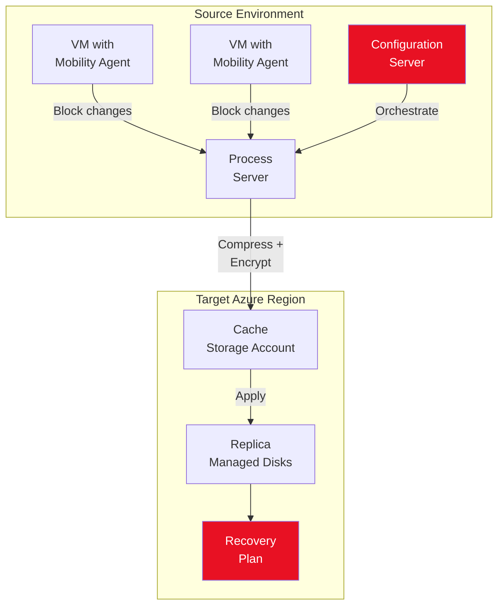
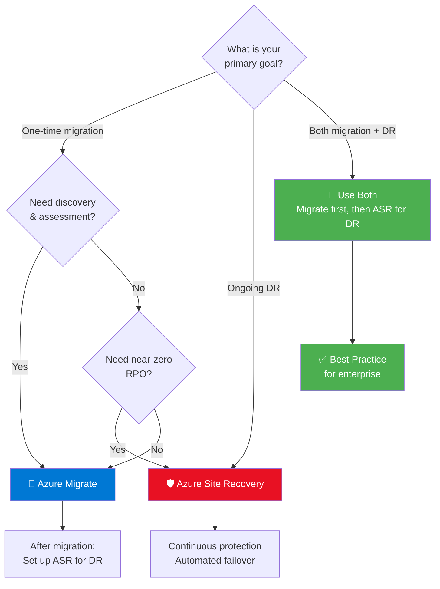
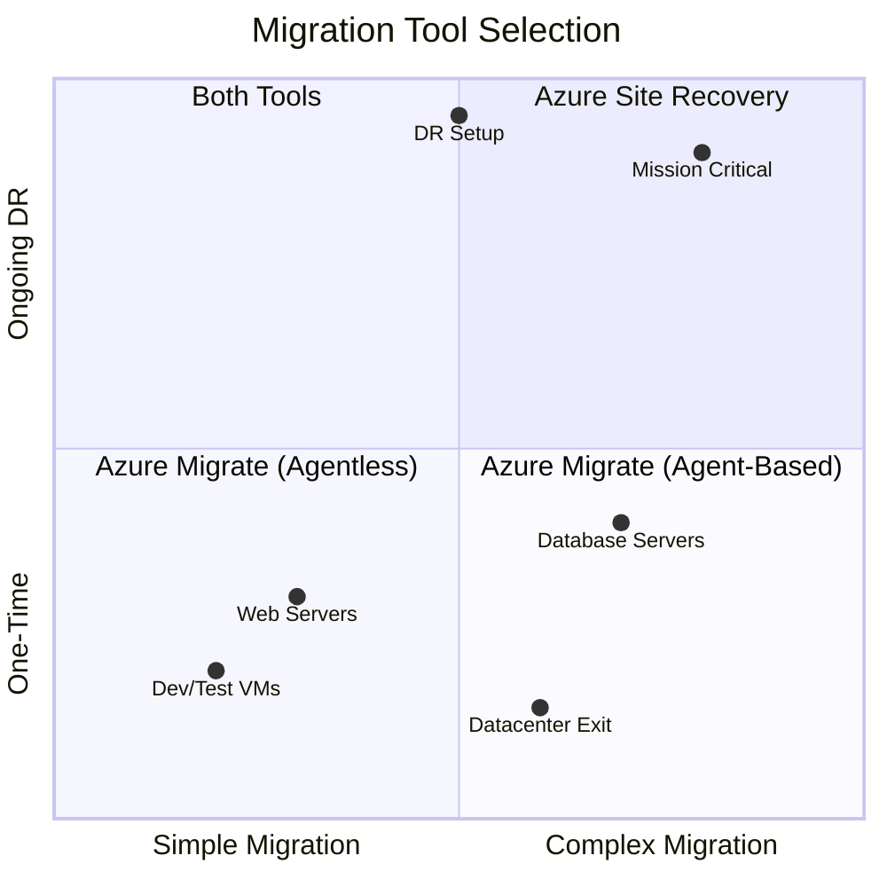
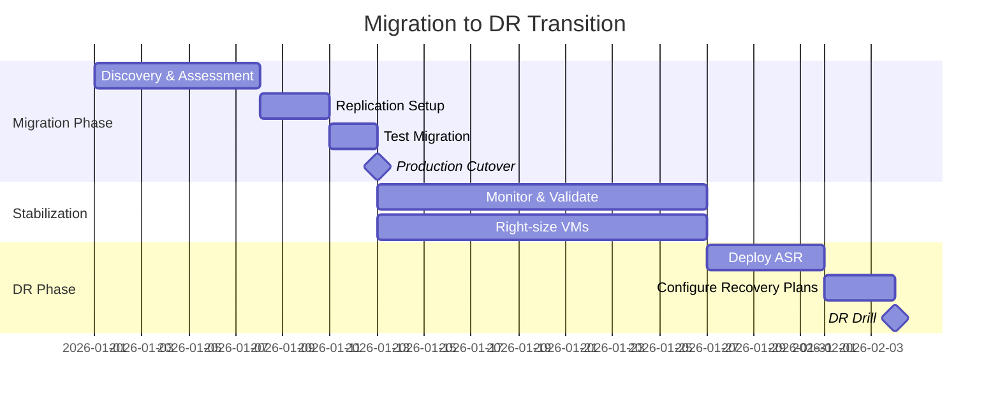

# Module 4: Azure Migrate vs. Azure Site Recovery — Strategic Tool Selection

> **Estimated Time:** ~45 minutes
>
> **CSA Competency:** Architectural Decision-Making · Tool Evaluation · DR Strategy Design

## 1. Overview — Choosing the Right Tool: A Solution Architect's Guide

Selecting between Azure Migrate and Azure Site Recovery (ASR) is not a feature checkbox exercise — it is an **architectural decision** that shapes your migration timeline, operational posture, and long-term DR strategy. As a Cloud Solution Architect, you must evaluate both tools against business requirements, risk tolerance, and the operational maturity of the organization you are advising.

### Historical Context

Before Azure Migrate reached general availability in 2018, **ASR was the only first-party migration tool** Microsoft offered. Organizations that migrated to Azure in 2016–2018 used ASR's "failover and commit" workflow for lift-and-shift migrations. This legacy is important because:

- Many existing customers still conflate ASR with migration tooling
- Older Microsoft documentation and blog posts recommend ASR for migration
- Some teams have institutional knowledge (and automation) built around ASR-as-migration-tool

### Current Microsoft Guidance

Microsoft's official position is clear: **Azure Migrate for migration, ASR for disaster recovery.** However, the nuance a CSA must understand is the overlap:

- Azure Migrate's agent-based replication **uses ASR technology under the hood** — the same Recovery Services Vault, the same Mobility Service agent, the same block-level replication engine
- For large-scale migrations where Day 1 DR is a hard requirement, ASR can serve dual duty — but at the cost of operational complexity
- The tools share infrastructure but serve different lifecycle phases

### What You Will Learn

By the end of this module, you will be able to:

- Evaluate ASR's architecture, replication mechanics, and pricing model
- Apply a CSA-grade comparison matrix across 15+ dimensions
- Use a decision framework to recommend the right tool for any scenario
- Design an integrated migration + DR strategy using both tools
- Document your recommendation as an Architecture Decision Record (ADR)

---

## 2. Azure Site Recovery — Architecture Deep Dive

Understanding ASR at the infrastructure level is essential for making informed architectural recommendations.

### 2.1 Component Architecture

```
┌─────────────────────────────────────────────────────────────────┐
│                     SOURCE ENVIRONMENT                         │
│                                                                 │
│  ┌─────────────────┐   ┌──────────────────┐                   │
│  │ Configuration   │   │  Process Server   │                   │
│  │ Server          │   │  (can be separate │                   │
│  │ (orchestration, │   │   for scale)      │                   │
│  │  coordination)  │   │                   │                   │
│  └────────┬────────┘   └────────┬──────────┘                   │
│           │                      │                              │
│  ┌────────▼──────────────────────▼──────────┐                  │
│  │        Mobility Service Agent             │                  │
│  │  (installed on each protected VM)         │                  │
│  │  • Block-level change tracking            │                  │
│  │  • Data compression & encryption          │                  │
│  │  • Crash-consistent + app-consistent pts  │                  │
│  └────────────────────┬──────────────────────┘                  │
│                       │                                         │
└───────────────────────┼─────────────────────────────────────────┘
                        │ HTTPS (port 443)
                        ▼
┌─────────────────────────────────────────────────────────────────┐
│                         AZURE                                   │
│                                                                 │
│  ┌─────────────────────────┐   ┌────────────────────────────┐  │
│  │  Recovery Services Vault │   │  Cache Storage Account     │  │
│  │  • Replication metadata  │   │  • Temporary landing zone  │  │
│  │  • Recovery points       │   │    for replication data    │  │
│  │  • Policy configuration  │   └─────────────┬──────────────┘  │
│  └─────────────────────────┘                   │                │
│                                                ▼                │
│                                   ┌────────────────────────┐   │
│  ┌──────────────────────┐        │  Managed Disks          │   │
│  │  Master Target Server │        │  (Replica disks)        │   │
│  │  (for failback only)  │        │  Ready for failover     │   │
│  └──────────────────────┘        └────────────────────────┘   │
│                                                                 │
└─────────────────────────────────────────────────────────────────┘
```

**Component roles an architect must understand:**

| Component | Role | Scale Consideration |
|---|---|---|
| **Configuration Server** | Orchestrates replication, coordinates communication between on-premises and Azure | 1 per vault; single point of management |
| **Process Server** | Receives replication data, applies compression/encryption, sends to Azure | Each handles ~200 VMs; scale out for larger environments |
| **Mobility Service** | Installed on each protected VM; captures block-level writes | Per-VM agent; OS compatibility matrix applies |
| **Master Target Server** | Receives data during failback from Azure to on-premises | Only needed for failback scenarios |
| **Cache Storage Account** | Temporary landing zone in Azure for inbound replication data | Performance-tier storage; must be in same region as vault |

#### ASR Replication Architecture Diagram



### 2.2 Replication Mechanics

ASR's replication engine operates at the **block level**, not the file level. This is a critical distinction for architects:

**Block-Level Change Tracking:**
1. The Mobility Service hooks into the VM's I/O stack
2. All disk writes are captured in a change-tracking bitmap
3. Changes are compressed, encrypted (AES-256), and sent to the Process Server
4. The Process Server forwards data over HTTPS to the Azure cache storage account
5. Data is applied to replica managed disks asynchronously

**Recovery Point Types:**

| Type | Mechanism | Use Case | RPO Impact |
|---|---|---|---|
| **Crash-consistent** | Point-in-time disk snapshot (all disks simultaneously) | Default; always available | Minimum RPO achievable |
| **App-consistent** | VSS snapshot (Windows) or pre/post scripts (Linux) | Database workloads, transactional systems | Every 1–12 hours (configurable) |
| **Multi-VM consistent** | Coordinated recovery points across VM groups | Multi-tier applications (web + app + DB) | Adds overhead; use selectively |

### 2.3 Recovery Plans

Recovery Plans are ASR's orchestration mechanism for multi-VM failover — and a key differentiator from Azure Migrate:

- **Sequenced failover**: Define boot order (e.g., DB tier → app tier → web tier)
- **Manual actions**: Insert approval gates or manual verification steps
- **Script execution**: Run Azure Automation runbooks or PowerShell scripts during failover
- **Grouping**: Organize VMs into failover groups that start in parallel within a sequence step

> **Architect's Note:** Recovery Plans are the closest thing ASR offers to infrastructure-as-code for DR. For organizations with complex multi-tier applications, this capability alone can justify using ASR over Azure Migrate for migration — the Recovery Plan can be repurposed for DR after cutover.

### 2.4 RPO/RTO Guarantees and SLA

| Metric | Hyper-V to Azure | VMware/Physical to Azure | Azure to Azure |
|---|---|---|---|
| **Minimum RPO** | 30 seconds | Near-continuous (seconds) | Near-continuous (seconds) |
| **Typical RPO** | 5 minutes | 5–15 minutes | 5 minutes |
| **RTO** | Depends on Recovery Plan complexity | Depends on Recovery Plan complexity | Minutes (automated) |
| **SLA** | [99.99% replication uptime](https://azure.microsoft.com/en-us/support/legal/sla/site-recovery/) | Same | Same |

### 2.5 Pricing Model

ASR uses **per-protected-instance** pricing:

| Component | Cost |
|---|---|
| First 31 days per instance | Free (trial) |
| Per protected instance/month | ~$25 USD |
| Storage (replica disks) | Standard managed disk rates |
| Network egress (replication traffic) | Standard Azure egress rates |
| Cache storage account | Standard storage rates |

> **CSA Tip:** When building a business case, remember that ASR cost is *ongoing* for DR but *temporary* for migration. If using ASR solely to migrate, the per-instance cost only applies during the replication window (typically 2–4 weeks). Azure Migrate's replication is priced similarly, but assessment and discovery are free.

### 2.6 Supported Source Environments

| Source Environment | ASR Support | Notes |
|---|---|---|
| VMware VMs | ✅ | Requires Configuration Server + Process Server |
| Hyper-V VMs (with/without SCVMM) | ✅ | Uses ASR Provider on host — no guest agent |
| Physical servers (Windows/Linux) | ✅ | Agent-based only |
| Azure VMs (region-to-region) | ✅ | Mobility Service extension auto-installed |
| AWS EC2 instances | ✅ | Treated as physical servers |

---

## 3. Comprehensive Comparison Matrix

This is a CSA-grade comparison designed for architecture review boards and stakeholder presentations. Use it as the foundation for your Architecture Decision Record.

| Dimension | Azure Migrate | Azure Site Recovery |
|---|---|---|
| **Primary Purpose** | Migration (one-time lift-and-shift) | Disaster Recovery (ongoing protection) |
| **Discovery & Assessment** | ✅ Built-in appliance, dependency analysis, SQL/web app assessment | ❌ None — requires separate tooling |
| **Business Case / TCO** | ✅ Built-in calculator with Azure Hybrid Benefit modeling | ❌ Not available |
| **Agentless Replication** | ✅ Hyper-V and VMware (appliance-based) | ❌ Always requires agent or provider |
| **Agent-Based Replication** | ✅ Via replication appliance (uses ASR engine) | ✅ Via Configuration Server |
| **Continuous Replication** | ✅ Agent-based only; agentless uses periodic snapshots | ✅ Always continuous |
| **Minimum RPO** | Minutes (agentless) to seconds (agent-based) | Seconds (continuous block-level) |
| **Failback** | ❌ One-way migration; no return path | ✅ Full failback to on-premises or original region |
| **Recovery Plans** | ❌ Not applicable — migration is a one-time event | ✅ Orchestrated multi-VM failover with scripting |
| **Multi-Region DR** | ❌ Not a DR tool | ✅ Azure-to-Azure replication across regions |
| **Physical Servers** | ✅ Agent-based | ✅ Agent-based |
| **Cost Model** | Free (assessment/discovery); per-instance (replication) | Per-protected-instance/month (~$25) |
| **Post-Migration DR** | Separate ASR setup required after cutover | Already configured — replication continues |
| **Automation** | PowerShell, REST API, Azure CLI | PowerShell, REST API, Recovery Plans, Azure Automation |
| **Scale Limits** | ~300 VMs per appliance (agentless); higher with multiple appliances | ~200 VMs per Process Server; scale out with additional servers |
| **Migration Tracking** | ✅ Centralized dashboard with wave/group management | ❌ No migration-specific tracking |
| **Dependency Visualization** | ✅ Agentless (Service Map) and agent-based | ❌ Not available |

### How They Relate Architecturally

```
┌──────────────────────────────────────────────────────────────────┐
│                      Azure Migrate Hub                           │
│                                                                  │
│  ┌───────────────────┐   ┌─────────────────────────────────┐   │
│  │  Discovery &      │   │     Migration & Replication      │   │
│  │  Assessment        │   │                                 │   │
│  │                   │   │  ┌───────────────────────────┐  │   │
│  │  • Appliance-     │   │  │ Agentless Replication     │  │   │
│  │    based discovery│   │  │ (Native Azure Migrate)    │  │   │
│  │  • Dependency     │   │  └───────────────────────────┘  │   │
│  │    mapping        │   │  ┌───────────────────────────┐  │   │
│  │  • TCO / Business │   │  │ Agent-Based Replication   │  │   │
│  │    Case           │   │  │ ┌───────────────────────┐ │  │   │
│  │  • SQL / Web App  │   │  │ │  ASR Engine (shared)  │ │  │   │
│  │    Assessment     │   │  │ │  Same block-level     │ │  │   │
│  │                   │   │  │ │  replication tech      │ │  │   │
│  │                   │   │  │ └───────────────────────┘ │  │   │
│  └───────────────────┘   │  └───────────────────────────┘  │   │
│                          └─────────────────────────────────┘   │
└──────────────────────────────────────────────────────────────────┘

  Azure Migrate agent-based migration uses the SAME replication
  engine as ASR. The difference is lifecycle intent: migrate once
  vs. protect continuously.
```

---

## 4. Decision Framework — CSA Decision Tree

Use this decision tree when advising customers. The goal is not to pick a "winner" — it is to match the tool to the scenario.

```
Is this a one-time migration to Azure?
│
├── YES
│   ├── Do you need discovery, assessment, or TCO analysis?
│   │   ├── YES ──────────────────────────────► Azure Migrate
│   │   └── NO
│   │       ├── Do you need ongoing DR immediately after cutover?
│   │       │   ├── YES ──► Consider ASR (migrate + DR in one setup)
│   │       │   └── NO ───► Azure Migrate
│   │       └── Do you need very low RPO (< 1 minute) during migration?
│   │           ├── YES ──► ASR (continuous block-level replication)
│   │           └── NO ───► Azure Migrate agentless (simpler, faster)
│   │
│   └── How many VMs are in scope?
│       ├── < 50 ─────────► Azure Migrate (single appliance, simple)
│       ├── 50–300 ────────► Azure Migrate (multiple appliances / waves)
│       └── 300+ ─────────► Azure Migrate + Migration Factory approach
│
└── NO — Ongoing DR / Business Continuity
    ├── On-premises to Azure DR
    │   └──────────────────────────────────────► Azure Site Recovery
    ├── Azure-to-Azure (cross-region DR)
    │   └──────────────────────────────────────► Azure Site Recovery
    └── Multi-cloud DR (AWS → Azure failover)
        └──────────────────────────────────────► Azure Site Recovery
```

> **Architect's Rule of Thumb:** If the conversation is about a *project* with an end date, recommend Azure Migrate. If the conversation is about an *ongoing operational capability*, recommend ASR.

### Visual Decision Tree



### Tool Selection by Scenario



---

## 5. Real-World Scenario Analysis

A CSA must translate abstract decision trees into concrete recommendations. Here are five scenarios you will encounter in the field:

### Scenario 1: Enterprise Datacenter Exit (500 VMs, Mixed OS)

**Context:** A financial services company is exiting a colocation facility. 500 VMs across Windows Server 2016/2019/2022 and RHEL 7/8. 18-month timeline. Mix of VMware and physical servers.

**Recommendation:** Azure Migrate + ASR post-migration
- **Phase 1:** Azure Migrate appliance for discovery and assessment (2 months)
- **Phase 2:** Azure Migrate for migration in 8–10 waves (12 months)
- **Phase 3:** ASR Azure-to-Azure for DR on critical workloads (ongoing)
- **Rationale:** Azure Migrate's assessment capabilities are essential for a 500-VM estate. The TCO calculator justifies the cloud business case to the CFO. ASR is overkill for the migration itself but critical for post-migration DR.

### Scenario 2: Single Mission-Critical SQL Server Migration

**Context:** A healthcare company needs to migrate a production SQL Server (2019 Enterprise, 2 TB database) with maximum 30-second RPO during cutover.

**Recommendation:** ASR (continuous replication, low RPO)
- ASR provides continuous block-level replication with near-zero RPO
- Test failover validates the migration without impacting production
- The Recovery Plan can include pre/post scripts for SQL consistency
- After cutover, keep ASR configured for ongoing DR
- **Rationale:** The low RPO requirement eliminates Azure Migrate agentless. While Azure Migrate agent-based could work (it uses ASR under the hood), using ASR directly gives the team explicit control over RPO settings and failback capability.

### Scenario 3: Development Environment Migration (50 VMs)

**Context:** A software company wants to migrate its development and QA environments to Azure. No strict RPO requirement. Speed is the priority.

**Recommendation:** Azure Migrate agentless
- No agents to install — minimal disruption to dev teams
- Agentless replication is faster to set up (hours, not days)
- Assessment provides right-sizing recommendations to avoid over-provisioning in Azure
- **Rationale:** Dev/QA environments don't need continuous replication or DR. The fastest, simplest path is Azure Migrate agentless. Save the ASR complexity for production.

### Scenario 4: Multi-Cloud Migration (AWS → Azure)

**Context:** A retail company is migrating 200 EC2 instances from AWS to Azure as part of a cloud consolidation strategy.

**Recommendation:** Azure Migrate agent-based
- Azure Migrate supports AWS-to-Azure migration via the replication appliance
- The agent-based approach treats EC2 instances like physical servers
- Assessment still works — install the appliance in AWS to discover workloads
- **Rationale:** Azure Migrate provides the discovery and tracking capabilities needed for a 200-instance migration project. ASR could also work but lacks the migration project management features.

### Scenario 5: Hybrid DR Setup (On-Premises ↔ Azure)

**Context:** A manufacturing company wants to keep production on-premises but use Azure as a DR site. 100 VMs across VMware, with RPO < 15 minutes and RTO < 4 hours.

**Recommendation:** ASR exclusively
- This is ASR's primary design purpose — not a migration at all
- Configure Recovery Plans with sequenced failover for multi-tier applications
- Run quarterly DR drills using test failover (no production impact)
- **Rationale:** Azure Migrate has no role here. There is no migration — the workloads stay on-premises. ASR provides continuous replication, orchestrated failover, and tested failback.

---

## 6. Migration + DR Integration Strategy

### The Recommended Pattern

For most enterprise migrations, the architecture calls for **both tools in sequence**:

```
┌─────────────┐     ┌─────────────┐     ┌──────────────┐     ┌─────────────┐
│   Assess    │────►│   Migrate   │────►│  Stabilize   │────►│  Protect    │
│             │     │             │     │              │     │             │
│ Azure       │     │ Azure       │     │ 2–4 weeks    │     │ ASR         │
│ Migrate     │     │ Migrate     │     │ monitoring & │     │ Azure-to-   │
│ Discovery   │     │ Replication │     │ validation   │     │ Azure DR    │
└─────────────┘     └─────────────┘     └──────────────┘     └─────────────┘
```

**Why this pattern is superior to using ASR for both migration and DR:**

| Factor | Separate Tools (Recommended) | ASR for Both |
|---|---|---|
| **Separation of concerns** | Migration is a project; DR is an operation. Different teams, different lifecycles. | Blurs the line — migration completion feels ambiguous |
| **Cost clarity** | Migration cost is a capital project; DR cost is an operational expense | Single cost line — harder to justify to finance |
| **Tool optimization** | Each tool used for its designed purpose | ASR lacks discovery, assessment, and migration tracking |
| **Operational handoff** | Clear handoff: migration team completes → ops team configures DR | No clean handoff point |

**The Stabilization Window (T+14 to T+30 days):**

Do not rush into DR configuration immediately after cutover. The stabilization period is critical:

1. **T+0 to T+7:** Validate application functionality, fix migration-induced issues
2. **T+7 to T+14:** Collect baseline performance metrics (Azure Monitor)
3. **T+14 to T+21:** Right-size VMs based on actual Azure utilization
4. **T+21 to T+30:** Configure ASR Azure-to-Azure DR, run first test failover

#### Migration to DR Transition Timeline



### The Alternative: ASR for Migration AND DR

In specific scenarios, using ASR for both is justified:

- **Single critical workload** where you cannot afford any gap in protection
- **Small migration** (< 10 VMs) where the overhead of two tools isn't warranted
- **Team familiarity** — the ops team already knows ASR and doesn't want to learn Azure Migrate
- **Continuous protection** — replication never stops, so there's no unprotected window between migration and DR setup

> **Trade-off:** Fewer tools and continuous protection, but you lose Azure Migrate's discovery, assessment, TCO analysis, and migration project tracking.

---

## 7. Hands-On: Understanding the ASR Setup Process

> **Context:** Since we migrated all four VMs using Azure Migrate in Modules 2 and 3, this section is a **guided demonstration** — not a re-migration. The goal is to understand the ASR setup process so you can evaluate it for your environment and compare the experience with the Azure Migrate setup from Module 1.

### 7.1 Create a Recovery Services Vault

A **Recovery Services Vault** is the management entity for ASR. It stores replication metadata, recovery points, and configuration. Compare this with the Azure Migrate project you created in Module 1 — similar concept, different scope.

1. Open the [Azure portal](https://portal.azure.com)
2. Search for **"Recovery Services vaults"** and select it


3. Click **+ Create** and configure:

   | Setting | Value |
   |---|---|
   | Subscription | *Your workshop subscription* |
   | Resource Group | `rg-migrate-workshop` |
   | Vault name | `MigrateWorkshop-ASR-Vault` |
   | Region | *Same region as your workshop resources* |

4. Click **Review + create**, then **Create**


> **Architect's Note:** In production, vault placement matters. The vault must be in the *target* region for on-premises-to-Azure DR, and in a *different* region than your primary workloads for Azure-to-Azure DR. Plan your vault topology as part of your landing zone design.

5. Once deployed, navigate to the vault and note the **Site Recovery** section — this is the DR control plane.

### 7.2 Walk Through ASR Configuration for Hyper-V

> **Note:** Follow along conceptually. You do not need to complete the full replication setup.

**Step 1 — Prepare Infrastructure:**
1. In the vault, navigate to **Site Recovery** → **Getting Started**
2. Under **Hyper-V machines to Azure**, click **Prepare infrastructure**


**Step 2 — Create a Hyper-V Site:**
1. Under **Source settings**, click **+ Hyper-V Site**
2. Enter site name: `MigrateWorkshop-HyperV-Site`
3. Click **OK**

> A Hyper-V site is a logical grouping of hosts. Compare this with the Azure Migrate appliance model — ASR groups by site, Azure Migrate groups by appliance/project.

**Step 3 — Install the ASR Provider:**
1. Click **+ Hyper-V Server** to add a host
2. Download the **Azure Site Recovery Provider** installer and **vault registration key**
3. On the Hyper-V host, run the Provider installer and register with the vault key

```powershell
# Verify the ASR Provider is installed on the Hyper-V host
Get-ItemProperty "HKLM:\SOFTWARE\Microsoft\Azure Site Recovery" | Select-Object -Property *
```


**Step 4 — Create a Replication Policy:**

Navigate to **Site Recovery Infrastructure** → **Replication Policies** → **+ Create**:

| Setting | Value | Architect's Consideration |
|---|---|---|
| Name | `MigrateWorkshop-ReplicationPolicy` | Use naming conventions aligned with your governance |
| Copy frequency | 5 minutes | Determines RPO — 30 sec / 5 min / 15 min options |
| Recovery point retention | 24 hours | Balance between protection and storage cost |
| App-consistent snapshot frequency | 4 hours | Essential for database VMs; adds VSS overhead |


> **Key Design Decision:** Copy frequency directly maps to RPO. A 30-second copy frequency requires more bandwidth and storage IOPS than a 15-minute frequency. Model the bandwidth requirement: `(Daily change rate × Churn factor) / Replication window`.

**Step 5 — Enable Replication (Conceptual):**
1. Navigate to **Site Recovery** → **Replicated items** → **+ Replicate**
2. Select source (Hyper-V site), target (Azure subscription/region/VNet), VMs, and replication policy
3. Initial replication copies full disk contents; subsequent replication sends only delta changes

**Expected Outcome:** You understand the end-to-end ASR setup workflow — vault creation, site registration, provider installation, policy configuration, and replication enablement — and can compare it with the Azure Migrate experience from earlier modules.

---

## 8. Key Takeaways

As a Cloud Solution Architect, remember these principles:

1. **There is no single "best" tool** — the right choice depends on the scenario, RPO/RTO requirements, team capabilities, and lifecycle phase
2. **Most enterprises will use both:** Azure Migrate for the migration project, ASR for ongoing DR — this is the recommended pattern
3. **Azure Migrate's agent-based mode uses ASR under the hood** — understanding this relationship prevents duplicate work and confusion
4. **The decision should be documented** as an Architecture Decision Record (ADR) in your project's decision log, capturing context, options evaluated, and rationale
5. **Tool selection is a CAF "Migrate" phase decision** — it should be finalized during planning, not improvised during execution
6. **Post-migration DR is not optional** — plan the ASR setup timeline as part of your migration project plan, not as an afterthought

> **ADR Template Prompt:** *"We recommend Azure Migrate for the migration of [X] workloads because [assessment capabilities / agentless option / migration tracking]. Post-migration DR will be implemented using ASR Azure-to-Azure replication within [Y] days of each migration wave's cutover. ASR was considered for migration but rejected because [lack of discovery / unnecessary complexity / cost clarity]."*

---

## Next Steps

Proceed to **[Module 5: Post-Migration — Operational Excellence & Governance](Module-5-Post-Migration.md)** where you will:

- Align post-migration operations to the Azure Well-Architected Framework
- Design an observability strategy with Azure Monitor and Data Collection Rules
- Implement data protection with Azure Backup and DR integration
- Harden security with a Zero Trust approach (NSGs, Bastion, JIT, Defender)
- Optimize cost strategically with right-sizing, commitments, and governance
- Build a Day 2 Operations runbook for handoff to the operations team

---

> **Workshop Navigation:**
> [← Module 3: Agent-Based Migration](Module-3-Agent-Based-Migration.md) | [Module 5: Post-Migration — Operational Excellence & Governance →](Module-5-Post-Migration.md)
