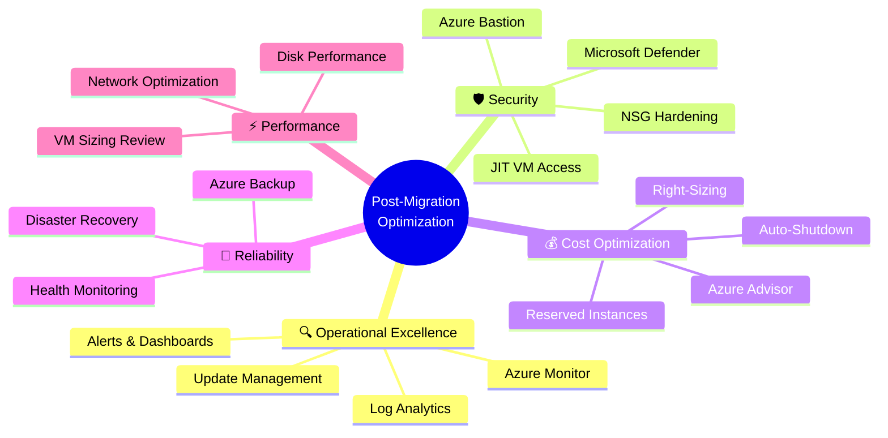
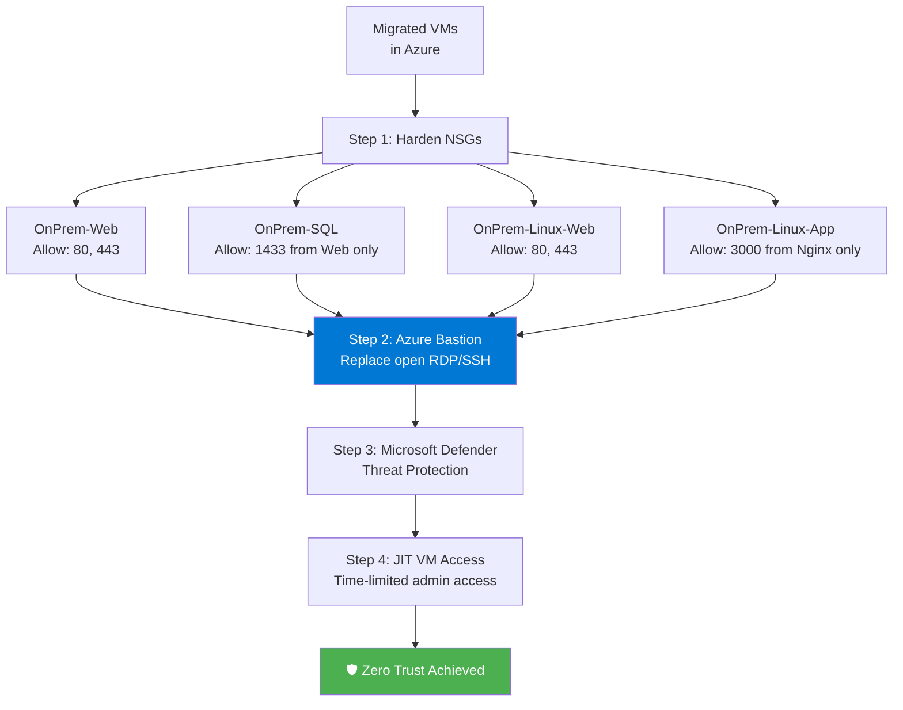
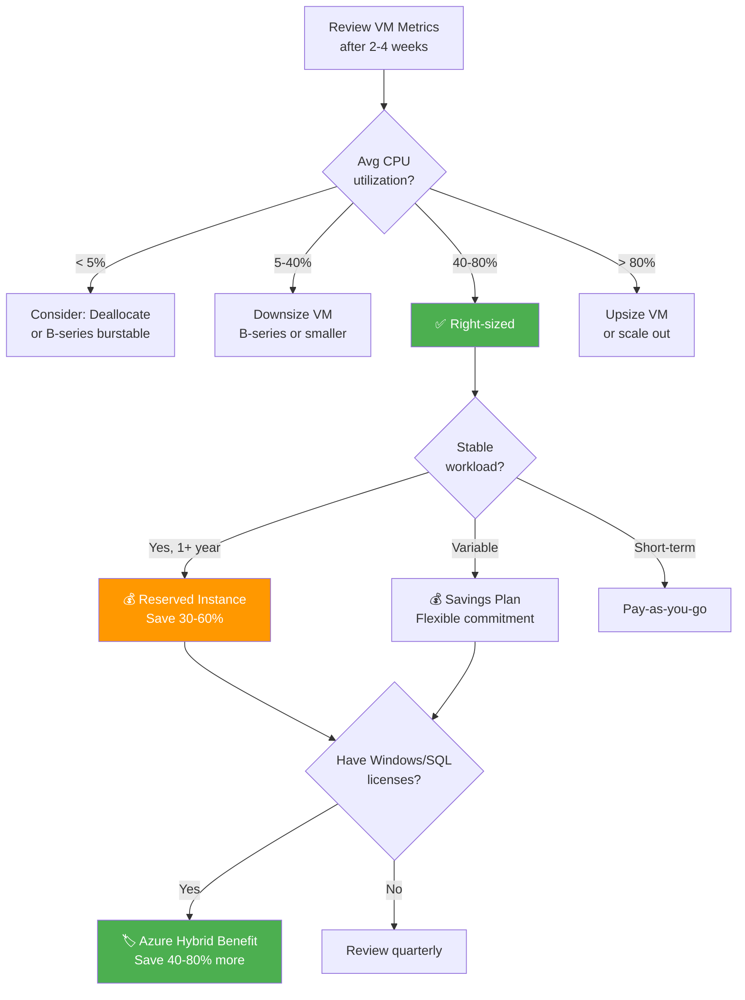
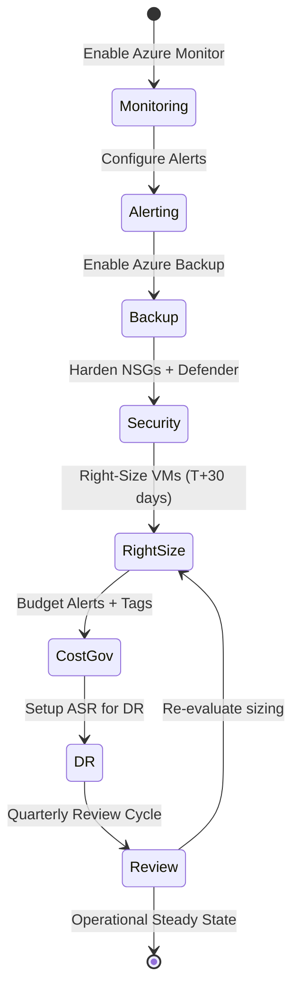

# Module 5: Post-Migration — Operational Excellence & Governance

> **Estimated Time:** ~60 minutes
>
> **CSA Competency:** CAF Manage Phase · Azure Well-Architected Framework · Day 2 Operations Design
>
> **WAF Pillars Covered:** Operational Excellence · Reliability · Security · Cost Optimization

## 1. Overview — Day 2 Operations: Where Migrations Succeed or Fail

The migration is not done at cutover. It is done when operations are **stable, secure, observable, and cost-optimized** in their new cloud environment. Industry data consistently shows that organizations that underinvest in post-migration operations fail to achieve the expected ROI from their cloud migration — often within the first 12 months.

This module maps directly to the **Manage phase** of the Cloud Adoption Framework (CAF) and operationalizes the **Azure Well-Architected Framework (WAF)** across five pillars:

| Pillar | What We Are Implementing |
|---|---|
| **Operational Excellence** | Observability, alerting strategy, operational runbooks |
| **Reliability** | Data protection (backup), disaster recovery, patch management |
| **Security** | Network segmentation, Zero Trust access, threat protection |
| **Cost Optimization** | Right-sizing, commitment discounts, governance controls |
| **Performance Efficiency** | Baseline metrics collection, capacity planning foundation |

### The Five Pillars of This Module

As a Cloud Solution Architect, you should structure post-migration operations around these domains:

1. **Observability** — You cannot manage what you cannot measure
2. **Protection** — Backup and DR are non-negotiable for production workloads
3. **Security** — Migrated workloads inherit cloud attack surface; they must be hardened
4. **Optimization** — Cloud cost is variable; without governance, it will surprise you
5. **Governance** — Policies, tags, budgets, and compliance controls prevent drift

### Well-Architected Framework Alignment

| Section | WAF Pillar | What We Are Implementing |
|---|---|---|
| Azure Monitor | Operational Excellence | Observability, alerting, diagnostics |
| Azure Backup | Reliability | Data protection, recovery capability |
| NSG Hardening | Security | Network segmentation, least privilege |
| Right-Sizing | Cost Optimization | Eliminate waste, match resources to demand |
| Update Management | Reliability + Security | Patch management, vulnerability remediation |
| Cost Management | Cost Optimization | Budgets, tagging, accountability |

### Well-Architected Framework — Visual Map



---

## 2. Observability Strategy

> **WAF Pillar: Operational Excellence**

Monitoring is not "install an agent and set some alerts." An observability strategy defines *what* you measure, *why* you measure it, *who* responds, and *how fast*.

### 2.1 Azure Monitor Architecture — The Modern Approach

Azure Monitor has evolved significantly. The modern architecture is built on **Data Collection Rules (DCRs)** and the **Azure Monitor Agent (AMA)**, which replaces the legacy Log Analytics agent (MMA) and Dependency agent.

```
┌─────────────────────────────────────────────────────────────────┐
│                    Azure Monitor Platform                        │
│                                                                  │
│  ┌─────────────────┐   ┌──────────────────┐   ┌──────────────┐ │
│  │  Azure Monitor  │   │ Data Collection  │   │ Log Analytics│ │
│  │  Agent (AMA)    │──►│ Rules (DCRs)     │──►│ Workspace    │ │
│  │  On each VM     │   │ Define what to   │   │              │ │
│  │                 │   │ collect & where   │   │ • Logs       │ │
│  └─────────────────┘   │ to send it       │   │ • Perf data  │ │
│                        └──────────────────┘   │ • Events     │ │
│                                                └──────┬───────┘ │
│                                                       │         │
│  ┌─────────────────┐   ┌──────────────────┐          │         │
│  │  Alert Rules    │   │  Workbooks &     │◄─────────┘         │
│  │  (Sev 0–4)     │   │  Dashboards      │                    │
│  └────────┬────────┘   └──────────────────┘                    │
│           │                                                     │
│  ┌────────▼────────┐                                           │
│  │  Action Groups  │                                           │
│  │  Email, SMS,    │                                           │
│  │  Webhook, ITSM  │                                           │
│  └─────────────────┘                                           │
└─────────────────────────────────────────────────────────────────┘
```

**Log Analytics Workspace Design Guidance:**

| Pattern | When to Use | Trade-off |
|---|---|---|
| **Single workspace** | Small-to-medium environments (< 100 VMs), single team | Simpler management; less granular RBAC |
| **Per-environment** (dev/staging/prod) | Compliance requirements for data separation | More workspaces to manage; cross-workspace queries available |
| **Per-application** | Large enterprises with chargeback models | Most granular; highest management overhead |

> **CSA Recommendation:** For most post-migration scenarios, start with a **single workspace per environment** (e.g., one for production, one for non-production). You can always split later — consolidating is harder than splitting.

### 2.2 Install Azure Monitor Agent

Deploy AMA to all migrated VMs. This is the foundation for all observability.

**Windows VMs:**

```powershell
# Install Azure Monitor Agent on Windows VMs
$windowsVMs = @("OnPrem-Web", "OnPrem-SQL")
foreach ($vmName in $windowsVMs) {
    Set-AzVMExtension `
      -ResourceGroupName "rg-migrate-workshop" `
      -VMName $vmName `
      -Name "AzureMonitorWindowsAgent" `
      -Publisher "Microsoft.Azure.Monitor" `
      -ExtensionType "AzureMonitorWindowsAgent" `
      -TypeHandlerVersion "1.0" `
      -Location "eastus"   # Replace with your region
    Write-Host "AMA installed on $vmName"
}
```

**Linux VMs:**

```powershell
# Install Azure Monitor Agent on Linux VMs
$linuxVMs = @("OnPrem-Linux-Web", "OnPrem-Linux-App")
foreach ($vmName in $linuxVMs) {
    Set-AzVMExtension `
      -ResourceGroupName "rg-migrate-workshop" `
      -VMName $vmName `
      -Name "AzureMonitorLinuxAgent" `
      -Publisher "Microsoft.Azure.Monitor" `
      -ExtensionType "AzureMonitorLinuxAgent" `
      -TypeHandlerVersion "1.0" `
      -Location "eastus"   # Replace with your region
    Write-Host "AMA installed on $vmName"
}
```


> **Verify:** Check each VM's **Extensions + applications** blade to confirm AMA is installed and provisioning succeeded.

### 2.3 Create a Log Analytics Workspace

```powershell
New-AzOperationalInsightsWorkspace `
  -ResourceGroupName "rg-migrate-workshop" `
  -Name "law-migrate-workshop" `
  -Location "eastus" `
  -Sku "PerGB2018"
```

Or via the portal: search **"Log Analytics workspaces"** → **+ Create** → configure:

| Setting | Value |
|---|---|
| Subscription | *Your workshop subscription* |
| Resource Group | `rg-migrate-workshop` |
| Name | `law-migrate-workshop` |
| Region | *Same region as your VMs* |


### 2.4 Configure Data Collection Rules (DCRs)

DCRs are the modern, declarative way to define what telemetry to collect. They replace legacy agent configuration.

1. In the Azure portal, search for **"Data Collection Rules"** → **+ Create**
2. Configure:

   | Setting | Value |
   |---|---|
   | Rule Name | `dcr-migrate-workshop` |
   | Subscription | *Your workshop subscription* |
   | Resource Group | `rg-migrate-workshop` |
   | Region | *Same region as your VMs* |
   | Platform Type | **All** (Windows and Linux) |

3. Under **Resources**, add all four VMs
4. Under **Collect and deliver**, add data sources:

**Application-Centric Monitoring — Not Just VM Metrics:**

| Data Source | What It Captures | Why It Matters |
|---|---|---|
| **Performance Counters** (basic preset) | CPU, Memory, Disk IOPS, Network throughput | Infrastructure health baseline |
| **Windows Event Logs** (Application: Warning+, System: Warning+) | Application crashes, service failures, driver issues | Root cause analysis for Windows workloads |
| **Linux Syslog** (LOG_SYSLOG, LOG_WARNING minimum) | System events, authentication failures, kernel messages | Operational visibility for Linux workloads |
| **IIS Logs** (custom text log) | HTTP requests, response codes, latency | Web server performance for `OnPrem-Web` |
| **SQL Performance Counters** | Buffer cache hit ratio, batch requests/sec, lock waits | Database performance for `OnPrem-SQL` |
| **Nginx Access Logs** (custom text log) | Request rates, upstream response times, error rates | Web tier monitoring for `OnPrem-Linux-Web` |
| **Node.js Application Metrics** (custom) | Event loop lag, heap usage, request throughput | Application health for `OnPrem-Linux-App` |

5. Under **Destination**, select `law-migrate-workshop`
6. Click **Review + create** → **Create**


> **Metrics vs. Logs — When to Use Each:**
> - **Metrics** (numeric time-series): Use for real-time dashboards, autoscale triggers, and threshold-based alerts. Cheap to store, fast to query. Example: CPU percentage over time.
> - **Logs** (structured/semi-structured records): Use for root cause analysis, correlation across services, and audit trails. More expensive but infinitely flexible with KQL. Example: Specific error messages in IIS logs.

### 2.5 Alert Strategy — Avoiding Alert Fatigue

> **Architect's Principle:** If every alert fires, no alert matters. Design alerts that drive **action**, not noise.

**Alert Severity Framework:**

| Severity | Meaning | Response SLA | Example |
|---|---|---|---|
| **Sev 0 — Critical** | Service down, data loss imminent | Immediate (< 15 min) | VM heartbeat lost |
| **Sev 1 — Error** | Service degraded, customer impact likely | < 1 hour | Disk > 95%, HTTP 5xx spike |
| **Sev 2 — Warning** | Performance degrading, action needed soon | < 4 hours | CPU > 90% sustained (5 min) |
| **Sev 3 — Informational** | Noteworthy but not urgent | Next business day | Disk > 80%, backup job warning |
| **Sev 4 — Verbose** | Diagnostic, typically suppressed | Review weekly | Memory > 70% |

**Recommended Baseline Alerts for Migrated VMs:**

| Alert | Signal | Condition | Severity | Action |
|---|---|---|---|---|
| **VM Heartbeat Lost** | VM Availability Metric | < 1 | Sev 0 | Page on-call engineer |
| **Disk Critical** | OS Disk Used Percentage | > 95% | Sev 1 | Email + SMS ops team |
| **HTTP 5xx Spike** | Custom log query (IIS/Nginx) | > 10 in 5 min | Sev 1 | Email + webhook to incident tool |
| **CPU Sustained High** | Percentage CPU | > 90% avg for 5 min | Sev 2 | Email ops team |
| **Disk Warning** | OS Disk Used Percentage | > 85% | Sev 3 | Email weekly digest |
| **Backup Job Failed** | Azure Backup alert | Failure | Sev 2 | Email backup admin |

**Configure the Critical Alerts:**

1. Navigate to **Azure Monitor** → **Alerts** → **+ Create alert rule**
2. **Scope:** Select all four VMs
3. **Condition:** Select signal **VM Availability Metric** → Operator: Less than → Threshold: 1
4. **Actions:** Create an action group:
   - **Name:** `ag-migrate-critical`
   - **Notifications:** Email + SMS to ops team lead
   - **Actions (optional):** Webhook to ServiceNow/PagerDuty/Slack
5. **Details:** Name: `VM Availability Alert - Migrated VMs`, Severity: **1 - Error**
6. Click **Create**

Repeat for CPU and disk alerts using the thresholds above.

> **Action Groups — Design Thoughtfully:**
> - Sev 0–1: Email + SMS + webhook to incident management (PagerDuty, ServiceNow)
> - Sev 2: Email to ops team distribution list
> - Sev 3–4: Email to monitoring dashboard / weekly digest
> - Consider ITSM integration for auto-ticket creation on Sev 0–2

**Expected Outcome:** All four VMs have AMA installed, a Log Analytics workspace collects performance data and logs via DCRs, and a tiered alert strategy is configured with severity-appropriate notification channels.

---

## 3. Data Protection Strategy

> **WAF Pillar: Reliability**

Backup is the minimum viable data protection. A complete strategy includes backup policies aligned to RPO, tested restore procedures, and DR integration.

### 3.1 Backup Policy Design — RPO-Based Thinking

Before configuring backup, ask the business question: **How much data can you afford to lose?**

| Workload | RPO Requirement | Backup Frequency | Retention |
|---|---|---|---|
| `OnPrem-SQL` (database) | 1 hour | Every 4 hours (SQL backup) + daily VM | 30 days daily, 12 months monthly, 5 years yearly |
| `OnPrem-Web` (IIS) | 24 hours | Daily | 30 days daily |
| `OnPrem-Linux-Web` (Nginx) | 24 hours | Daily | 30 days daily |
| `OnPrem-Linux-App` (Node.js) | 24 hours | Daily | 30 days daily, 12 months monthly |

### 3.2 Create a Recovery Services Vault and Backup Policy

```powershell
# Create or reuse a Recovery Services Vault
New-AzRecoveryServicesVault `
  -ResourceGroupName "rg-migrate-workshop" `
  -Name "MigrateWorkshop-Backup-Vault" `
  -Location "eastus"
```

Configure the backup policy:

1. In the Recovery Services Vault, navigate to **Backup policies** → **+ Add**
2. Select **Azure Virtual Machine** as the policy type
3. Configure:

   | Setting | Value | Architect's Note |
   |---|---|---|
   | Policy name | `DailyBackup-30DayRetention` | Name should encode frequency + retention |
   | Backup frequency | Daily at 11:00 PM UTC | Schedule during off-peak hours |
   | Instant restore retention | 2 days | Fast restore from local snapshots |
   | Daily backup point retention | 30 days | Short-term operational recovery |
   | Weekly backup point | Disabled (for workshop) | Production: enable for compliance |
   | Monthly backup point | Disabled (for workshop) | Production: enable, 12-month retention |
   | Yearly backup point | Disabled (for workshop) | Production: enable, 5-year retention |

4. Click **Create**


**PowerShell alternative:**

```powershell
$vault = Get-AzRecoveryServicesVault -Name "MigrateWorkshop-ASR-Vault" -ResourceGroupName "rg-migrate-workshop"
Set-AzRecoveryServicesVaultContext -Vault $vault

$schedulePolicy = Get-AzRecoveryServicesBackupSchedulePolicyObject -WorkloadType "AzureVM"
$retentionPolicy = Get-AzRecoveryServicesBackupRetentionPolicyObject -WorkloadType "AzureVM"
$retentionPolicy.DailySchedule.DurationCountInDays = 30

New-AzRecoveryServicesBackupProtectionPolicy `
  -Name "DailyBackup-30DayRetention" `
  -WorkloadType "AzureVM" `
  -SchedulePolicy $schedulePolicy `
  -RetentionPolicy $retentionPolicy `
  -VaultId $vault.ID
```

**Production Retention Strategy (CSA Recommendation):**

| Tier | Frequency | Retention | Purpose |
|---|---|---|---|
| **Short-term** | Daily | 30 days | Operational recovery (accidental deletion, config errors) |
| **Medium-term** | Weekly | 12 weeks | Rollback window for application changes |
| **Long-term** | Monthly | 12 months | Compliance, audit, quarterly snapshots |
| **Archive** | Yearly | 5–7 years | Regulatory requirements (HIPAA, SOX, GDPR) |

### 3.3 Enable Backup for All VMs

1. In the vault, navigate to **Backup** → **+ Backup**
2. Workload location: **Azure** → What to back up: **Virtual machine**
3. Select policy: `DailyBackup-30DayRetention`
4. Add all four VMs and click **Enable Backup**


```powershell
$vault = Get-AzRecoveryServicesVault -Name "MigrateWorkshop-ASR-Vault" -ResourceGroupName "rg-migrate-workshop"
$policy = Get-AzRecoveryServicesBackupProtectionPolicy -Name "DailyBackup-30DayRetention" -VaultId $vault.ID

$vmNames = @("OnPrem-Web", "OnPrem-SQL", "OnPrem-Linux-Web", "OnPrem-Linux-App")

foreach ($vmName in $vmNames) {
    Enable-AzRecoveryServicesBackupProtection `
      -ResourceGroupName "rg-migrate-workshop" `
      -Policy $policy `
      -Name $vmName `
      -VaultId $vault.ID
    Write-Host "Backup enabled for $vmName"
}
```

### 3.4 Trigger and Verify a Backup

> **Architect's Principle:** A backup that has never been tested is not a backup — it is a hope.

1. In the vault, go to **Backup items** → **Azure Virtual Machine** → select `OnPrem-Web`
2. Click **Backup now** → set retention → **OK**

```powershell
$vault = Get-AzRecoveryServicesVault -Name "MigrateWorkshop-ASR-Vault" -ResourceGroupName "rg-migrate-workshop"
$backupItem = Get-AzRecoveryServicesBackupItem `
  -BackupManagementType "AzureVM" `
  -WorkloadType "AzureVM" `
  -Name "OnPrem-Web" `
  -VaultId $vault.ID

$endDate = (Get-Date).AddDays(30).ToUniversalTime()
Backup-AzRecoveryServicesBackupItem -Item $backupItem -ExpiryDateTimeUTC $endDate -VaultId $vault.ID
```

Verify the job:

```powershell
Get-AzRecoveryServicesBackupJob -VaultId $vault.ID -Status "InProgress" | Format-Table Operation, Status, StartTime
```


> **Note:** The first backup (snapshot + transfer) can take 30+ minutes. The snapshot phase is fast; vault transfer takes longer depending on disk size.

### 3.5 SQL Server Backup Considerations

For `OnPrem-SQL`, VM-level backup provides crash-consistent protection. For **application-consistent** SQL backup:

| Approach | RPO | Complexity | Best For |
|---|---|---|---|
| **Azure Backup for SQL in VM** | 15 min (log backup) | Medium | Production SQL workloads |
| **VM-level backup (crash-consistent)** | 24 hours | Low | Dev/test, small databases |
| **Native SQL backup to Azure Blob** | Custom | High | Existing SQL backup infrastructure |

> **CSA Recommendation:** For production SQL Server workloads, enable **Azure Backup for SQL Server in Azure VM** — it provides 15-minute RPO via transaction log backups, without the overhead of managing backup jobs manually.

### 3.6 Disaster Recovery — Tie Back to Module 4

Now that your VMs are in Azure, consider **Azure-to-Azure ASR** for cross-region DR:

- Your VMs in East US → Replicate to West US 2
- RPO: Near-continuous (seconds)
- Automated failover via Recovery Plans
- This was the "Protect" phase discussed in Module 4's integration strategy

> **When to set this up:** After the 2–4 week stabilization window (see Module 4, Section 6). Do not rush DR configuration — get operations stable first.

**Expected Outcome:** All four VMs are configured with daily backups and 30-day retention. An on-demand backup has been triggered and verified. You understand the tiered retention strategy and SQL-specific backup considerations.

---

## 4. Security Hardening — Zero Trust Approach

> **WAF Pillar: Security**

Migrated workloads carry their on-premises security posture into the cloud — which is almost always **too permissive** for a cloud environment. A CSA must harden these workloads using Zero Trust principles: verify explicitly, use least-privilege access, assume breach.

### Security Hardening Flow



### 4.1 Network Security — NSG Design Principles

**Foundational rule:** Default-deny inbound, explicit-allow per workload role.

```powershell
# Audit current NSG rules — identify overly permissive configurations
Get-AzNetworkSecurityGroup -ResourceGroupName "rg-migrate-workshop" |
  ForEach-Object {
    Write-Host "`n=== $($_.Name) ===" -ForegroundColor Cyan
    $_.SecurityRules | Format-Table Name, Direction, Access, Protocol, SourceAddressPrefix, DestinationPortRange, Priority
  }
```

### 4.2 Remove Overly Permissive Rules

> **Warning:** Before removing rules, ensure you have alternative management access (Azure Bastion or a specific IP-based RDP/SSH rule). Removing all inbound rules without a management path will lock you out.

```powershell
# Example: Remove a dangerous "allow all" rule
$nsg = Get-AzNetworkSecurityGroup -Name "OnPrem-Web-nsg" -ResourceGroupName "rg-migrate-workshop"
Remove-AzNetworkSecurityRuleConfig -Name "AllowAllInbound" -NetworkSecurityGroup $nsg
Set-AzNetworkSecurityGroup -NetworkSecurityGroup $nsg
```

### 4.3 Apply Role-Based NSG Rules — Microsegmentation

Design NSG rules based on **application architecture tiers**: web → app → data. Each tier should only accept traffic from the tier directly upstream.

**OnPrem-Web (IIS — Web Tier):**

| Priority | Name | Direction | Action | Protocol | Source | Dest Port |
|---|---|---|---|---|---|---|
| 100 | Allow-HTTP | Inbound | Allow | TCP | * | 80 |
| 110 | Allow-HTTPS | Inbound | Allow | TCP | * | 443 |
| 200 | Allow-RDP-MyIP | Inbound | Allow | TCP | *Your IP* | 3389 |
| 4096 | Deny-All-Inbound | Inbound | Deny | * | * | * |

```powershell
$nsg = Get-AzNetworkSecurityGroup -Name "OnPrem-Web-nsg" -ResourceGroupName "rg-migrate-workshop"

Add-AzNetworkSecurityRuleConfig -NetworkSecurityGroup $nsg `
  -Name "Allow-HTTP" -Priority 100 -Direction Inbound -Access Allow `
  -Protocol TCP -SourceAddressPrefix "*" -SourcePortRange "*" `
  -DestinationAddressPrefix "*" -DestinationPortRange "80"

Add-AzNetworkSecurityRuleConfig -NetworkSecurityGroup $nsg `
  -Name "Allow-HTTPS" -Priority 110 -Direction Inbound -Access Allow `
  -Protocol TCP -SourceAddressPrefix "*" -SourcePortRange "*" `
  -DestinationAddressPrefix "*" -DestinationPortRange "443"

Add-AzNetworkSecurityRuleConfig -NetworkSecurityGroup $nsg `
  -Name "Allow-RDP-MyIP" -Priority 200 -Direction Inbound -Access Allow `
  -Protocol TCP -SourceAddressPrefix "YOUR_PUBLIC_IP/32" -SourcePortRange "*" `
  -DestinationAddressPrefix "*" -DestinationPortRange "3389"

Set-AzNetworkSecurityGroup -NetworkSecurityGroup $nsg
```

> **Important:** Replace `YOUR_PUBLIC_IP` with your actual public IP address.

**OnPrem-SQL (SQL Server — Data Tier):**

| Priority | Name | Direction | Action | Protocol | Source | Dest Port |
|---|---|---|---|---|---|---|
| 100 | Allow-SQL-FromWeb | Inbound | Allow | TCP | *OnPrem-Web private IP* | 1433 |
| 200 | Allow-RDP-MyIP | Inbound | Allow | TCP | *Your IP* | 3389 |
| 4096 | Deny-All-Inbound | Inbound | Deny | * | * | * |

```powershell
$nsg = Get-AzNetworkSecurityGroup -Name "OnPrem-SQL-nsg" -ResourceGroupName "rg-migrate-workshop"

Add-AzNetworkSecurityRuleConfig -NetworkSecurityGroup $nsg `
  -Name "Allow-SQL-FromWeb" -Priority 100 -Direction Inbound -Access Allow `
  -Protocol TCP -SourceAddressPrefix "10.0.0.4/32" -SourcePortRange "*" `
  -DestinationAddressPrefix "*" -DestinationPortRange "1433"

Add-AzNetworkSecurityRuleConfig -NetworkSecurityGroup $nsg `
  -Name "Allow-RDP-MyIP" -Priority 200 -Direction Inbound -Access Allow `
  -Protocol TCP -SourceAddressPrefix "YOUR_PUBLIC_IP/32" -SourcePortRange "*" `
  -DestinationAddressPrefix "*" -DestinationPortRange "3389"

Set-AzNetworkSecurityGroup -NetworkSecurityGroup $nsg
```

> **Note:** Replace `10.0.0.4` with the actual private IP of `OnPrem-Web`. In production, use **Application Security Groups (ASGs)** instead of IP addresses for more maintainable rules.

**OnPrem-Linux-Web (Nginx — Web Tier):**

| Priority | Name | Direction | Action | Protocol | Source | Dest Port |
|---|---|---|---|---|---|---|
| 100 | Allow-HTTP | Inbound | Allow | TCP | * | 80 |
| 110 | Allow-HTTPS | Inbound | Allow | TCP | * | 443 |
| 200 | Allow-SSH-MyIP | Inbound | Allow | TCP | *Your IP* | 22 |
| 4096 | Deny-All-Inbound | Inbound | Deny | * | * | * |

**OnPrem-Linux-App (Node.js — App Tier):**

| Priority | Name | Direction | Action | Protocol | Source | Dest Port |
|---|---|---|---|---|---|---|
| 100 | Allow-App-FromNginx | Inbound | Allow | TCP | *OnPrem-Linux-Web private IP* | 3000 |
| 200 | Allow-SSH-MyIP | Inbound | Allow | TCP | *Your IP* | 22 |
| 4096 | Deny-All-Inbound | Inbound | Deny | * | * | * |


> **Application Security Groups (ASGs):** In production, create ASGs (e.g., `asg-web-tier`, `asg-app-tier`, `asg-data-tier`) and reference them in NSG rules instead of IP addresses. ASGs make rules self-documenting and automatically adapt when VMs are added or replaced.

### 4.4 NSG Flow Logs + Traffic Analytics

NSG Flow Logs provide network visibility — essential for security auditing, forensics, and capacity planning.

1. Navigate to **Network Watcher** → **NSG Flow Logs** → **+ Create**
2. Select NSGs for all four VMs
3. Configure:

   | Setting | Value |
   |---|---|
   | Storage Account | *Create or select an existing one* |
   | Retention (days) | 30 |
   | Flow Log Version | Version 2 |
   | Traffic Analytics | Enable |
   | Traffic Analytics Workspace | `law-migrate-workshop` |

4. Click **Create**


> **Traffic Analytics** processes flow log data and presents it in visual dashboards — showing traffic patterns, blocked flows, top talkers, and geographic distribution. This is invaluable for identifying unexpected traffic and validating that NSG rules are working as intended.

### 4.5 Azure Bastion — Eliminate Open Management Ports

**The Zero Trust approach to remote access:** Replace open RDP (3389) and SSH (22) with Azure Bastion.

1. Navigate to **Bastions** → **+ Create**
2. Configure:

   | Setting | Value |
   |---|---|
   | Name | `bastion-migrate-workshop` |
   | Virtual Network | *Your workshop VNet* |
   | Subnet | `AzureBastionSubnet` (minimum /26) |
   | Public IP | Create new |

3. Click **Create**

> With Bastion deployed, **remove all RDP and SSH NSG rules** that expose management ports to the internet. Bastion provides browser-based RDP/SSH over TLS via the Azure portal — no public IP needed on VMs.

### 4.6 JIT VM Access via Microsoft Defender for Cloud

For environments where Azure Bastion is not deployed, **Just-In-Time (JIT) VM Access** provides time-limited, approval-gated access to management ports:

- Management ports are blocked by default
- Users request access for a specific time window (e.g., 3 hours)
- Access is auto-revoked when the window expires
- All access requests are logged for audit

> Enable JIT via **Microsoft Defender for Cloud** → **Workload protections** → **Just-in-time VM access**.

### 4.7 Identity, Access & Threat Protection

**Identity & Access (Production Guidance):**

| Control | Implementation | Priority |
|---|---|---|
| **Entra ID authentication for VMs** | Enable Azure AD login extension for Windows/Linux | Medium |
| **Managed identities** | Assign system-assigned managed identity for Azure resource access (e.g., Key Vault, Storage) | High |
| **RBAC least privilege** | Assign VM Contributor (not Owner) to operators; use custom roles where needed | High |

**Threat Protection:**

| Service | What It Protects | Enable For |
|---|---|---|
| **Microsoft Defender for Servers** | File integrity monitoring, adaptive application controls, vulnerability assessment | All four VMs |
| **Microsoft Defender for SQL** | SQL injection detection, brute force alerts, anomalous queries | `OnPrem-SQL` |
| **Vulnerability Assessment** | Built-in Qualys scanner via Defender for Servers | All four VMs |

> **CSA Recommendation:** At minimum, enable **Defender for Servers Plan 2** on all migrated VMs. The per-server cost (~$15/month) is trivial compared to the risk of an undetected breach in a newly-migrated environment.

**Expected Outcome:** NSG rules are tightened to role-appropriate, least-privilege configurations. Management access is secured via Bastion or JIT. Flow logs provide network visibility. Threat protection is scoped to each workload.

---

## 5. Cost Optimization — Strategic, Not Tactical

> **WAF Pillar: Cost Optimization**

Cost optimization is not "resize VMs." It is a **continuous discipline** that spans right-sizing, commitment discounts, governance controls, and cultural practices. A CSA must design cost optimization as an ongoing operational capability, not a one-time exercise.

### Cost Optimization Decision Flow



### 5.1 Right-Sizing Process

> **Critical:** Wait **2–4 weeks** post-migration before right-sizing. You need actual Azure utilization data, not assumptions from on-premises sizing. On-premises VMs often appear over-provisioned because they were sized for peak capacity that may never materialize in Azure.

**Step 1 — Review Azure Advisor Recommendations:**

1. Navigate to **Azure Advisor** → **Cost** tab
2. Look for "Right-size or shutdown underutilized virtual machines"


```powershell
Get-AzAdvisorRecommendation -Category Cost |
  Where-Object { $_.ImpactedField -eq "Microsoft.Compute/virtualMachines" } |
  Select-Object ShortDescription, ImpactedValue, Impact |
  Format-Table
```

> **Architect's Note:** Use Advisor recommendations as a **starting point, not gospel.** Advisor looks at average utilization — a VM running at 10% average CPU might spike to 95% during batch processing. Always validate with P95 utilization analysis.

**Step 2 — Performance-Based Analysis:**

1. Navigate to each VM → **Monitoring** → **Metrics**
2. Chart **Percentage CPU** and **Available Memory Bytes** over **Last 7–30 days**
3. Analyze both **average** and **P95** utilization:

| Utilization Pattern | Action |
|---|---|
| Average < 20% AND P95 < 50% | Strong candidate for downsizing |
| Average < 20% BUT P95 > 80% | Candidate for B-series (burstable) VMs |
| Average > 60% | Correctly sized or needs scale-up |
| Average < 5% (all hours) | Candidate for shutdown or decommission |


**Step 3 — Resize When Justified:**

```powershell
# Resize requires VM stop — schedule during maintenance window
Stop-AzVM -ResourceGroupName "rg-migrate-workshop" -Name "OnPrem-Web" -Force

$vm = Get-AzVM -ResourceGroupName "rg-migrate-workshop" -Name "OnPrem-Web"
$vm.HardwareProfile.VmSize = "Standard_B1s"
Update-AzVM -ResourceGroupName "rg-migrate-workshop" -VM $vm

Start-AzVM -ResourceGroupName "rg-migrate-workshop" -Name "OnPrem-Web"
```

> **B-series (burstable) VMs** are ideal for workloads with variable CPU patterns — web servers, development environments, small databases. They accumulate CPU credits during idle periods and burst when needed. Significantly cheaper than fixed-performance VMs.

**Right-sizing is iterative:** Schedule quarterly reviews. Workload patterns change over time.

### 5.2 Commitment Discounts

Once workloads are stable (typically T+60 to T+90 days post-migration), evaluate commitment discounts:

| Option | Savings | Commitment | Flexibility | Best For |
|---|---|---|---|---|
| **Pay-as-you-go** | 0% | None | Maximum | Short-term, testing, unpredictable |
| **Reserved Instance (1 year)** | ~30% | Specific VM size + region | Low (can exchange) | Known, stable workloads |
| **Reserved Instance (3 year)** | ~60% | Specific VM size + region | Low | Long-term commitments |
| **Savings Plan (1 year)** | ~15–25% | Hourly compute spend (any size/region) | High | Variable workloads, multi-region |
| **Savings Plan (3 year)** | ~30–40% | Hourly compute spend (any size/region) | High | Portfolio-level commitment |
| **Azure Hybrid Benefit** | 40–80% | Existing Windows Server or SQL Server licenses | N/A — stackable | License reuse (Software Assurance) |

> **CSA Decision Framework for Commitments:**
> - **Stable workload, known size** → Reserved Instance (deepest discount)
> - **Stable spend, variable sizes** → Savings Plan (flexible)
> - **Existing Windows/SQL licenses** → Azure Hybrid Benefit (stackable with RI/SP)
> - **Uncertain future** → Pay-as-you-go (optimize later when patterns are clear)

### 5.3 Cost Governance

**Resource Tagging Strategy:**

Implement tagging on Day 1. It is nearly impossible to retroactively tag a large environment accurately.

```powershell
$resourceGroup = "rg-migrate-workshop"
$tags = @{
    "CostCenter"   = "IT-Infrastructure"
    "Environment"  = "Lab"
    "Owner"        = "WorkshopAdmin"
    "Application"  = "MigrationWorkshop"
    "ManagedBy"    = "CloudOps"
}

$vmNames = @("OnPrem-Web", "OnPrem-SQL", "OnPrem-Linux-Web", "OnPrem-Linux-App")
foreach ($vmName in $vmNames) {
    $vm = Get-AzVM -ResourceGroupName $resourceGroup -Name $vmName
    Update-AzTag -ResourceId $vm.Id -Tag $tags -Operation Merge
    Write-Host "Tagged $vmName"
}
```

**Required Tags (CSA Recommendation):**

| Tag | Purpose | Example Values |
|---|---|---|
| `CostCenter` | Chargeback/showback | `IT-Infra`, `Marketing`, `Engineering` |
| `Environment` | Environment classification | `Production`, `Staging`, `Development`, `Lab` |
| `Owner` | Accountable person/team | `team-cloudops@company.com` |
| `Application` | Application or workload name | `ERP`, `CRM`, `MigrationWorkshop` |
| `ManagedBy` | Operational responsibility | `CloudOps`, `AppTeam`, `Vendor` |

**Budget Alerts:**

1. Navigate to **Cost Management** → **Budgets** → **+ Add**
2. Configure:

   | Setting | Value |
   |---|---|
   | Name | `migrate-workshop-budget` |
   | Reset period | Monthly |
   | Budget amount | $200 (adjust for your subscription) |
   | Start date | *Current month* |

3. Alert conditions:

   | Alert Type | Threshold | Notification |
   |---|---|---|
   | Actual cost warning | 50% of budget | Email to workshop admin |
   | Actual cost alert | 80% of budget | Email to workshop admin |
   | Forecasted cost alert | 100% of budget | Email to workshop admin |

4. Click **Create**

**Azure Policy for Cost Controls:**

In production, enforce cost controls via Azure Policy:

| Policy | Effect | Purpose |
|---|---|---|
| Allowed VM sizes | Deny | Prevent accidental deployment of expensive SKUs |
| Allowed regions | Deny | Prevent deployment to costly or non-compliant regions |
| Require tags on resources | Deny | Enforce tagging governance |
| Inherit tag from resource group | Modify | Auto-apply tags for consistency |

### 5.4 Identify and Eliminate Waste

```powershell
# Find unattached managed disks (orphaned from migration)
Get-AzDisk -ResourceGroupName "rg-migrate-workshop" |
  Where-Object { $_.DiskState -eq "Unattached" } |
  Select-Object Name, DiskSizeGB, Sku |
  Format-Table
```

```powershell
# Find unused public IPs
Get-AzPublicIpAddress -ResourceGroupName "rg-migrate-workshop" |
  Where-Object { -not $_.IpConfiguration } |
  Select-Object Name, IpAddress |
  Format-Table
```

**Auto-Shutdown for Non-Production VMs:**

```powershell
$vmNames = @("OnPrem-Web", "OnPrem-SQL", "OnPrem-Linux-Web", "OnPrem-Linux-App")
$shutdownTime = "1900"   # 7:00 PM
$timeZone = "Eastern Standard Time"

foreach ($vmName in $vmNames) {
    $vm = Get-AzVM -ResourceGroupName "rg-migrate-workshop" -Name $vmName

    $properties = @{
        status           = "Enabled"
        taskType         = "ComputeVmShutdownTask"
        dailyRecurrence  = @{ time = $shutdownTime }
        timeZoneId       = $timeZone
        targetResourceId = $vm.Id
    }

    New-AzResource `
      -ResourceId "/subscriptions/$((Get-AzContext).Subscription.Id)/resourceGroups/rg-migrate-workshop/providers/microsoft.devtestlab/schedules/shutdown-computevm-$vmName" `
      -Location $vm.Location `
      -Properties $properties `
      -Force

    Write-Host "Auto-shutdown enabled for $vmName at $shutdownTime $timeZone"
}
```


> **Production Consideration:** Auto-shutdown is for non-production only. For production savings, evaluate Reserved Instances and consider scale-down schedules (resize to smaller SKU during off-hours) if supported by the workload.

**Expected Outcome:** Right-sizing analysis is underway based on actual utilization data. Cost governance controls (tags, budgets, policies) are in place. Waste is identified and eliminated. Commitment discount strategy is documented.

---

## 6. Operational Maturity — Update Management

> **WAF Pillar: Reliability + Security**

Unpatched systems are the most common attack vector. Update management is not optional.

### 6.1 Configure Azure Update Manager

1. Navigate to **Azure Update Manager** → **Machines**
2. Select all four migrated VMs
3. Click **Check for updates** to assess current patch status


### 6.2 Schedule Maintenance Windows

1. In Update Manager, navigate to **Maintenance configurations** → **+ Create**
2. Configure:

   | Setting | Value |
   |---|---|
   | Name | `maint-weekly-sunday` |
   | Resource Group | `rg-migrate-workshop` |
   | Region | *Your region* |
   | Maintenance scope | **Guest (Azure VM)** |
   | Schedule | Weekly, Sunday, 2:00 AM UTC |
   | Duration | 3 hours, 55 minutes |
   | Reboot setting | Reboot if required |

3. Under **Machines**, add all four VMs
4. Under **Updates**, select **Critical** and **Security** classifications for both Windows and Linux
5. Click **Review + create** → **Create**

### 6.3 Enable Periodic Assessment

Enable automatic daily assessment so Azure checks for new updates every 24 hours:

- Navigate to **Update settings** → select VMs → enable **Periodic assessment**
- This ensures you always have visibility into your patch posture without manual scans

> **CSA Recommendation:** For urgent security patches (e.g., zero-day vulnerabilities), use one-time deployment immediately rather than waiting for the scheduled maintenance window. Azure Update Manager supports on-demand patch deployment.

**Expected Outcome:** Azure Update Manager is configured with weekly maintenance windows. Periodic assessment is enabled for ongoing patch visibility. Critical and security updates are auto-applied.

---

## 7. Day 2 Operations Runbook

This is the checklist a CSA hands to the operations team after migration cutover. It represents the minimum operational baseline for production-ready migrated workloads.

### Day 2 Operations Workflow



### Post-Migration Operations Checklist

| # | Task | Status | Owner | Target Date |
|---|---|---|---|---|
| 1 | Azure Monitor Agent installed on all VMs | ☐ | Cloud Ops | T+1 day |
| 2 | Data Collection Rules configured (perf counters, event logs, syslog) | ☐ | Cloud Ops | T+1 day |
| 3 | Alert rules created (Sev 0–2 with action groups) | ☐ | Cloud Ops | T+3 days |
| 4 | Alert validation — trigger test alert, verify notification | ☐ | Cloud Ops | T+3 days |
| 5 | Azure Backup enabled with appropriate retention policy | ☐ | Cloud Ops | T+1 day |
| 6 | Test restore completed — verify backup integrity | ☐ | Cloud Ops | T+7 days |
| 7 | NSGs reviewed and tightened from lab/migration defaults | ☐ | Security | T+3 days |
| 8 | Azure Bastion or JIT deployed — management ports closed | ☐ | Security | T+7 days |
| 9 | NSG Flow Logs + Traffic Analytics enabled | ☐ | Security | T+7 days |
| 10 | Microsoft Defender for Cloud enabled (Servers + SQL) | ☐ | Security | T+3 days |
| 11 | VM right-sizing review scheduled | ☐ | FinOps | T+30 days |
| 12 | Azure Update Manager configured with maintenance window | ☐ | Cloud Ops | T+3 days |
| 13 | Cost budget alerts set at subscription/resource group level | ☐ | FinOps | T+7 days |
| 14 | Resource tagging applied and validated | ☐ | FinOps | T+7 days |
| 15 | RBAC reviewed — least privilege applied to VM operators | ☐ | Security | T+14 days |
| 16 | DR strategy documented (ASR Azure-to-Azure or cross-region) | ☐ | Architect | T+30 days |
| 17 | Decommission plan for source on-premises VMs documented | ☐ | Project Mgr | T+30 days |
| 18 | Operational runbooks created for common scenarios | ☐ | Cloud Ops | T+30 days |

> **Architect's Tip:** This checklist should be a living document in your organization's ITSM tool (ServiceNow, Jira, Azure DevOps). Track each item to completion with clear ownership and due dates.

---

## 8. Workshop Summary & Next Steps

### Module Recap — Mapped to Cloud Adoption Framework

| Module | CAF Phase | What You Accomplished |
|---|---|---|
| **Module 0: Environment Setup** | Ready | Deployed a nested Hyper-V lab environment simulating an on-premises datacenter |
| **Module 1: Discovery & Assessment** | Plan | Used Azure Migrate to discover, assess, and plan migration for on-premises VMs |
| **Module 2: Agentless Migration** | Migrate | Migrated `OnPrem-Web` and `OnPrem-Linux-Web` using agentless replication |
| **Module 3: Agent-Based Migration** | Migrate | Migrated `OnPrem-SQL` and `OnPrem-Linux-App` using agent-based replication |
| **Module 4: ASR vs Azure Migrate** | Migrate (Tool Selection) | Evaluated ASR architecture, built a CSA decision framework for tool selection |
| **Module 5: Post-Migration Operations** | Manage + Govern | Implemented observability, backup, security hardening, cost optimization, and governance |

### What You Delivered

- ✅ End-to-end migration from on-premises to Azure using both migration methods
- ✅ Strategic tool selection framework (Azure Migrate vs. ASR) with documented rationale
- ✅ Observability strategy with tiered alerting and application-centric monitoring
- ✅ Data protection with RPO-aligned backup policies
- ✅ Security hardening with Zero Trust principles (NSGs, Bastion, Defender)
- ✅ Cost optimization strategy (right-sizing, commitments, governance, waste elimination)
- ✅ Operational runbook for Day 2 handoff to the operations team

### What Comes Next in a Real Migration

A workshop environment demonstrates the mechanics. A real enterprise migration requires additional layers:

| Next Step | What It Involves | Key Resource |
|---|---|---|
| **Azure Landing Zone** | Deploy CAF Enterprise-Scale architecture: Management Groups, subscriptions, networking, identity | [CAF Enterprise-Scale](https://learn.microsoft.com/en-us/azure/cloud-adoption-framework/ready/enterprise-scale/) |
| **Cloud Center of Excellence (CCoE)** | Cross-functional team (infra, security, dev, finance) to govern cloud adoption | [CAF Organize](https://learn.microsoft.com/en-us/azure/cloud-adoption-framework/organize/) |
| **Migration Factory** | Standardized, repeatable processes for migration waves (templates, automation, quality gates) | [CAF Migration Factory](https://learn.microsoft.com/en-us/azure/cloud-adoption-framework/migrate/) |
| **Cloud Governance** | Azure Policy, Management Groups, Blueprints, compliance monitoring | [CAF Govern](https://learn.microsoft.com/en-us/azure/cloud-adoption-framework/govern/) |
| **Workload Modernization** | Evaluate PaaS alternatives: Azure SQL Database, App Services, AKS, Azure Functions | [Azure Migration Center](https://azure.microsoft.com/en-us/migration/) |
| **WAF Assessment** | Run the Well-Architected Framework assessment tool against migrated workloads | [WAF Assessment](https://learn.microsoft.com/en-us/assessments/azure-architecture-review/) |

### Recommended Certifications

| Certification | Focus | Relevance to This Workshop |
|---|---|---|
| **AZ-305: Azure Solutions Architect Expert** | Architecture design — compute, networking, data, identity, governance | Core CSA credential; covers everything in this workshop |
| **AZ-104: Azure Administrator Associate** | Day-to-day operations — VMs, networking, storage, monitoring | Maps to Module 5 operational tasks |
| **AZ-500: Azure Security Engineer Associate** | Security — identity, platform protection, data security, security operations | Maps to security hardening in Module 5 |
| **AZ-700: Azure Network Engineer Associate** | Networking — VNets, NSGs, load balancers, DNS, hybrid connectivity | Maps to network design and NSG configuration |

### Additional Resources

**Microsoft Documentation:**
- [Azure Migrate Documentation](https://learn.microsoft.com/en-us/azure/migrate/)
- [Azure Site Recovery Documentation](https://learn.microsoft.com/en-us/azure/site-recovery/)
- [Azure Monitor Documentation](https://learn.microsoft.com/en-us/azure/azure-monitor/)
- [Azure Backup Documentation](https://learn.microsoft.com/en-us/azure/backup/)
- [Azure Update Manager Documentation](https://learn.microsoft.com/en-us/azure/update-manager/)
- [Azure Cost Management Documentation](https://learn.microsoft.com/en-us/azure/cost-management-billing/)

**Frameworks & Best Practices:**
- [Azure Well-Architected Framework](https://learn.microsoft.com/en-us/azure/well-architected/)
- [Cloud Adoption Framework — Migrate](https://learn.microsoft.com/en-us/azure/cloud-adoption-framework/migrate/)
- [Azure Landing Zones](https://learn.microsoft.com/en-us/azure/cloud-adoption-framework/ready/landing-zone/)
- [WAF Assessment Tool](https://learn.microsoft.com/en-us/assessments/azure-architecture-review/)

**Microsoft Learn Paths:**
- [Migrate servers and workloads to Azure](https://learn.microsoft.com/en-us/training/paths/migrate-servers-to-azure/)
- [Protect your virtual machines with Azure Backup](https://learn.microsoft.com/en-us/training/modules/protect-virtual-machines-with-azure-backup/)
- [Design a monitoring strategy for Azure infrastructure](https://learn.microsoft.com/en-us/training/paths/design-monitoring-strategy/)
- [Control Azure spending and manage bills](https://learn.microsoft.com/en-us/training/paths/control-spending-manage-bills/)
- [AZ-305 Exam Preparation](https://learn.microsoft.com/en-us/training/paths/design-identity-governance-monitor-solutions/)

**Community & Support:**
- [Azure Migration Community](https://techcommunity.microsoft.com/t5/azure-migration-and/ct-p/AzureMigrationBlog)
- [Azure Support Plans](https://azure.microsoft.com/en-us/support/plans/)
- [Azure Updates](https://azure.microsoft.com/en-us/updates/)

---

> **Congratulations on completing the Azure Migrate Workshop!** 🎉
>
> You have not just migrated VMs — you have built the operational foundation that separates a successful cloud migration from a "lift-and-shift-and-hope" exercise. As a Cloud Solution Architect, your value is in designing this operational layer, not just executing the migration mechanics.

---

> **Workshop Navigation:**
> [← Module 4: ASR vs Azure Migrate — Strategic Tool Selection](Module-4-ASR-Comparison.md) | **Workshop Complete!**
